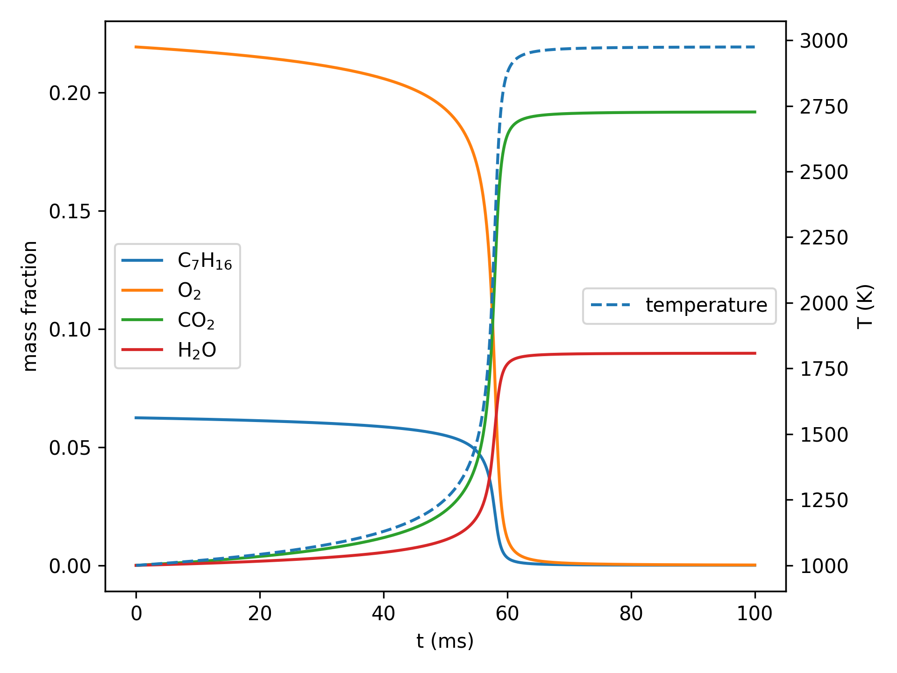
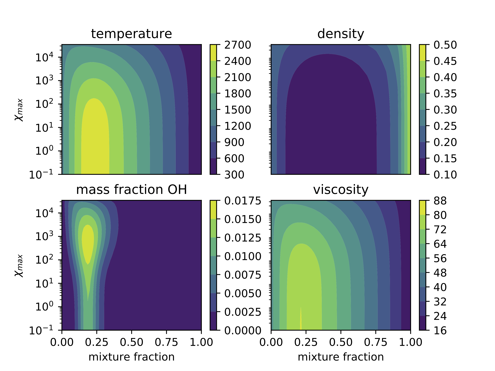
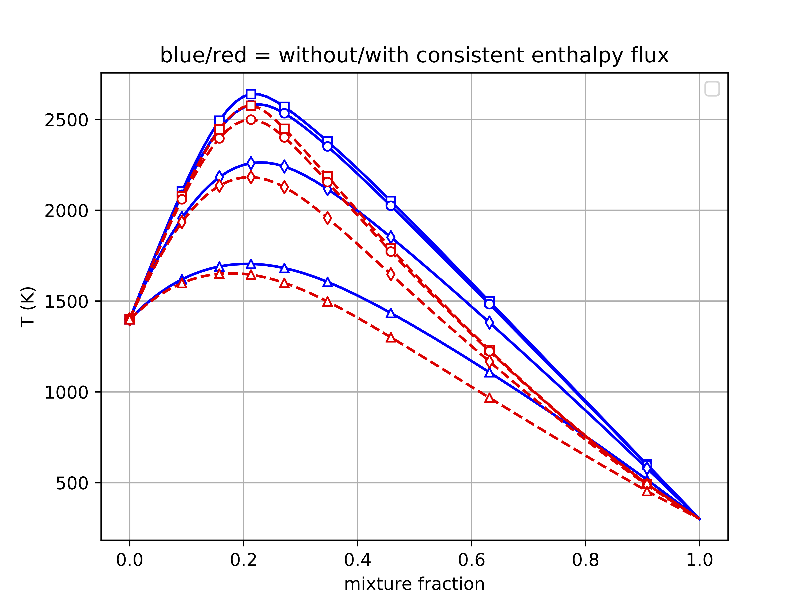

Solving Combustion Problems
===========================

This section describes setting up homogeneous reactors and non-premixed flamelets and computing steady and unsteady solutions,
and the following section discusses relevant combustion theory.

Chemical Mechanisms
+++++++++++++++++++
The first step to solving any combustion problem in Spitfire is setting up the chemical mechanism,
which contains all of the necessary information regarding thermodynamics, chemical kinetics, and (not necessarily) transport properties.
To manage mechanism data, Spitfire uses the Python interface of `Cantera`_.
It is highly recommended for advanced users to become familiar with Cantera's Python interface,
not only for using Spitfire but also for the wealth of useful capabilities of Cantera.

.. _cantera: https://cantera.org/

Mechanism data can be provided to Spitfire in any way that it can be provided to Cantera.
Three useful routes are:

- Build or find a Cantera XML file (often by converting a Cantera CTI or Chemkin database)
- Build a Cantera CTI file manually
- Build a mechanism programmatically with Cantera's Python interface

Mechanisms can be passed to Spitfire with either a Cantera ``Solution`` object or an XML file and phase group.
Behind the scenes both leverage a ``Solution`` object.

Simulating Ignition with a One-Step Mechanism
+++++++++++++++++++++++++++++++++++++++++++++
First, we'll show a simple demonstration of programmatically building a one-step mechanism for n-heptane combustion
and solving the equations governing an perfectly stirred reactor to simulate autoignition.
This description follows the ``spitfire_demo/reactors/one_step_ignition.py`` script.
The first lines in this script past module imports build a custom mechanism for the idealized combustion of heptane.
To obtain the thermodynamic properties of the five species in the model, we leverage an existing XML file.
The reaction is written out in CTI format in a string, following standard Cantera syntax.
Using this data we build a Cantera ``Solution`` object and then a Spitfire ``Mechanism`` instance::

    species_in_model = ['NXC7H16', 'O2', 'H2O', 'CO2', 'N2']
    reaction_cti = '''
    reaction('2 NXC7H16 + 22 O2 => 14 CO2 + 16 H2O', [2e7, 0, (30.0, 'kcal/mol')], order='NXC7H16:0.25 O2:1.5')
    '''
    xml_file_for_species = 'heptane-liu-hewson-chen-pitsch-highT.xml'

    species_data = ct.Species.listFromFile(xml_file_for_species)

    species_list = list()
    for sp in species_data:
        if sp.name in species_in_model:
            species_list.append(sp)

    s = ct.Solution(thermo='IdealGas',
                    kinetics='GasKinetics',
                    species=species_list,
                    reactions=[ct.Reaction.fromCti(reaction_cti)])
    mech = Mechanism.from_solution(s)

Given the mechanism object, we now build 'streams' of reactants and and mix them by equivalence ratio::

    fuel = mech.stream('X', 'NXC7H16:1')
    air = mech.stream(stp_air=True)

    mix = mech.mix_for_equivalence_ratio(phi=1., fuel=fuel, oxy=air)
    mix.TP = 1000, 101325

Finally, we build an adiabatic, isobaric, closed reactor model, tell it to save off the temperature and species mass fractions,
and integrate the reactor to a final time of 100 ms::

    r = HomogeneousReactor(mech_spec=mech,
                           initial_mixture=mix,
                           configuration='isobaric',
                           heat_transfer='adiabatic',
                           mass_transfer='closed')
    r.insitu_process_quantity(['temperature', 'mass fractions'])
    r.integrate_to_time(0.1)

Some Matplotlib code gives the following temperature and mass fraction profiles over the course of the autoignition event.

.. _figure_one_step_ignition:

    Autoignition profiles of the one-step heptane mechanism.

This first example shows a simple end-to-end ignition calculation with a custom-made one-step chemical mechanism.
In the following sections we provide a bit more detail on constructing material streams and reactors
in addition to advanced integration and analysis capabilities.

Streams & Mixing
++++++++++++++++
Having constructed a ``ChemicalMechanismSpec`` instance, either through a Cantera ``Solution`` or XML and phase group,
we need to specify thermochemical properties of mixtures.
In Spitfire this is accomplished with *streams* created by a ``ChemicalMechanismSpec`` instance.
For example, a mixture of pure Hydrogen is created and its temperature and pressure set with::

    h2 = sm.stream('X', 'H2:1')
    h2.TP = 300, 101325

To specify the temperature and pressure at the same time as the composition (mole fractions here), the stream could be created with::

    h2 = sm.stream('TPX', (300, 101325, 'H2:1'))

Streams are instances of the ``Quantity`` class in Cantera's Python interface.
The ``stream`` method on ``ChemicalMechanismSpec`` can be given temperature, pressure, and composition or any combination Cantera allows.
See `Cantera documentation for options`_ regarding the construction of ``Quantity`` instances and setting/getting thermochemical properties.

.. _Cantera documentation for options: https://www.cantera.org/docs/sphinx/html/cython/importing.html#cantera.Quantity

For convenience, Spitfire makes it easy to create a stream of air at standard temperature and pressure::

    air = sm.stream(stp_air=True)

New streams can be composed by mixing existing streams.
Mixing can be done on a mass or mole basis, isobarically or isometrically, to attain a particular equivalence ratio or mixture fraction, etc.

To mix two streams, say, one unit mass of ``h2`` and two unit masses of ``air``, at constant pressure, call::

    mix = sm.mix_streams([(h2, 1.), (air, 2.)], 'mass')

To mix by mole at constant energy and volume (thus pressurizing the mixture)::

    mix2 = sm.mix_streams([(h2, 1.), (air, 2.)], 'mole', 'UV')

Some additional mixing options are discussed in the following sections.

Homogeneous Reactors
++++++++++++++++++++

A simple autoignition example
_____________________________
Starting from the point of constructing streams for air and fuel, we can mix them by specifying an equivalence ratio, :math:`\phi`.
The `equivalence ratio`_ is the actual fuel-to-oxidizer ratio divided by the stoichiometric value.
With the ``h2`` and ``air`` streams, setting it to one yields a stoichiometric mixture of hydrogen and air,
meaning there is just the right amount of oxygen to burn all of the fuel in an ideal combustion reaction::

    mix = sm.mix_for_equivalence_ratio(1.0, h2, air)

.. _equivalence ratio: https://en.wikipedia.org/wiki/Air%E2%80%93fuel_ratio#Fuel%E2%80%93air_equivalence_ratio_(%CF%95)

The equivalence ratio varies from zero to infinity, with lean (too much oxygen) and rich (too much fuel) mixtures below and above one, respectively.
The *normalized* equivalence ratio, :math:`\Phi=\phi/(\phi+1)`, however, varies more nicely from zero to one.
Stoichiometric mixtures correspond to :math:`\phi=1` and :math:`\Phi=0.5`.
As it may be more convenient in some cases, the normalized equivalence ratio can also be used for mixing fuel and air::

    mix = sm.mix_for_normalized_equivalence_ratio(0.5, h2, air)

The temperature and pressure of the fuel-air blend can then be set with ``mix.TP = 1200, 101325``.
Recall that streams are simply instances of the ``Quantity`` class in Cantera's Python interface.
See `Cantera documentation for options`_ regarding the construction of ``Quantity`` instances and setting/getting thermochemical properties.

Now we are ready to fill a reactor with this mixture and simulate its evolution.
First, build a homogeneous reactor that holds a constant pressure (isobaric) and has impermeable (no mass flow - closed) and adiabatic (no heat flow) walls::

    from spitfire import HomogeneousReactor
    r = HomogeneousReactor(sm, mix,
                           configuration='isobaric',
                           heat_transfer='adiabatic',
                           mass_transfer='closed')

Now to run a simple autoignition simulation and plot the temperature history along with several species mass fractions::

    r.integrate_to_steady_after_ignition(plot=['H2', 'O2', 'H2O', 'OH', 'H'])

Adding the ``plot`` argument shows the temperature evolution in the top panel and species mass fractions in the bottom panel, as in Figure :numref:`figure_simple_example_easyplot`.
The occurence of ignition at around 0.05 milliseconds can be seen in the sudden temperature spike, consumption of hydrogen and oxygen, and production of water.
Observe that the hydrogen radical, H, a major chain carrying species, is produced prior to ignition and consumed afterwards, with its mass fraction peaking just at the onset of the temperature spike.
The ignition delay may be printed with the following command, ``print('Ignition delay: {:.1f} us'.format(r.ignition_delay() * 1.e6))``.
The precise number is 51.7 microseconds, matching our estimate of 0.05 milliseconds from the plot.
This simple tutorial can be run in total with the demonstration script, ``spitfire_demo/reactors/simple_ignition_plot.py``.
This script is reproduced here as a summary::

    from spitfire import ChemicalMechanismSpec, HomogeneousReactor

    sm = ChemicalMechanismSpec(cantera_xml='mechanisms/h2-burke.xml', group_name='h2-burke')

    h2 = sm.stream('X', 'H2:1')
    air = sm.stream(stp_air=True)

    mix = sm.mix_for_equivalence_ratio(1.0, h2, air)
    mix.TP = 1200, 101325

    r = HomogeneousReactor(sm, mix,
                           configuration='isobaric',
                           heat_transfer='adiabatic',
                           mass_transfer='closed')

    r.integrate_to_steady_after_ignition(plot=['H2', 'O2', 'H2O', 'OH', 'H'])

    print('Ignition delay: {:.1f} us'.format(r.ignition_delay() * 1.e6))

.. _figure_simple_example_easyplot:
.. figure:: images/simple_example_isobaric_adiabatic_closed_plot.png
    :width: 640px
    :align: center
    :height: 480px
    :figclass: align-center

    Example figure produced by ``r.integrate_to_steady_after_ignition(plot=['H2', 'O2', 'H2O', 'OH', 'H'])``.

In-situ processing and analysis
_______________________________
In the previous example we constructed a reactor and observed its evolution, quickly obtaining a plot of temperature and species mass fraction evolution.
To do more detailed analysis, we'll need to save state variables such as temperature and mass fractions for later use.
Start this next example in the same way, blending fuel and air streams and then using the mixture to construct a homogeneous reactor::

    from spitfire import ChemicalMechanismSpec, HomogeneousReactor

    sm = ChemicalMechanismSpec(cantera_xml='mechanisms/h2-burke.xml', group_name='h2-burke')

    h2 = sm.stream('X', 'H2:1')
    air = sm.stream(stp_air=True)

    mix = sm.mix_for_equivalence_ratio(1.0, h2, air)
    mix.TP = 1200, 101325

    r = HomogeneousReactor(sm, mix,
                           configuration='isobaric',
                           heat_transfer='adiabatic',
                           mass_transfer='closed')

This time, before integrating the reactor to a steady state, we will tell Spitfire to save data.
We will save the temperature, mass fractions, and species net production rates.
This is done with the ``insitu_process_quantity`` method, which allows us to tell Spitfire to compute thermochemical quantities *in situ* during the simulation.
After integration, we can obtain the saved quantities with the ``trajectory_data`` method.
To plot quantities over simulation time, we can use ``t = r.solution_times``::

    r.insitu_process_quantity(['temperature', 'mass fractions', 'production rates'])

    r.integrate_to_steady_after_ignition()

    t = r.solution_times * 1.e6  # scale to microseconds
    T = r.trajectory_data('temperature')
    yH = r.trajectory_data('mass fraction H')
    wH = r.trajectory_data('production rate H')

Importing ``import matplotlib.pyplot as plt``, we can then plot, for example, the production rate of the hydrogen radical over the reactor temperature.
This produces Figure :numref:`figure_simple_example_prodrate_over_T`.
This figure shows that the peak production rate of hydrogen radical occurs at around 200 K above the initial temperature::

    plt.plot(T, wH)
    plt.grid()
    plt.xlabel('T (K)')
    plt.ylabel('prod. rate H (kg/m3/s)')
    plt.show()

.. _figure_simple_example_prodrate_over_T:
.. figure:: images/simple_example_isobaric_adiabatic_closed_wHoverT.png
    :width: 640px
    :align: center
    :height: 480px
    :figclass: align-center

    Net production rate of hydrogen radical over the reactor temperature in an isobaric, adiabatic, closed autoignition simulation.

    A number of quantities may be computed *in situ* with the ``insitu_process_quantity`` method using either cantera or Griffon.
    These are listed below.

- ``'temperature'``: the reactor temperature
- ``'pressure'``: the reactor pressure
- ``'density'``: the mass density of the mixture
- ``'mass fractions'``: species mass fractions - obtain a particular species value with ``'mass fraction A'``
- ``'mole fractions'``: species mole fractions - obtain a particular species value with ``'mole fraction A'``
- ``'energy'``: the specific energy of the mixture
- ``'enthalpy'``: the specific enthalpy of the mixture
- ``'heat capacity cv'``: the specific constant-volume heat capacity of the mixture
- ``'heat capacity cp'``: the specific constant-pressure heat capacity of the mixture
- ``'production rates'``: species net mass production rates - obtain a particular species value with ``'production rate A'``
- ``'heat release rate'``: chemical right-hand side component of the temperature equation. Energy-based for isochoric reactors, enthalpy-based for isobaric. Scaled by the appropriate volumetric heat capacity.
- ``'eigenvalues'``: the full set of eigenvalues of the Jacobian matrix of the chemical source terms

There are two other types of quantities that can be processed *in situ*.
First, one may calculate any quantity computable by the cantera gas phase - see `Cantera documentation for options`_.
For instance, ``r.insitu_process_cantera_method('cp_mass')`` will save the result of the ``cp_mass`` method (which computes the specific heat capacity at constant pressure) at each state to the ``'cp_mass'`` label.
Any label may be specified as in ``r.insitu_process_cantera_method(label='cpm', method='cp_mass')``.
This triggers calculation of ``cp_mass`` at every step and saves the data to the label, ``'cpm'``.
In addition to simple scalar methods such as ``cp_mass``, one can compute particular elements of vector quantities such as elementary reaction rates.
The line, ``r.insitu_process_cantera_method(label='qCB', method='net_rates_of_progress', index=0)`` will save the zeroth (first...) element of the vector computed by the ``net_rates_of_progress`` cantera method, and label it ``qCB``.
For vectors of species quantities, the ``index`` argument can be the species' name, such as in ``r.insitu_process_cantera_method(label='cH', method='concentrations', index='H')``, which computes the molar concentration of species H.
Here are all four examples of general cantera-based processing::

    r.insitu_process_cantera_method('cp_mass')
    r.insitu_process_cantera_method(label='cpm', method='cp_mass')
    r.insitu_process_cantera_method(label='qCB', method='net_rates_of_progress', index=0)
    r.insitu_process_cantera_method(label='cH', method='concentrations', index='H')

And this code plots the rate of the chain-branching reaction, ``H + O2 <-> O + OH``, over time along with temperature in two panels.::

    plt.subplot(211)
    plt.semilogx(t, qCB)
    plt.grid()
    plt.ylabel('net rate (mol/m3/s)')
    plt.title('H + O2 <-> O + OH')
    plt.subplot(212)
    plt.semilogx(t, T)
    plt.grid()
    plt.xlabel('t (us)')
    plt.ylabel('T (K)')
    plt.show()

The final type of *in situ* processing available is chemical explosive mode analysis (CEMA).
To trigger CEMA, call ``r.insitu_process_cema()``.
There are several additional arguments that enable advanced analysis but we do not cover them here.
Calling ``r.insitu_process_cema()`` without any arguments triggers only the most basic technique of CEMA, which is to compute the 'explosive eigenvalue'.
The explosive eigenvalue may be retrieved with ''r.trajectory_data('cema-lexp1')''.
See the demonstration script, ``spitfire_demo/reactors/detailed_ignition_plot.py``, for more.

Ignition delay calculations
___________________________
A common task of combustion codes is to compute the ignition delay - how long it takes a mixture to ignite.
Spitfire's reactor class makes this straightforward with the ``compute_ignition_delay()`` method.
See the demonstration script, ``ignition_delay_profiles_DME_NTC.py,`` in the ``spitfire_demo/reactors/`` directory.
This demonstrates negative temperature coefficient (NTC) behavior of dimethyl ether (DME) mixtures and the dependency of NTC strength on pressure, as in Figure :numref:`figure_dme_ntc_curves`

.. _figure_dme_ntc_curves:
.. figure:: images/dme_ntc_curves.png
    :width: 640px
    :align: center
    :height: 480px
    :figclass: align-center

    Ignition delay curves of dimethyl ether mixtures for a number of pressures, demonstrating both the negative temperature coefficient behavior and its sensitivity to pressure

Computing ignition-extinction curves
____________________________________
Another common task is to assess the presence of multiple steady states along ignition-extinction curves.
The ignition branch is computed by increasing the mixing time of an open reactor increases from zero to infinity.
Reversing the direction gives the extinction branch.
The ``spitfire_demo/reactors/ignext_ethylene_mechanism_comparison.py`` script shows how one can compute ignition-extinction curves with Spitfire.

Time-dependent parameters
_________________________
In the ignition-extinction demonstration scripts we build reactors with constant parameters (e.g. mixing time, feed temperature).
It is simple to specify the reactor parameters as functions of time.
Instead of providing a value for a parameter, provide a callable object such as a function, lambda, or class with the ``__call__`` method defined (note that the first argument in the function must be time, and only one argument is given).
For example, the ``spitfire_demo/reactors/open_reactor_oscillatory_feed_temperature.py`` script specifies the feed temperature as a sine wave of time with a lambda.
This slow oscillation of the feed temperature causes the reactor to periodically ignite and extinguish as shown in Figure :numref:`figure_oscillating_feed_temperature`.
Also note that in this script we do not compute a steady solution, instead using the ``integrate_to_time`` method of the reactor to integrate only until reaching a specified simulation time.

.. _figure_oscillating_feed_temperature:
.. figure:: images/oscillatory_feed_temp_example.png
    :width: 640px
    :align: center
    :height: 480px
    :figclass: align-center

    Periodic ignition and extinction in a reactor due to slow oscillation of the feed stream temperature

Reactor types
_____________
A few other demonstration scripts in ``spitfire_demo/reactors/`` that haven't been covered in previous sections showcase some of the reactor types available in Spitfire.
Spitfire provides three types of specifications and twelve types of reactors in total:

- **configuration**: whether the reactor is isobaric (constant pressure) or isochoric (constant volume)
- **heat_transfer**: whether the reactor is adiabatic (no heat flow), isothermal (constant temperature), or diathermal (convective and radiative heat transfer with external media)
- **mass_transfer**: whether the reactor is open (mass flow with specified mixing time and inflow stream) or closed (no mass flow)

Spitfire requires diathermal reactors to have a geometry.
The shape is relevant because it determines ratio of surface area to volume, which plays a role in balancing volumetric heat release due to chemistry against heat transfer across a surface.
The ``spitfire_demo/reactors/open_reactors_isobaric_diathermal_shapes.py`` example shows the impact of reactor geometry, with high surface areas corresponding to stronger heat loss.
The different reactors each have the same volume, but distinct surface areas lead to more or less heat loss.

Two other interesting demonstration scripts are included:
``spitfire/demo/reactors/open_reactors_isobaric_isothermal_with_analysis.py`` gives an example of detailed chemical explosive mode analysis on an isothermal reactor.
``spitfire/demo/reactors/open_reactor_oscillatory_convection.py`` involves kinetics, mass transfer (a hot feed stream), and heat transfer (convective losses to a cool fluid) simultaneously.
The convection coefficient oscillates in time to force periodic ignition and extinction.

Non-premixed Flamelets
++++++++++++++++++++++
Spitfire provides a convenient Python API for solving the nonpremixed flamelet equations,
a critical piece of building tabulated chemistry models for simulation of reactive flow systems.
An API is provided for directly building a range of tabulated chemistry models; it is discussed later.
Here we show several examples of solving the steady and unsteady nonpremixed flamelet equations, including both ignition and extinction phenomena.

Spitfire provides a number of convenient methods of solving steady and unsteady nonpremixed flamelets, both adiabatic and nonadiabatic.

A special method is provided for building adiabatic steady flamelet libraries, a common task required for large eddy simulation and flow-resolved direct numerical simulation of combustion systems.
The first demonstration discussed here, in ``spitfire/demo/flamelet/adiabatic-table-generation.py``, uses this method to build an adiabiatic flamelet library for a hydrogen-air system.
With the ``build_adiabatic_slfm_table`` method, we first build a dictionary with a mechanism wrapper, oxidizer and fuel streams (as discussed in prior demonstrations), and specify a pressure and number of grid points to discretize mixture fraction space.::

    flamelet_specs = {'mech_spec': m,
                      'pressure': pressure,
                      'oxy_stream': air,
                      'fuel_stream': fuel,
                      'grid_points': 34}

Next we specify the thermochemical quantities and transport properties to compute on the table.
A common set required for flame simulation, which typically requires at least density and viscosity, is::

    quantities = ['temperature', 'density', 'mass fraction OH', 'viscosity']

As in the Python script, we then use the table builder method as follows::

    table_coarse = build_adiabatic_slfm_table(flamelet_specs,
                                              quantities,
                                              lower_chimax=1.e-1,
                                              upper_chimax=1.e4,
                                              n_chimax=6)

This particular call specifies the flamelet specifications, tabulated quantities, bounds of the dissipation rate, and the number of dissipation rates to save.
Only six are saved here for the demonstration, while a call shortly afterwards builds a finer table with forty dissipation rates.
The following matplotlib commands in the Python script produce the plots below,
one showing the profiles of each quantity in mixture fraction and the other showing contours on the mixture fraction and dissipation rate space.

.. _figure_steady_adiabatic_h2_flamelet_profiles:
.. figure:: images/steady_adiabatic_h2_flamelet_profiles.png
    :width: 660px
    :align: center
    :figclass: align-center

    Selected profiles of several quantities over mixture fraction space for steady, adiabatic hydrogen flamelets

.. _figure_steady_adiabatic_h2_flamelet_contours:

    Contours of several quantities over mixture fraction and dissipation rate space for steady, adiabatic hydrogen flamelets

The ``build_adiabatic_slfm_table`` method is the simplest option for building adiabatic, steady flamelet libraries.
In the ``spitfire/demo/flamelet/steady-adiabatic-with-enthalpy-flux.py`` script, we use this function to build two libraries,
computed with or without the consistent enthalpy flux discussed in the theory section.
To enable the flux or not, we simply build the ``flamelet_specs`` object differently.
This allows a simple observation of the impact of the consistent enthalpy flux formulation on flamelet temperature profiles,
shown here in Figure :numref:`figure_steady_adiabatic_h2_flamelet_contours`.

.. _figure_steady_adiabatic_h2_flamelet_profiles_enthalpy_flux:

    Comparison of temperature profiles of steady, adiabiatic hydrogen flamelets for several dissipation rates with and without the consistent enthalpy flux

This documentation is in progress... TODO:

- steady, nonadiabatic demo (quasi steady heat loss)
- make a nonadiabiatic demo with the transient heat loss formulation
- unsteady, adiabatic with cema demo
- steady coal flamelet demo
- jupyter demos - clean up necessary

Flamelet Models for Tabulated Chemistry
+++++++++++++++++++++++++++++++++++++++

Combustion Theory
=================

This section details the theory behind Spitfire's combustion modeling capabilities.
We present the governing equations for homogeneous reactors and non-premixed flamelets,
techniques for building tabulated chemistry models,
and supported reaction rate laws and thermodynamic property models.

Governing Equations for Homogeneous Reactors
++++++++++++++++++++++++++++++++++++++++++++
Homogeneous, or 'zero-dimensional,' reactor models represent well-mixed combustion systems wherein there are no spatial gradients in any quantity describing the chemical mixture.
In such a system the temperature :math:`T`, pressure :math:`p`, and composition, expressed by the mass fractions :math:`\{Y_i\}`, are all homogeneous and a reactor may be modeled as a point in space whose properties vary only in time, :math:`t`.
Zero-dimensional systems are idealizations of very complex systems but have their place in the modeling of combustion processes.
In a lab setting this idealization can be approached with *jet-stirred reactors* (JSR, also commonly referred to as a continuous stirred tank reactor (CSTR), perfectly stirred reactor (PSR), and Longwell reactor) and *rapid compression machines* (RCM).
A JSR is a continuous stirred tank reactor to which reactants are fed and mixed rapidly through several opposed jets.
A JSR unit coupled with downstream gas chromatography and mass spectrometry can be used to quantify the composition of the chemical mixture as reaction proceeds.
Detailed models of combustion kinetics are developed through comparison with experimental data from such systems.
The rapid computational solution of kinetic models for simple, zero-dimensional reactors is of great fundamental importance to combustion modeling.

In Spitfire we model mixtures of ideal gases in twelve types of reactors distinguished by their *configuration*, *heat transfer*, and *mass transfer*.
We use *configuration* to distinguish isochoric, or constant-volume, reactors from isobaric, or constant-pressure, ones.
*Mass transfer* refers to a closed, or batch, reactor or an open reactor with mass flow at specified mean residence time.
Three types of *heat transfer* are available:

- adiabatic: a reactor with insulated walls that allow no heat transfer with the surroundings
- isothermal: a reactor whose temperature is held exactly constant for all time
- diathermal: a reactor whose walls allow a finite rate of heat transfer by radiative heat transfer to a nearby surface and convective heat transfer to a fluid flowing around the reactor

Below we detail the equations governing isochoric and isobaric reactors with any pair of models for mass and transfer.
In all cases the ideal gas law applies,

.. math::
 p = \rho R_\mathrm{mix} T,
 :label: ideal_gas_law

where the mixture specific gas constant, :math:`R_\mathrm{mix}`, is the universal molar gas constant divided by the mixture molar mass,

.. math::
 M_\mathrm{mix} = \left(\sum_{i=1}^{n}\frac{Y_i}{M_i}\right)^{-1},
 :label: mixture_molar_mass

where :math:`M_i` is the molar mass of species :math:`i` in a mixture with :math:`n` distinct species.
Additionally for all reactors the mass fractions, of which only :math:`n-1` are independent, are related by

.. math::
 Y_n = 1 - \sum_{i=1}^{n-1}Y_i.
 :label: Y_n_eqn

Isochoric Reactors
__________________

Figure :numref:`figure_isochoric_reactor_diagram` diagrams an open, constant-volume reactor with diathermal walls.
The reactor has volume :math:`V` and surface area :math:`A`.
Convective heat transfer is described by a fluid temperature :math:`T_\infty` and convective heat transfer coefficient :math:`h`.
Radiative heat transfer is determined by the temperature of the surface, :math:`T_\mathrm{surf}`, and effective emissivity, :math:`\varepsilon`.
Finally, for an isochoric reactor, mass transfer is specified by the residence time :math:`\tau`, based on volumetric flow rate, and inflowing state
with temperature :math:`T_\mathrm{in}`, density :math:`\rho_\mathrm{in}`, and mass fractions :math:`\{Y_{i,\mathrm{in}}\}`.

.. _figure_isochoric_reactor_diagram:
.. figure:: images/isochoric-reactor-diagram.png
    :width: 660px
    :align: center
    :figclass: align-center

    Isochoric reactor with mass transfer and convective and radiative heat transfer

Isochoric reactors are governed by the following equations for the reactor density, temperature, and first :math:`n-1` mass fractions.
:math:`\omega_i` is the net mass production rate of species :math:`i` due to chemical reactions,
:math:`c_v` is the specific, isochoric heat capacity of the mixture,
and :math:`e_i` and :math:`e_{i,\mathrm{in}}` are the specific internal energy of species :math:`i` in the feed and reactor.
:math:`\sigma` is the Stefan-Boltzmann constant.
We solve these equations in Spitfire to maximize sparsity and minimize calculation cost of Jacobian matrices.
Recent work [MJ2018]_ has shown that the conservation error that results from solving a temperature equation instead of an energy equation is negligible when high-order time integration methods such as those in Spitfire are used.
Closed reactors are obtained by setting :math:`\tau\to\infty`.
Adiabatic reactors are obtained by setting :math:`h,\varepsilon\to0`.
Isothermal reactors are obtained by setting the entire right-hand side of the temperature equation to zero.

.. math::
 \frac{\partial \rho}{\partial t} = \frac{\rho_\mathrm{in} - \rho}{\tau},
 :label: isochoric_rho_eqn

.. math::
 \frac{\partial Y_i}{\partial t} = \frac{\rho_\mathrm{in}}{\rho}\frac{Y_{i,\mathrm{in}} - Y_i}{\tau} + \frac{\omega_i}{\rho}, \quad i=1,\ldots,n-1
 :label: isochoric_Yi_eqn

.. math::
 \frac{\partial T}{\partial t} = \frac{\rho_\mathrm{in}}{\rho \tau c_v}\sum_{i=1}^{n}Y_{i,\mathrm{in}}(e_{i,\mathrm{in}} - e_i) - \frac{1}{\rho c_v}\sum_{i=1}^{n}\omega_i e_i + \frac{1}{\rho c_v}\frac{A}{V}\left(h(T_\infty - T) + \varepsilon\sigma(T_\mathrm{surf}^4 - T^4)\right),
 :label: isochoric_T_eqn

.. [MJ2018] Michael A. Hansen, James C. Sutherland,
    On the consistency of state vectors and Jacobian matrices,
    Combustion and Flame,
    Volume 193,
    2018,
    Pages 257-271,

Isobaric Reactors
_________________

Figure :numref:`figure_isobaric_reactor_diagram` diagrams an open, constant-pressure reactor with diathermal walls.
The pressure, :math:`p`, of this reactor is held constant by the motion of a weightless, frictionless piston.
The expansion work done by this process is an important difference between isobaric and isochoric reactors.
We solve the following equations governing isobaric reactors.
:math:`c_p` is the specific, isobaric heat capacity of the mixture,
and :math:`h_i` and :math:`h_{i,\mathrm{in}}` are the specific internal enthalpy of species :math:`i` in the feed and reactor.

.. math::
 \frac{\partial Y_i}{\partial t} = \frac{Y_{i,\mathrm{in}} - Y_i}{\tau} + \frac{\omega_i}{\rho}, \quad i=1,\ldots,n-1
 :label: isobaric_Yi_eqn

.. math::
 \frac{\partial T}{\partial t} = \frac{1}{\tau c_p}\sum_{i=1}^{n}Y_{i,\mathrm{in}}(h_{i,\mathrm{in}} - h_i) - \frac{1}{\rho c_p}\sum_{i=1}^{n}\omega_i h_i + \frac{1}{\rho c_p}\frac{A}{V}\left(h(T_\infty - T) + \varepsilon\sigma(T_\mathrm{surf}^4 - T^4)\right),
 :label: isobaric_T_eqn

.. _figure_isobaric_reactor_diagram:
.. figure:: images/isobaric-reactor-diagram.png
    :width: 660px
    :align: center
    :figclass: align-center

    Isobaric reactor with expansion work, mass transfer, and convective and radiative heat transfer

Governing Equations for Non-premixed Flamelets
++++++++++++++++++++++++++++++++++++++++++++++
The unsteady flamelet equations describe the evolution of mass fractions :math:`Y_i` and temperature :math:`T`
in a Lagrangian time :math:`t` and the mixture fraction :math:`\mathcal{Z}`.
Equations :eq:`adiabatic_flamelet_Yi_eqn` and :eq:`adiabatic_flamelet_T_eqn` govern adiabatic flamelets,
which evolve due to diffusion (with strength proportional the scalar dissipation rate :math:`\chi`) and chemistry.
These equations do not account for differential diffusion, which is currently not supported in Spitfire.
The term in the temperature equation with single derivatives in :math:`\mathcal{Z}` is not seen in all flamelet
equations as it requires careful derivation.
This term models enthalpy diffusion and is optional in Spitfire (specify ``include_enthalpy_flux=True`` when building a flamelet object).
Steady flamelets are derived from these equations by simply removing the time term, which leaves the steady flamelet equations
that define the diffusive-reactive balance presumed in the ensemble of thin laminar flames in a turbulent flame (in the flamelet modeling approach).

todo: update for the variable cp term

todo: update the diffusive flux definition

.. math::
    \frac{\partial Y_i}{\partial t} = \frac{\chi}{2}\frac{\partial^2 Y_i}{\partial \mathcal{Z}^2} + \frac{\omega_i}{\rho},
    :label: adiabatic_flamelet_Yi_eqn

.. math::
    \frac{\partial T}{\partial t} = \frac{\chi}{2}\left(\frac{\partial^2 T}{\partial \mathcal{Z}^2} + \frac{\partial T}{\partial \mathcal{Z}}\sum_{i=1}^{n}\frac{c_{p,i}}{c_p}\frac{\partial Y_i}{\partial \mathcal{Z}}\right) - \frac{1}{\rho c_p}\sum_{i=1}^{n}\omega_i h_i.
    :label: adiabatic_flamelet_T_eqn

These equations are supplemented by boundary conditions defined by the oxidizer and fuel states,

.. math::
    T(t, 0) &= T_{\mathrm{oxy}}, \\
    Y_i(t, 0) &= Y_{i,\mathrm{oxy}}, \\
    T(t, 1) &= T_{\mathrm{fuel}}, \\
    Y_i(t, 1) &= Y_{i,\mathrm{fuel}}.

The dissipation rate :math:`\chi` can be a constant or depend on the mixture fraction as

.. math::
    \chi(\mathcal{Z}) = \chi_{\mathrm{max}} \exp\left( -2\left[\mathrm{erfinv}(2\mathcal{Z}-1)\right]^2 \right).

Spitfire also supports nonadiabatic flamelets, which modifies only the temperature equation,

.. math::
    \frac{\partial T}{\partial t} = \left.\frac{\partial T}{\partial t}\right|_{\mathrm{adiabatic}} + \frac{1}{\rho c_p}\left(h(T_\infty - T) + \varepsilon\sigma(T_\mathrm{surf}^4 - T^4)\right).
    :label: nonadiabatic_flamelet_T_eqn

Spitfire allows the convection and radiation coefficients and temperatures to vary over the mixture fraction.
A special option for building transient heat loss flamelet libraries involves the following choices
(enabled with ``use_scaled_heat_loss=True``).

.. math::
    T_\infty &= T_\mathrm{oxy} + \mathcal{Z}(T_\mathrm{fuel} - T_\mathrm{oxy}), \\
    h &= h' \chi_{\mathrm{max}} \frac{1 - \mathcal{Z}_{\mathrm{st}} }{ \mathcal{Z}_{\mathrm{st}} }, \\
    \varepsilon &= 0,

where :math:`\mathcal{Z}_{\mathrm{st}}` is the stoichiometric mixture fraction and
:math:`h'` is an arbitrary parameter of order :math:`10^7` to drive a flamelet to extinction due to heat loss.

Flamelet Tabulation Techniques
++++++++++++++++++++++++++++++

Chemical Kinetic Models
+++++++++++++++++++++++
Spitfire currently supports various forms of reaction rate expressions for homogeneous gas-phase systems.
Let :math:`n_r` be the number of elementary reactions.
The net mass production rate of species :math:`i` is then

.. math::
    \omega_i = M_i \sum_{j=1}^{n_r}\nu_{i,j}q_j,

where :math:`\nu_{i,j}` is the net molar stoichiometric coefficient of species :math:`i` in reaction :math:`j` and :math:`q_j` is the rate of progress of reaction :math:`j`.

The rate of progress is decomposed into two parts: first, the mass action component :math:`\mathcal{R}_j`, and second, the TBAF component :math:`\mathcal{C}_j` which contains third-body enhancement and falloff effects.

.. math::
    q_j = \overset{\text{mass action}}{\mathcal{R}_j}\cdot\overset{\text{3-body + falloff}}{\mathcal{C}_j}.

The mass action component consists of forward and reverse rate constants :math:`k_{f,j}` and :math:`k_{r,j}` along with products of species concentrations :math:`\left\langle c_k\right\rangle`,

.. math::
    \mathcal{R}_j = k_{f,j}\prod_{k=1}^{N}\left\langle c_k\right\rangle^{\nu^f_{k,j}} - k_{r,j}\prod_{k=1}^{N}\left\langle c_k\right\rangle^{\nu^r_{k,j}},

in which :math:`\nu^f_{i,j}` and :math:`\nu^r_{i,j}` are the forward and reverse stoichiometric coefficients of species :math:`i` in reaction :math:`j`, respectively.

The forward rate constant is found with a modified Arrhenius expression,

.. math::
    k_{f,j} = A_j T^{b_j} \exp\left(-\frac{E_{a,j}}{R_u T}\right) = A_j T^{b_j} \exp\left(-\frac{T_{a,j}}{T}\right),

where :math:`A_j`, :math:`b_j`, and :math:`E_{a,j}` are the pre-exponential factor, temperature exponent, and activation energy of reaction :math:`j`, respectively.
We define :math:`T_{a,j}=E_{a,j}/R_u` as the activation temperature.

The reverse rate constant of an irreversible reaction is zero.
:math:`k_{r,j}` for a reversible reaction is found with the equilibrium constant :math:`K_{c,j}`, via :math:`k_{r,j} = k_{f,j}/K_{c,j}`.
The equilibrium constant is

.. math::
    K_{c,j} = \left(\frac{p_\text{atm}}{R_u}\right)^{\Xi_j}\exp\left(\sum_{k=1}^{N}\nu_{k,j}B_k\right),

where :math:`\Xi_j=\sum_{k=1}^{N}\nu_{k,j}` and :math:`B_k` is

.. math::
    B_k = -\ln(T) + \frac{M_k}{R_u}\left(s_k - \frac{h_k}{T}\right).

For the TBAF component :math:`\mathcal{C}_j` there are two nontrivial cases: (1) a three-body reaction and, (2) a unimolecular/recombination falloff reaction.
If a reaction is not of a three-body or falloff type, then :math:`\mathcal{C}_j = 1`.
For three-body reactions, it is

.. math::
    \mathcal{C}_j = \left\langle c_{TB,j}\right\rangle = \sum_{i=1}^{N}\alpha_{i,j}\left\langle c_i\right\rangle,

where :math:`\alpha_{i,j}` is the third-body enhancement factor of species :math:`i` in reaction :math:`j`, and :math:`\left\langle c_{TB,j}\right\rangle` is the third-body-enhanced concentration of reaction :math:`j`.
The quantity :math:`\alpha_{i,j}` defaults to one if not specified.
For falloff reactions, the TBAF component is

.. math::
    \mathcal{C}_j = \frac{p_{fr,j}}{1 + p_{fr,j}}\mathcal{F}_j,

in which :math:`p_{fr,j}` and :math:`\mathcal{F}_j` are the falloff reduced pressure and falloff blending factor, respectively.
The falloff reduced pressure is

.. math::
    p_{fr,j} = \frac{k_{0,j}}{k_{f,j}}\mathcal{T}_{F,j},

where :math:`k_{0,j}` is the low-pressure limit rate constant evaluated with low-pressure Arrhenius parameters :math:`A_{0,j}`, :math:`b_{0,j}`, :math:`E_{a,0,j}`, and :math:`\mathcal{T}_{F,j}` is the concentration of the mixture
which is either that of a single species if specified or the third-body-enhanced concentration if not.

The falloff blending factor :math:`\mathcal{F}_j` depends upon the specified falloff form.
For the Lindemann approach, :math:`\mathcal{F}_j = 1`.
In the Troe form,

.. math::
    \mathcal{F}_j &= \mathcal{F}_{\text{cent}}^{1/(1+(A/B)^2)}, \\
    \mathcal{F}_{\text{cent}} &= (1-a_{\text{Troe}})\exp\left(-\frac{T}{T^{***}}\right) + a_{\text{Troe}}\exp\left(-\frac{T}{T^{*}}\right) + \exp\left(-\frac{T^{**}}{T}\right), \\
    A &= \log_{10}p_{FR,j} - 0.67\log_{10}\mathcal{F}_{\text{cent}} - 0.4, \\
    B &= 0.806 - 1.1762\log_{10}\mathcal{F}_{\text{cent}} - 0.14\log_{10}p_{FR,j},

where :math:`a_{\text{Troe}}`, :math:`T^{*}`, :math:`T^{**}`, and :math:`T^{***}` are specified parameters of the Troe form.
If :math:`T^{***}` is unspecified in the mechanism file then its term is ignored.

todo: add description of new non-elementary reaction rates

Species Thermodynamics
++++++++++++++++++++++
Spitfire supports thermodynamics (enthalpies, entropies, equilibrium coefficients, etc.) based on two models of
species heat capacities.
First is a species with a constant heat capacity:

.. math::
    c_{p,i} &= c_{p,i}^\circ, \\
    h_i &= h_i^\circ + c_{p,i}^\circ(T - T^\circ), \\
    s_i &= s_i^\circ + c_{p,i}^\circ\ln\left(\frac{T}{T^\circ}\right),

where :math:`h_i^\circ` and :math:`s_i^\circ` are the standard state enthalpy and entropy of formation.

Second is a species with a variable heat capacity determined by the NASA-7 polynomials:

.. math::
    c_{p,i} &= \frac{R_u}{M_i}\left(a_0 + a_1T + a_2T^2 + a_3T^3 + a_4T^4\right), \\
    h_i &= \frac{R_u}{M_i}\left(a_0T + \frac{a_1}{2}T^2 + \frac{a_2}{3}T^3 + \frac{a_3}{4}T^4 + \frac{a_4}{5}T^5 + a_5\right), \\
    s_i &= \frac{R_u}{M_i}\left(a_0\ln(T) + a_1T + \frac{a_2}{2}T^2 + \frac{a_3}{3}T^3 + \frac{a_4}{4}T^4 + a_6\right),

where :math:`a_i` are the coefficients of the polynomial (in a particular temperature range) and :math:`R_u` is the universal molar gas constant.

