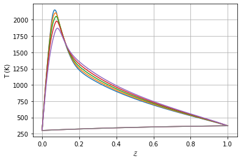
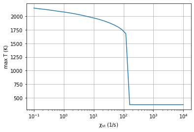
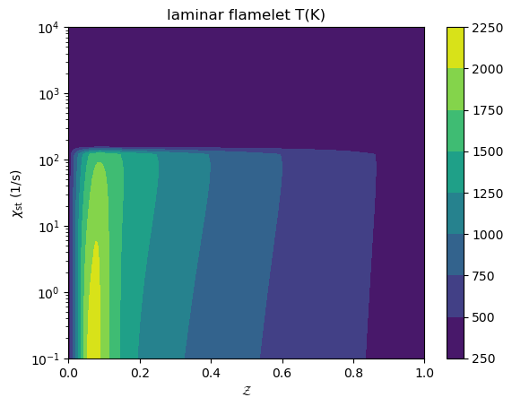
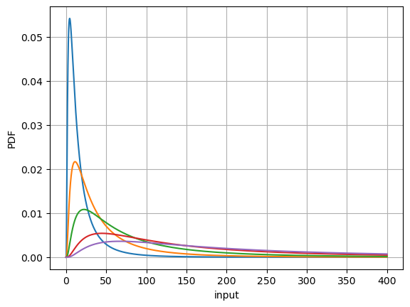
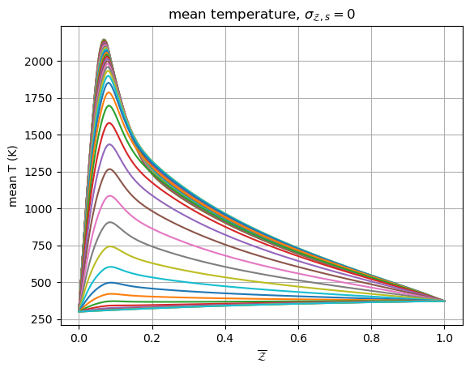
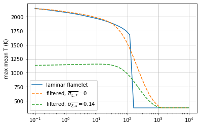
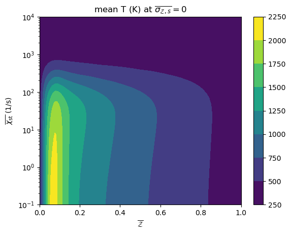
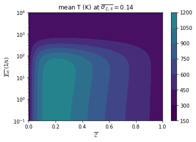
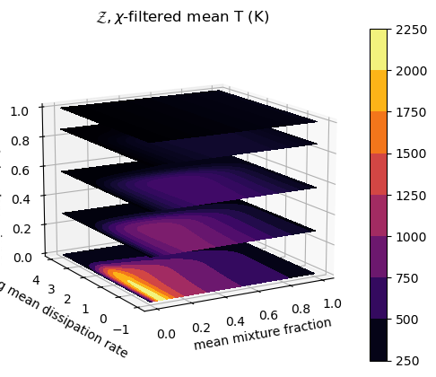

Custom Presumed PDF: log-mean PDF of the scalar dissipation rate
================================================================

*This demo is part of Spitfire, with*\ `licensing and copyright info
here. <https://github.com/sandialabs/Spitfire/blob/master/license.md>`__

*Highlights*

- Building presumed PDF adiabatic and nonadiabatic SFLM libraries for turbulent flows

- Using Spitfire’s wrapper around the Python interface of ``TabProps`` <https://multiscale.utah.edu/software/> to easily extend tables with clipped Gaussian and Beta PDFs

In this demo, we build reaction models and then incorporate custom built presumed PDF mixing models to perform the convolution integrals outlined in the mixing model documentation.

Reaction Model
--------------

We’ll start by building a standard adiabatic SLFM library for an
n-heptane/air mixture, except in this case we’ll specify a very wide
range of the stoichiometric dissipation rate and set
``include_extinguished=True`` to keep non-burning states after
extinction in the library. You can verify this with the plots below,
where the discontinuity of extinction is clear.

.. code:: ipython3

    from spitfire import (ChemicalMechanismSpec, 
                          FlameletSpec, 
                          build_adiabatic_slfm_library,
                          apply_mixing_model,
                          PDFSpec,
                          Library)
    import matplotlib.pyplot as plt
    from matplotlib.colors import Normalize
    import numpy as np
    
    mech = ChemicalMechanismSpec(cantera_xml='heptane-liu-hewson-chen-pitsch-highT.xml', 
                                 group_name='gas')
    
    flamelet_specs = FlameletSpec(mech_spec=mech, 
                                  initial_condition='equilibrium',
                                  oxy_stream=mech.stream(stp_air=True),
                                  fuel_stream=mech.stream('TPY', (372., 101325., 'NXC7H16:1')),
                                  grid_points=64)
    
    slfm = build_adiabatic_slfm_library(flamelet_specs,
                                        diss_rate_values=np.logspace(-1, 4, 40),
                                        diss_rate_ref='stoichiometric',
                                        include_extinguished=True,
                                        verbose=False)
    
    plt.plot(slfm.mixture_fraction_values, slfm['temperature'][:, ::5])
    plt.xlabel('$\\mathcal{Z}$')
    plt.ylabel('T (K)')
    plt.grid()
    plt.show()
    plt.semilogx(slfm.dissipation_rate_stoich_values, np.max(slfm['temperature'], axis=0), 
                 '-', markersize=2)
    plt.xlabel('$\\chi_{\\rm st}$ (1/s)')
    plt.ylabel('max T (K)')
    plt.grid()
    plt.show()
    plt.contourf(slfm.mixture_fraction_grid, 
                 slfm.dissipation_rate_stoich_grid,
                 slfm['temperature'])
    plt.yscale('log')
    plt.xlabel('$\\mathcal{Z}$')
    plt.ylabel('$\\chi_{\\rm st}$ (1/s)')
    plt.title('laminar flamelet T(K)')
    plt.colorbar()
    plt.show()

The User-Defined PDF Class
--------------------------

Here we use a one-parameter logarithmic mean PDF for the dissipation
rate (in addition to a clipped Gaussian PDF for the scalar variance).
The class below defines several key methods, some of which are required
for the integration in Spitfire.

-  ``set_mean(self, mean)``: necessary API for Spitfire’s PDF
   integration.
-  ``set_variance(self, variance)``/``set_scalar_variance(self, variance)``:
   one of these is needed, even though there isn’t a variance in this
   PDF, as Spitfire will internally call one of the two methods
   depending on which of ``variance_values`` or
   ``scalar_variance_values`` is provided as an argument to
   ``apply_mixing_model``.
-  ``integrate(self, interpolant)``: necessary for the internal API,
   which will provide a 1D interpolant with a call operator. The
   integrand being integrated must be the PDF multiplied by the
   interpolant. Here we simply use Simpson’s rule as the log mean PDF
   seems pretty simple to integrate. In general, adaptive quadrature
   should be used to guarantee accurate results.
-  ``get_pdf(self, x)``: completely unnecessary for integration with the
   PDF, but convenient for visualization.
-  override the ``__str__(self)`` method as shown for more verbose error messaging.

.. code:: ipython3

    from scipy.integrate import simps as simpson
    
    class LogMean1ParamPDF:
        def __init__(self, sigma):
            self._sigma = sigma
            self._mu = 0.
            self._s2pi = np.sqrt(2. * np.pi)
            self._xt = np.logspace(-6, 6, 1000)
            self._pdft = np.zeros_like(self._xt)

        def __str__(self):
            return f'LogMean1ParamPDF, sigma={self._sigma}'

        def get_pdf(self, x):
            s = self._sigma
            m = self._mu
            return 1. / (x * s * self._s2pi) * np.exp(-(np.log(x) - m) * (np.log(x) - m) / (2. * s * s))

        def set_mean(self, mean):
            self._mu = np.log(mean) - 0.5 * self._sigma * self._sigma
            self._pdft = self.get_pdf(self._xt)
        
        def set_variance(self, variance):
            pass
        
        def set_scaled_variance(self, variance):
            raise ValueError('cannot use set_scaled_variance on LogMean1ParamPDF, use direct variance values')
        
        def integrate(self, interpolant):
            ig = interpolant(self._xt) * self._pdft
            return simpson(ig, x=self._xt)
        
    lm_pdf = LogMean1ParamPDF(1.0)
    
    xtest = np.logspace(-3, np.log10(400), 10000)
        
    for mean in [20., 50., 100.0, 200, 300]:
        lm_pdf.set_mean(mean)
        plt.plot(xtest, lm_pdf.get_pdf(xtest))
    plt.grid()
    plt.xlabel('input')
    plt.ylabel('PDF')
    plt.show()

Integrating the Custom PDF
--------------------------

Now we simply provide our instance of the class, ``lm_pdf``, as the
``pdf`` argument to the ``PDFSpec`` for ``apply_mixing_model``. We just
set a single ``variance_value`` here because we’re not actually adding
an entire range of variances with the one-parameter log-mean PDF. Also,
note that the ``set_variance()`` method on the class above doesn’t
actually use the value, which is just set to ``1.`` for simplicity.

An important consequence of only specifying a single variance or scaled
variance value is that the resultant library will be ``squeeze``\ d so
that no additional dimensions are actually added. You can see this below
when we print the library - it doesn’t have a
``dissipation_rate_stoich_variance_mean`` dimension.

.. code:: ipython3

    # remove the mass fractions to speed up the convolution integrals - we're only observing the temperature here
    mass_fracs = slfm.props
    mass_fracs.remove('temperature')
    slfm.remove(*mass_fracs)
    
    slfm_t = apply_mixing_model(
        slfm,
        verbose=True,
        mixing_spec={'dissipation_rate_stoich': PDFSpec(pdf=lm_pdf, variance_values=np.array([1.])),
                     'mixture_fraction': PDFSpec(pdf='ClipGauss', scaled_variance_values=np.linspace(0, 1, 8))},
        num_procs=4
        )
    
    print(slfm_t)

.. parsed-literal::

    dissipation_rate_stoich_variance: computing 2560 integrals... completed in 1.1 seconds, average = 2374 integrals/s.
    scaled_scalar_variance_mean: computing 20480 integrals... completed in 4.5 seconds, average = 4562 integrals/s.
    
    Spitfire Library with 3 dimensions and 1 properties
    ------------------------------------------
    1. Dimension "mixture_fraction_mean" spanning [0.0, 1.0] with 64 points
    2. Dimension "dissipation_rate_stoich_mean" spanning [0.1, 10000.0] with 40 points
    3. Dimension "scaled_scalar_variance_mean" spanning [0.0, 1.0] with 8 points
    ------------------------------------------
    temperature         , min = 299.99991531427054 max = 2144.707709229305
    Extra attributes: {'mech_spec': <spitfire.chemistry.mechanism.ChemicalMechanismSpec object at 0x7f8b4393ee10>, 'mixing_spec': {'dissipation_rate_stoich': <spitfire.chemistry.tabulation.PDFSpec object at 0x7f8b3d2935d0>, 'mixture_fraction': <spitfire.chemistry.tabulation.PDFSpec object at 0x7f8b3d293590>}}
    ------------------------------------------
    

Visualizing the Result
----------------------

Now we finish up with some plots. Note especially the effect filtering
the dissipation rate has on the max temperature plot - we’ve actually
smoothed the extinction behavior over a much larger range of the mean
dissipation rate.

.. code:: ipython3

    plt.plot(slfm_t.mixture_fraction_mean_values, np.squeeze(slfm_t['temperature'][:, :, 0]))
    plt.xlabel('$\\overline{\\mathcal{Z}}$')
    plt.ylabel('mean T (K)')
    plt.title('mean temperature, $\\sigma_{\\mathcal{Z},s}=0$')
    plt.grid()
    plt.show()
    plt.semilogx(slfm.dissipation_rate_stoich_values, np.max(slfm['temperature'], axis=0), 
                 '-', markersize=2, label='laminar flamelet')
    plt.semilogx(slfm_t.dissipation_rate_stoich_mean_values, np.max(slfm_t['temperature'], axis=0)[:, 0], 
                 '--', markersize=2, label='filtered, $\\overline{\\sigma_{\\mathcal{Z},s}}=0$')
    plt.semilogx(slfm_t.dissipation_rate_stoich_mean_values, np.max(slfm_t['temperature'], axis=0)[:, 1], 
                 '--', markersize=2, label='filtered, $\\overline{\\sigma_{\\mathcal{Z},s}}=0.14$')
    plt.ylabel('$\\overline{\\chi_{\\rm st}}$ (1/s)')
    plt.ylabel('max mean T (K)')
    plt.grid()
    plt.legend()
    plt.show()
    plt.contourf(np.squeeze(slfm_t.mixture_fraction_mean_grid[:, :, 0]),
                 np.squeeze(slfm_t.dissipation_rate_stoich_mean_grid[:, :, 0]),
                 np.squeeze(slfm_t['temperature'][:, :, 0]),
                 norm=Normalize(slfm_t['temperature'].min(), slfm_t['temperature'].max()))
    plt.colorbar()
    plt.yscale('log')
    plt.xlabel('$\\overline{\\mathcal{Z}}$')
    plt.ylabel('$\\overline{\\chi_{\\rm st}}$ (1/s)')
    plt.title('mean T (K) at $\\overline{\\sigma_{\\mathcal{Z},s}}=0$')
    plt.show()
    plt.contourf(np.squeeze(slfm_t.mixture_fraction_mean_grid[:, :, 0]),
                 np.squeeze(slfm_t.dissipation_rate_stoich_mean_grid[:, :, 0]),
                 np.squeeze(slfm_t['temperature'][:, :, 1]),
                 norm=Normalize(slfm_t['temperature'].min(), slfm_t['temperature'].max()))
    plt.colorbar()
    plt.yscale('log')
    plt.xlabel('$\\overline{\\mathcal{Z}}$')
    plt.ylabel('$\\overline{\\chi_{\\rm st}}$ (1/s)')
    plt.title('mean T (K) at $\\overline{\\sigma_{\\mathcal{Z},s}}=0.14$')
    plt.show()

.. code:: ipython3

    from mpl_toolkits.mplot3d import axes3d
    from matplotlib.colors import Normalize

.. code:: ipython3

    fig = plt.figure()
    ax = fig.gca(projection='3d')
    z = np.squeeze(slfm_t.mixture_fraction_mean_grid[:, :, 0])
    x = np.squeeze(np.log10(slfm_t.dissipation_rate_stoich_mean_grid[:, :, 0]))
    v_list = slfm_t.scaled_scalar_variance_mean_values
    for idx in [7, 6, 4, 2, 0]:
        p = ax.contourf(z, x, np.squeeze(slfm_t['temperature'][:, :, idx]), 
                        offset=v_list[idx], 
                        cmap='inferno',
                        norm=Normalize(300, 2200))
    plt.colorbar(p)
    ax.view_init(elev=14, azim=-120)
    ax.set_zlim([0, 1])
    ax.set_xlabel('mean mixture fraction')
    ax.set_ylabel('log mean dissipation rate')
    ax.set_zlabel('mean scaled scalar variance')
    ax.set_title('$\\mathcal{Z},\chi$-filtered mean T (K)')
    plt.show()

