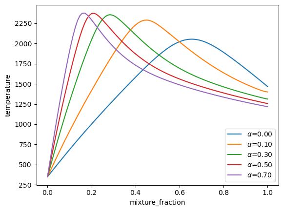
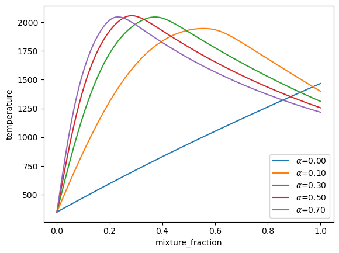
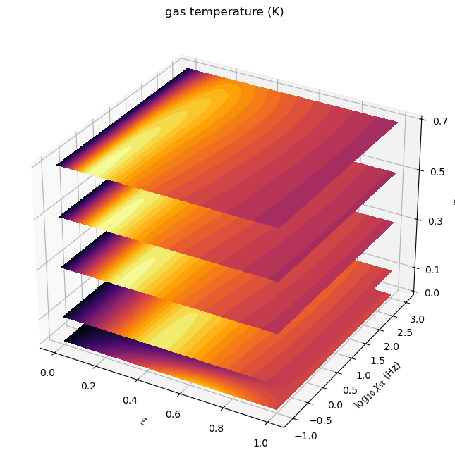
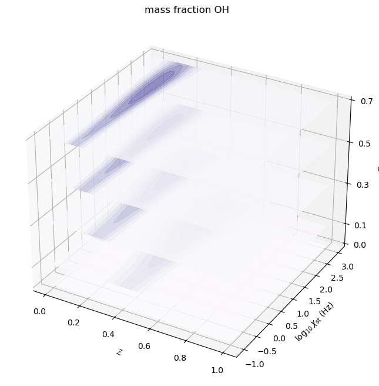
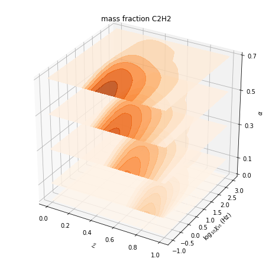

Custom Tabulation Example: 4D Coal Combustion Model
===================================================

*This demo is part of Spitfire, with*\ `licensing and copyright info
here. <https://github.com/sandialabs/Spitfire/blob/master/license.md>`__

*Highlights* - building a table with user-defined continuation loops -
varying the fuel stream and incorporating nonadiabatic effects in a
quasisteady manner - stacking contour plots to visualize a 3D field

This example showcases a flamelet library built with manual loops over
the tabulation dimensions. We build a four-dimensional table of states
over the mixture fraction, scalar dissipation rate (stoichiometric
value), heat transfer coefficient, and fraction of volatiles and char
(from coal particle gasification) in the fuel stream. The heat transfer
dimension is expanded in a quasisteady manner, with steady states
calcalated at each heat transfer coefficient (or, at each enthalpy
defect), as an alternative to transient heat loss calculations in the
provided ``build_nonadiabatic_defect_transient_slfm_library`` method
(but very similar to the
``build_nonadiabatic_defect_steady_slfm_library`` method).

Here we manually loop over table dimensions and use the ``Flamelet``
class directly instead of the higher-level convenience methods provided
in the ``spitfire.chemistry.tabulation`` module. While the tabulation
methods are much more convenient, this provides a finer level of control
and customizability for tabulation techniques not currently wrapped in a
high-level interface.

.. code:: ipython3

    import numpy as np
    import matplotlib.pyplot as plt
    import pickle
    from time import perf_counter
    from spitfire import ChemicalMechanismSpec, Flamelet, FlameletSpec, Dimension, Library

First we define a helper function for mixing char and volatiles and load
some stream data for later use.

.. code:: ipython3

    def get_fuel_stream(coal_fuels, alpha, mechanism, pressure=101325.):
        """
        Fuel streams representative of coal combustion, spanning char to volatiles, with volatiles fraction alpha.
        Personal communication with Josh McConnell, University of Utah, 2018.
        """
        volatiles = mechanism.stream('TPY', (coal_fuels['volatiles']['T'], pressure, coal_fuels['volatiles']['Y']))
        char = mechanism.stream('TPY', (coal_fuels['char']['T'], pressure, coal_fuels['char']['Y']))
        return mechanism.mix_streams([(volatiles, alpha), (char, 1. - alpha)], 'mass', 'HP')
    
    with open('coalflamelet_bcs.pkl', 'rb') as bcs_src:
        coal_fuels = pickle.load(bcs_src)

Next we load up a wrapper of the GRI-3.0 methane combustion mechanism
and make an air stream.

.. code:: ipython3

    mechanism = ChemicalMechanismSpec(cantera_xml='methane-gri30.xml', group_name='gri30_mix')
    
    pressure = 101325.
    
    oxy = mechanism.stream(stp_air=True)
    oxy.TP = 350., pressure

Next we specify the table dimensions for the char/volatiles fraction,
dissipation rate, heat transfer coefficient, and mixture fraction. From
the set of values of each variable we make a ``Library`` object. Then
for each property to be tabulated we set up an empty dataset in the
library to fill later as we perform continuation across each library
dimension.

.. code:: ipython3

    mixfrac_vec = np.linspace(0., 1., 96)
    alpha_vec = np.array([0.0, 0.1, 0.3, 0.5, 0.7])
    chist_vec = np.logspace(-1., 3., 8)
    h_vec = np.hstack([0., np.logspace(-8, 1, 24)])
    
    zdim = Dimension('mixture_fraction', mixfrac_vec)
    xdim = Dimension('dissipation_rate_stoich', chist_vec, log_scaled=True)
    hdim = Dimension('heat_transfer_coefficient', h_vec)
    adim = Dimension('alpha', alpha_vec)
    
    l = Library(adim, hdim, xdim, zdim)
    l.extra_attributes['mech_spec'] = mechanism
    
    for q in ['temperature', 'pressure'] + ['mass fraction ' + s for s in mechanism.species_names]:
        l[q] = l.get_empty_dataset()

Now we make a specifications for the flamelet.

.. code:: ipython3

    particle_temperature = 350.
    
    flamelet_specs = {'mech_spec': mechanism,
                      'oxy_stream': oxy,
                      'fuel_stream': get_fuel_stream(coal_fuels, 0., mechanism, pressure),
                      'grid': mixfrac_vec,
                      'heat_transfer': 'nonadiabatic',
                      'convection_temperature': particle_temperature,
                      'convection_coefficient': 0.,
                      'scale_heat_loss_by_temp_range': False,
                      'scale_convection_by_dissipation': False,
                      'use_linear_ref_temp_profile': False,
                      'radiation_temperature': particle_temperature,
                      'radiative_emissivity': 0.,
                      'rates_sensitivity_type': 'sparse'}

Now we enter into the loops. In continuation calculations it is critical
to get the best initial guess, as this determines convergence rates and
often the solution that is ultimately computed. We treat different
values of :math:`\alpha` (the char/volatiles fraction) as separate
problems entirely, not using the solution from one value to inform the
next, as the chemistry is so different between them given our coarse
resolution of the :math:`\alpha` line.

For each :math:`\alpha`, then, we build a three-dimensional library over
the dissipation rate (:math:`\chi_{\rm st}`), heat transfer coefficient
(:math:`h`), and mixture fraction (:math:`\mathcal{Z}`). Note that each
three-dimensional table could be generated in parallel with the
``multiprocessing`` module. A relevant approach to parallelization is
taken in the ``build_nonadiabatic_defect_*_slfm_library`` methods in
Spitfire. An annoyance that Cantera solution objects cannot be directly
pickled (a form of serialization required by ``multiprocessing``).
However ``ChemicalMechanismSpec`` instances can be pickled and so
incorporation of multiprocessing isn’t too bad.

In building the three-dimensional library, we first iterate over serial
calculations in the dissipation rate direction with zero heat loss
(adiabatic flamelets), where each prior solution provides an excellent
initial guess for the next dissipation rate. From this line of
solutions, then, we have even more parallel work in the heat loss
dimension, which may be solved for each dissipation rate independently
of the others. Again, each extension of the heat loss dimension is
treated serially, using the prior solution as the initial guess.

Here we do not exploit the available parallelism in any way to keep
things simple, but factors of ten or more speedup could be easily
obtained with a bit of extra work for either Python-based
multiprocessing or simply running multiple scripts and combining the
libraries after the fact.

.. code:: ipython3

    flamelet_specs['initial_condition'] = 'equilibrium'
    if 'library_slice' in flamelet_specs:
        flamelet_specs.pop('library_slice')
    
    cput000 = perf_counter()
    for ia, alpha in enumerate(alpha_vec):
        print(f'Running alpha = {alpha:4.2f} ...')
        flamelet_specs.update({'fuel_stream': get_fuel_stream(coal_fuels, alpha, mechanism)})
        
        adiabatic_solutions = list()
        cput00 = perf_counter()
        for ichi, chist in enumerate(chist_vec):
            flamelet_specs.update({'stoich_dissipation_rate': chist})
            if ichi > 0:
                flamelet_specs['library_slice'] = Library.squeeze(l[ia, 0, ichi - 1, :])
            else:
                if 'library_slice' in flamelet_specs:
                    flamelet_specs.pop('library_slice')
            f = Flamelet(**flamelet_specs)
            steady_adiabatic_lib = f.compute_steady_state()
            for quantity in steady_adiabatic_lib.props:
                l[quantity][ia, 0, ichi, :] = steady_adiabatic_lib[quantity].ravel()
        cput1 = perf_counter()
        print(f'Converged adiabatic solutions in {cput1-cput00:6.2f} s {"":24} | total cpu time is {cput1 - cput000:6.2f} s')
        
        for ichi, chist in enumerate(chist_vec):
            flamelet_specs.update({'stoich_dissipation_rate': chist})
            cput0 = perf_counter()
            for ih, h in enumerate(h_vec):
                flamelet_specs.update({'convection_coefficient': h})
                flamelet_specs['library_slice'] = Library.squeeze(l[ia, ih - 1 if ih > 0 else 0, ichi, :])
                f = Flamelet(**flamelet_specs)
                output = f.compute_steady_state()
        
                for quantity in output.props:
                    l[quantity][ia, ih, ichi, :] = output[quantity].ravel()
            cput1 = perf_counter()
            print(f'{"":9} heat loss solutions for chi_st = {chist:7.2e} Hz in {cput1-cput0:6.2f} s | {"":14} is {cput1 - cput000:6.2f} s')
        
        cput1 = perf_counter()
        print(f'Completed alpha = {alpha:4.2f} in {cput1-cput00:6.2f} s')
        print('-' * 95)

.. parsed-literal::

    Running alpha = 0.00 ...
    Converged adiabatic solutions in   2.94 s                          | total cpu time is   2.94 s
              heat loss solutions for chi_st = 1.00e-01 Hz in   2.90 s |                is   5.84 s
              heat loss solutions for chi_st = 3.73e-01 Hz in   0.75 s |                is   6.59 s
              heat loss solutions for chi_st = 1.39e+00 Hz in   0.69 s |                is   7.28 s
              heat loss solutions for chi_st = 5.18e+00 Hz in   0.68 s |                is   7.96 s
              heat loss solutions for chi_st = 1.93e+01 Hz in   0.68 s |                is   8.64 s
              heat loss solutions for chi_st = 7.20e+01 Hz in   0.69 s |                is   9.34 s
              heat loss solutions for chi_st = 2.68e+02 Hz in   0.68 s |                is  10.01 s
              heat loss solutions for chi_st = 1.00e+03 Hz in   0.68 s |                is  10.69 s
    Completed alpha = 0.00 in  10.69 s
    -----------------------------------------------------------------------------------------------
    Running alpha = 0.10 ...
    Converged adiabatic solutions in   9.16 s                          | total cpu time is  19.85 s
              heat loss solutions for chi_st = 1.00e-01 Hz in  29.99 s |                is  49.84 s
              heat loss solutions for chi_st = 3.73e-01 Hz in  13.01 s |                is  62.86 s
              heat loss solutions for chi_st = 1.39e+00 Hz in   1.28 s |                is  64.14 s
              heat loss solutions for chi_st = 5.18e+00 Hz in   0.80 s |                is  64.94 s
              heat loss solutions for chi_st = 1.93e+01 Hz in   0.76 s |                is  65.70 s
              heat loss solutions for chi_st = 7.20e+01 Hz in   0.73 s |                is  66.43 s
              heat loss solutions for chi_st = 2.68e+02 Hz in   0.73 s |                is  67.16 s
              heat loss solutions for chi_st = 1.00e+03 Hz in   0.76 s |                is  67.92 s
    Completed alpha = 0.10 in  57.23 s
    -----------------------------------------------------------------------------------------------
    Running alpha = 0.30 ...
    Converged adiabatic solutions in   5.95 s                          | total cpu time is  73.87 s
              heat loss solutions for chi_st = 1.00e-01 Hz in  30.48 s |                is 104.35 s
              heat loss solutions for chi_st = 3.73e-01 Hz in  17.18 s |                is 121.53 s
              heat loss solutions for chi_st = 1.39e+00 Hz in   1.35 s |                is 122.88 s
              heat loss solutions for chi_st = 5.18e+00 Hz in   0.80 s |                is 123.68 s
              heat loss solutions for chi_st = 1.93e+01 Hz in   0.74 s |                is 124.42 s
              heat loss solutions for chi_st = 7.20e+01 Hz in   0.75 s |                is 125.17 s
              heat loss solutions for chi_st = 2.68e+02 Hz in   0.74 s |                is 125.90 s
              heat loss solutions for chi_st = 1.00e+03 Hz in   0.74 s |                is 126.64 s
    Completed alpha = 0.30 in  58.72 s
    -----------------------------------------------------------------------------------------------
    Running alpha = 0.50 ...
    Converged adiabatic solutions in   6.25 s                          | total cpu time is 132.89 s
              heat loss solutions for chi_st = 1.00e-01 Hz in  25.93 s |                is 158.82 s
              heat loss solutions for chi_st = 3.73e-01 Hz in  12.21 s |                is 171.03 s
              heat loss solutions for chi_st = 1.39e+00 Hz in   1.31 s |                is 172.34 s
              heat loss solutions for chi_st = 5.18e+00 Hz in   0.91 s |                is 173.25 s
              heat loss solutions for chi_st = 1.93e+01 Hz in   0.77 s |                is 174.01 s
              heat loss solutions for chi_st = 7.20e+01 Hz in   0.77 s |                is 174.78 s
              heat loss solutions for chi_st = 2.68e+02 Hz in   0.77 s |                is 175.55 s
              heat loss solutions for chi_st = 1.00e+03 Hz in   0.78 s |                is 176.33 s
    Completed alpha = 0.50 in  49.69 s
    -----------------------------------------------------------------------------------------------
    Running alpha = 0.70 ...
    Converged adiabatic solutions in   7.56 s                          | total cpu time is 183.90 s
              heat loss solutions for chi_st = 1.00e-01 Hz in  23.49 s |                is 207.39 s
              heat loss solutions for chi_st = 3.73e-01 Hz in   8.83 s |                is 216.21 s
              heat loss solutions for chi_st = 1.39e+00 Hz in   1.02 s |                is 217.23 s
              heat loss solutions for chi_st = 5.18e+00 Hz in   0.79 s |                is 218.02 s
              heat loss solutions for chi_st = 1.93e+01 Hz in   0.79 s |                is 218.81 s
              heat loss solutions for chi_st = 7.20e+01 Hz in   0.80 s |                is 219.60 s
              heat loss solutions for chi_st = 2.68e+02 Hz in   0.80 s |                is 220.40 s
              heat loss solutions for chi_st = 1.00e+03 Hz in   0.84 s |                is 221.24 s
    Completed alpha = 0.70 in  44.90 s
    -----------------------------------------------------------------------------------------------

Saving a library file for later use
~~~~~~~~~~~~~~~~~~~~~~~~~~~~~~~~~~~

Saving a library file to disk to be reloaded later is straightforward.

The rest of the notebook consists of some visualizations of the library
data.

.. code:: ipython3

    l.save_to_file('coal_library.pkl')
    library = Library.load_from_file('coal_library.pkl')

.. code:: ipython3

    z_dim = library.dim('mixture_fraction')
    x_dim = library.dim('dissipation_rate_stoich')
    h_dim = library.dim('heat_transfer_coefficient')
    a_dim = library.dim('alpha')

Here are the adiabatic temperature profiles at minimium and moderate
:math:`\chi_{\rm st}` for various mixtures of volatiles and char.

.. code:: ipython3

    for ia, a in enumerate(a_dim.values):
        plt.plot(z_dim.values, library['temperature'][ia, 0, 0, :], label='$\\' + a_dim.name + '$' + f'={a:.2f}')
    plt.legend(loc='best')
    plt.xlabel(z_dim.name)
    plt.ylabel('temperature')
    plt.show()
    
    for ia, a in enumerate(a_dim.values):
        plt.plot(z_dim.values, library['temperature'][ia, 0, 6, :], label='$\\' + a_dim.name + '$' + f'={a:.2f}')
    plt.legend(loc='best')
    plt.xlabel(z_dim.name)
    plt.ylabel('temperature')
    plt.show()

And here are some contour plots of adiabatic profiles over
:math:`(\mathcal{Z},\chi_{\rm st})` for each :math:`\alpha` value. Note
the effect of :math:`\alpha` on the availablity of acetylene, a key
ingredient in soot formation.

.. code:: ipython3

    from mpl_toolkits.mplot3d import axes3d
    from matplotlib.colors import Normalize
    
    fig = plt.figure()
    ax = fig.gca(projection='3d')
    z = library.mixture_fraction_grid[0, 0, :, :]
    x = np.log10(library.dissipation_rate_stoich_grid[0, 0, :, :])
    for ia, alpha in enumerate(adim.values):
        ax.contourf(z, x, l['temperature'][ia, 0, :, :], offset=alpha, 
                    cmap='inferno', levels=30, norm=Normalize(vmin=300, vmax=2400))
    ax.set_zlim([0, 0.7])
    ax.set_xlabel('$\\mathcal{Z}$')
    ax.set_ylabel('$\\log_{10}\\chi_{\\rm st}$ (Hz)')
    ax.set_zlabel('$\\alpha$')
    ax.set_zticks([0, 0.1, 0.3, 0.5, 0.7])
    ax.set_title('gas temperature (K)')
    fig.set_size_inches(8, 8)
    plt.show()
    
    fig = plt.figure()
    ax = fig.gca(projection='3d')
    for ia, alpha in enumerate(adim.values):
        ax.contourf(z, x, l['mass fraction OH'][ia, 0, :, :], offset=alpha, 
                    cmap='Purples', norm=Normalize(vmin=0, vmax=1e-2), alpha=0.8)
    ax.set_zlim([0, 0.7])
    ax.set_xlabel('$\\mathcal{Z}$')
    ax.set_ylabel('$\\log_{10}\\chi_{\\rm st}$ (Hz)')
    ax.set_zlabel('$\\alpha$')
    ax.set_zticks([0, 0.1, 0.3, 0.5, 0.7])
    ax.set_title('mass fraction OH')
    fig.set_size_inches(8, 8)
    plt.show()
    
    fig = plt.figure()
    ax = fig.gca(projection='3d')
    for ia, alpha in enumerate(adim.values):
        ax.contourf(z, x, l['mass fraction C2H2'][ia, 0, :, :], offset=alpha, 
                    cmap='Oranges', norm=Normalize(vmin=0, vmax=1e-2), alpha=0.8)
    ax.set_zlim([0, 0.7])
    ax.set_xlabel('$\\mathcal{Z}$')
    ax.set_ylabel('$\\log_{10}\\chi_{\\rm st}$ (Hz)')
    ax.set_zlabel('$\\alpha$')
    ax.set_zticks([0, 0.1, 0.3, 0.5, 0.7])
    ax.set_title('mass fraction C2H2')
    fig.set_size_inches(8, 8)
    plt.show()

