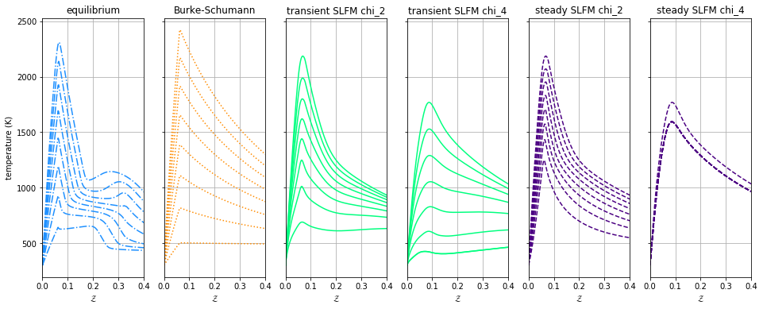
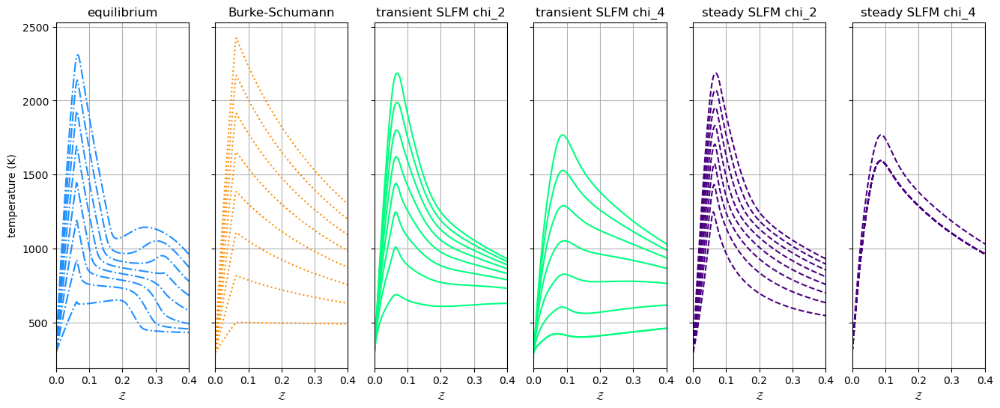
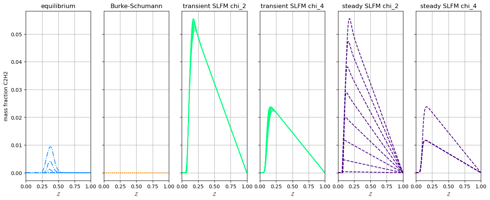
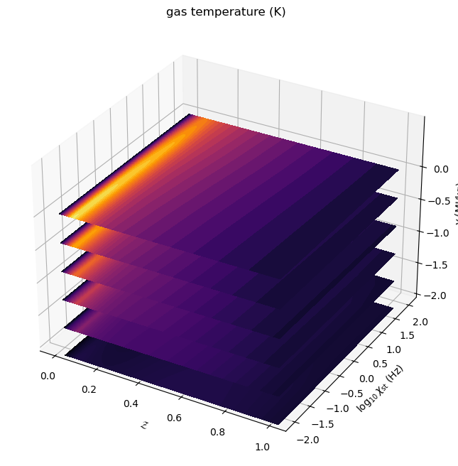
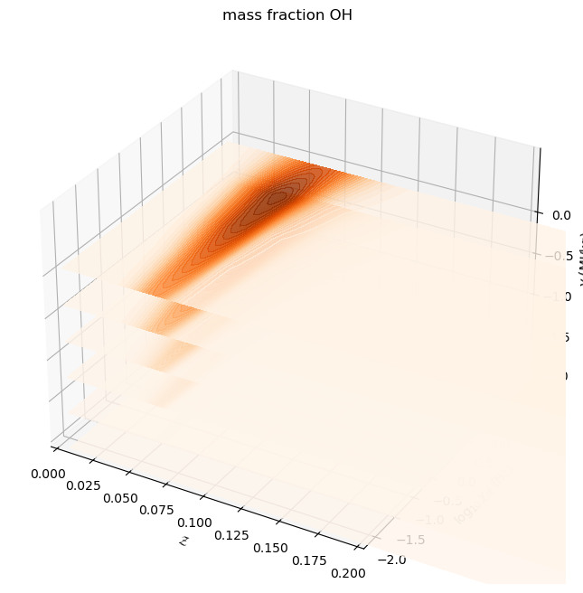
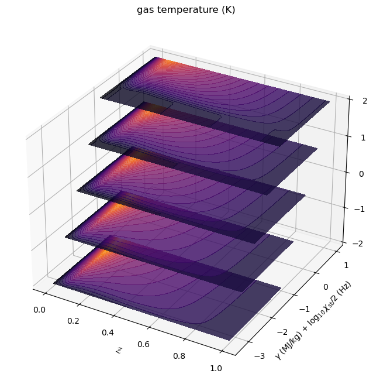

Tabulation API Example: Nonadiabatic Flamelet Models
====================================================

*This demo is part of Spitfire, with* `licensing and copyright info
here. <https://github.com/sandialabs/Spitfire/blob/master/license.md>`__

*Highlights*

-  using ``build_nonadiabatic*`` methods in Spitfire to build
   nonadiabatic equilibrium, Burke-Schumann, and SLFM models

This example builds nonadiabatic flamelet models and compares profiles
of the temperature, mass fractions, and enthalpy defect of several
nonadiabatic flamelet tabulation techniques for n-heptane chemistry.

.. code:: ipython3

    from spitfire import (ChemicalMechanismSpec, 
                          FlameletSpec,
                          build_nonadiabatic_defect_eq_library, 
                          build_nonadiabatic_defect_bs_library, 
                          build_nonadiabatic_defect_transient_slfm_library,
                          build_nonadiabatic_defect_steady_slfm_library)
    import matplotlib.pyplot as plt
    import numpy as np
    
    mech = ChemicalMechanismSpec(cantera_input='heptane-liu-hewson-chen-pitsch-highT.yaml', group_name='gas')
    pressure = 101325.
    air = mech.stream(stp_air=True)
    air.TP = 300., pressure
    fuel = mech.stream('TPX', (485., pressure, 'NXC7H16:1'))
    
    flamelet_specs = {'mech_spec': mech, 'oxy_stream': air, 'fuel_stream': fuel, 'grid_points': 128}

.. code:: ipython3

    l_eq = build_nonadiabatic_defect_eq_library(FlameletSpec(**flamelet_specs), verbose=False)
    l_bs = build_nonadiabatic_defect_bs_library(FlameletSpec(**flamelet_specs), verbose=False)

.. code:: ipython3

    l_ts = build_nonadiabatic_defect_transient_slfm_library(FlameletSpec(**flamelet_specs), 
                                                            verbose=True, 
                                                            diss_rate_values=np.array([1e-2, 1e-1, 1e0, 1e1, 1e2]),
                                                            diss_rate_log_scaled=True)

.. parsed-literal::

    ----------------------------------------------------------------------------------
    building nonadiabatic (defect) SLFM library
    ----------------------------------------------------------------------------------
    - mechanism: heptane-liu-hewson-chen-pitsch-highT.yaml
    - 38 species, 105 reactions
    - stoichiometric mixture fraction: 0.062
    ----------------------------------------------------------------------------------
    ----------------------------------------------------------------------------------
    building adiabatic SLFM library
    ----------------------------------------------------------------------------------
    - mechanism: heptane-liu-hewson-chen-pitsch-highT.yaml
    - 38 species, 105 reactions
    - stoichiometric mixture fraction: 0.062
    ----------------------------------------------------------------------------------
       1/   5 (chi_stoich =  1.0e-02 1/s)  converged in   5.44 s, T_max = 2249.2
       2/   5 (chi_stoich =  1.0e-01 1/s)  converged in   0.25 s, T_max = 2186.1
       3/   5 (chi_stoich =  1.0e+00 1/s)  converged in   1.37 s, T_max = 2109.4
       4/   5 (chi_stoich =  1.0e+01 1/s)  converged in   2.32 s, T_max = 1998.4
       5/   5 (chi_stoich =  1.0e+02 1/s)  converged in   0.08 s, T_max = 1768.7
    ----------------------------------------------------------------------------------
    library built in   9.84 s
    ----------------------------------------------------------------------------------
    expanding (transient) enthalpy defect dimension ...
    chi_st =  1.0e-02 1/s converged in  14.84 s
    chi_st =  1.0e-01 1/s converged in  13.01 s
    chi_st =  1.0e+00 1/s converged in  11.88 s
    chi_st =  1.0e+01 1/s converged in   9.99 s
    chi_st =  1.0e+02 1/s converged in   9.79 s
    ----------------------------------------------------------------------------------
    enthalpy defect dimension expanded in  59.51 s
    ----------------------------------------------------------------------------------
    Structuring enthalpy defect dimension ... 
    Initializing ... Done.
    Interpolating onto structured grid ... 
    Progress: 0%--10%--20%--30%--40%--50%--100%
    Structured enthalpy defect dimension built in   7.27 s
    ----------------------------------------------------------------------------------
    library built in  76.64 s
    ----------------------------------------------------------------------------------

.. code:: ipython3

    l_ss = build_nonadiabatic_defect_steady_slfm_library(FlameletSpec(**flamelet_specs), 
                                                         verbose=True, 
                                                         diss_rate_values=np.array([1e-2, 1e-1, 1e0, 1e1, 1e2]),
                                                         diss_rate_log_scaled=True,
                                                         solver_verbose=False,
                                                         h_stoich_spacing=1.e-3)

.. parsed-literal::

    ----------------------------------------------------------------------------------
    building nonadiabatic (defect) SLFM library
    ----------------------------------------------------------------------------------
    - mechanism: heptane-liu-hewson-chen-pitsch-highT.yaml
    - 38 species, 105 reactions
    - stoichiometric mixture fraction: 0.062
    ----------------------------------------------------------------------------------
    ----------------------------------------------------------------------------------
    building adiabatic SLFM library
    ----------------------------------------------------------------------------------
    - mechanism: heptane-liu-hewson-chen-pitsch-highT.yaml
    - 38 species, 105 reactions
    - stoichiometric mixture fraction: 0.062
    ----------------------------------------------------------------------------------
       1/   5 (chi_stoich =  1.0e-02 1/s)  converged in   3.81 s, T_max = 2249.2
       2/   5 (chi_stoich =  1.0e-01 1/s)  converged in   0.21 s, T_max = 2186.1
       3/   5 (chi_stoich =  1.0e+00 1/s)  converged in   0.92 s, T_max = 2109.4
       4/   5 (chi_stoich =  1.0e+01 1/s)  converged in   1.94 s, T_max = 1998.4
       5/   5 (chi_stoich =  1.0e+02 1/s)  converged in   0.09 s, T_max = 1768.7
    ----------------------------------------------------------------------------------
    library built in   7.34 s
    ----------------------------------------------------------------------------------
    expanding (steady) enthalpy defect dimension ...
    chi_st =  1.0e-02 1/s converged in  53.47 s
    chi_st =  1.0e-01 1/s converged in  23.62 s
    chi_st =  1.0e+00 1/s converged in  15.73 s
    chi_st =  1.0e+01 1/s converged in  11.91 s
    chi_st =  1.0e+02 1/s converged in  18.46 s
    ----------------------------------------------------------------------------------
    enthalpy defect dimension expanded in 123.22 s
    ----------------------------------------------------------------------------------
    Structuring enthalpy defect dimension ... 
    Initializing ... Done.
    Interpolating onto structured grid ... 
    Progress: 0%--10%--20%--30%--40%--50%--100%
    Structured enthalpy defect dimension built in   8.31 s
    ----------------------------------------------------------------------------------
    library built in 138.89 s
    ----------------------------------------------------------------------------------

.. code:: ipython3

    c_ts = 'SpringGreen'
    c_ss = 'Indigo'
    c_eq = 'DodgerBlue'
    c_bs = 'DarkOrange'
    
    ichi1 = 1
    ichi2 = 4
    
    fig, axarray = plt.subplots(1, 6, sharex=True, sharey=True)
    axarray[0].plot(l_eq.mixture_fraction_values, l_eq['enthalpy_defect'][:, ::2] * 1e-6, '-.', color=c_eq)
    axarray[1].plot(l_bs.mixture_fraction_values, l_bs['enthalpy_defect'][:, ::2] * 1e-6, ':', color=c_bs)
    axarray[2].plot(l_ts.mixture_fraction_values, l_ts['enthalpy_defect'][:, ichi1, ::4] * 1e-6, '-', color=c_ts)
    axarray[3].plot(l_ts.mixture_fraction_values, l_ts['enthalpy_defect'][:, ichi2, ::4] * 1e-6, '-', color=c_ts)
    axarray[4].plot(l_ss.mixture_fraction_values, l_ss['enthalpy_defect'][:, ichi1, ::4] * 1e-6, '--', color=c_ss)
    axarray[5].plot(l_ss.mixture_fraction_values, l_ss['enthalpy_defect'][:, ichi2, ::4] * 1e-6, '--', color=c_ss)
    axarray[0].set_ylabel('enthalpy defect (MJ/kg)')
    axarray[0].set_title('equilibrium')
    axarray[1].set_title('Burke-Schumann')
    axarray[2].set_title('transient SLFM chi_2')
    axarray[3].set_title('transient SLFM chi_4')
    axarray[4].set_title('steady SLFM chi_2')
    axarray[5].set_title('steady SLFM chi_4')
    for ax in axarray:
        ax.set_xlim([0, 1])
        ax.grid()
        ax.set_xlabel('$\\mathcal{Z}$')
    fig.set_size_inches(16, 6)
    plt.show()
    
    fig, axarray = plt.subplots(1, 6, sharex=True, sharey=True)
    axarray[0].plot(l_eq.mixture_fraction_values, l_eq['temperature'][:, ::2], '-.', color=c_eq)
    axarray[1].plot(l_bs.mixture_fraction_values, l_bs['temperature'][:, ::2], ':', color=c_bs)
    axarray[2].plot(l_ts.mixture_fraction_values, l_ts['temperature'][:, ichi1, ::4], '-', color=c_ts)
    axarray[3].plot(l_ts.mixture_fraction_values, l_ts['temperature'][:, ichi2, ::4], '-', color=c_ts)
    axarray[4].plot(l_ss.mixture_fraction_values, l_ss['temperature'][:, ichi1, ::4], '--', color=c_ss)
    axarray[5].plot(l_ss.mixture_fraction_values, l_ss['temperature'][:, ichi2, ::4], '--', color=c_ss)
    axarray[0].set_ylabel('temperature (K)')
    axarray[0].set_title('equilibrium')
    axarray[1].set_title('Burke-Schumann')
    axarray[2].set_title('transient SLFM chi_2')
    axarray[3].set_title('transient SLFM chi_4')
    axarray[4].set_title('steady SLFM chi_2')
    axarray[5].set_title('steady SLFM chi_4')
    for ax in axarray:
        ax.set_xlim([0, 0.4])
        ax.grid()
        ax.set_xlabel('$\\mathcal{Z}$')
    fig.set_size_inches(16, 6)
    plt.show()
    
    fig, axarray = plt.subplots(1, 6, sharex=True, sharey=True)
    axarray[0].plot(l_eq.mixture_fraction_values, l_eq['mass fraction C2H2'][:, ::2], '-.', color=c_eq)
    axarray[1].plot(l_bs.mixture_fraction_values, l_bs['mass fraction C2H2'][:, ::2], ':', color=c_bs)
    axarray[2].plot(l_ts.mixture_fraction_values, l_ts['mass fraction C2H2'][:, ichi1, ::4], '-', color=c_ts)
    axarray[3].plot(l_ts.mixture_fraction_values, l_ts['mass fraction C2H2'][:, ichi2, ::4], '-', color=c_ts)
    axarray[4].plot(l_ss.mixture_fraction_values, l_ss['mass fraction C2H2'][:, ichi1, ::4], '--', color=c_ss)
    axarray[5].plot(l_ss.mixture_fraction_values, l_ss['mass fraction C2H2'][:, ichi2, ::4], '--', color=c_ss)
    axarray[0].set_ylabel('temperature (K)')
    axarray[0].set_title('equilibrium')
    axarray[1].set_title('Burke-Schumann')
    axarray[2].set_title('transient SLFM chi_2')
    axarray[3].set_title('transient SLFM chi_4')
    axarray[4].set_title('steady SLFM chi_2')
    axarray[5].set_title('steady SLFM chi_4')
    axarray[0].set_ylabel('mass fraction C2H2')
    for ax in axarray:
        ax.set_xlim([0, 1])
        ax.grid()
        ax.set_xlabel('$\\mathcal{Z}$')
    fig.set_size_inches(16, 6)
    plt.show()

.. parsed-literal::

    INFO:matplotlib.mathtext:Substituting symbol Z from STIXNonUnicode
    INFO:matplotlib.mathtext:Substituting symbol Z from STIXNonUnicode

.. parsed-literal::

    INFO:matplotlib.mathtext:Substituting symbol Z from STIXNonUnicode
    INFO:matplotlib.mathtext:Substituting symbol Z from STIXNonUnicode

.. parsed-literal::

    INFO:matplotlib.mathtext:Substituting symbol Z from STIXNonUnicode
    INFO:matplotlib.mathtext:Substituting symbol Z from STIXNonUnicode

.. code:: ipython3

    from mpl_toolkits.mplot3d import axes3d
    from matplotlib.colors import Normalize
    
    fig = plt.figure()
    ax = fig.add_subplot(projection='3d')
    z = l_ts.mixture_fraction_grid[:, :, 0]
    x = np.log10(l_ts.dissipation_rate_stoich_grid[:, :, 0])
    for ih in range(0, l_ts.enthalpy_defect_stoich_npts, 6):
        dh = l_ts.enthalpy_defect_stoich_values[ih]
        ax.contourf(z, x, l_ts['temperature'][:, :, ih], offset=dh / 1.e6, 
                    cmap='inferno', levels=30, norm=Normalize(vmin=300, vmax=2400))
    ax.set_zlim([0, 0.7])
    ax.set_xlabel('$\\mathcal{Z}$')
    ax.set_ylabel('$\\log_{10}\\chi_{\\rm st}$ (Hz)')
    ax.set_zlabel('$\\gamma$ (MJ/kg)')
    ax.set_zticks([-2.0, -1.5, -1.0, -0.5, 0.0])
    ax.set_title('gas temperature (K)')
    fig.set_size_inches(8, 8)
    plt.show()
    
    fig = plt.figure()
    ax = fig.add_subplot(projection='3d')
    for ih in range(0, l_ts.enthalpy_defect_stoich_npts, 6):
        dh = l_ts.enthalpy_defect_stoich_values[ih]
        ax.contourf(z, x, l_ts['mass fraction OH'][:, :, ih], offset=dh / 1.e6, 
                    cmap='Oranges', levels=30, norm=Normalize(vmin=0, vmax=5e-3), alpha=0.8)
    ax.set_zlim([0, 0.7])
    ax.set_xlabel('$\\mathcal{Z}$')
    ax.set_ylabel('$\\log_{10}\\chi_{\\rm st}$ (Hz)')
    ax.set_zlabel('$\\gamma$ (MJ/kg)')
    ax.set_zticks([-2.0, -1.5, -1.0, -0.5, 0.0])
    ax.set_xlim([0, 0.2])
    ax.set_title('mass fraction OH')
    fig.set_size_inches(8, 8)
    plt.show()

.. parsed-literal::

    INFO:matplotlib.mathtext:Substituting symbol Z from STIXNonUnicode

.. parsed-literal::

    INFO:matplotlib.mathtext:Substituting symbol Z from STIXNonUnicode

.. parsed-literal::

    INFO:matplotlib.mathtext:Substituting symbol Z from STIXNonUnicode
    INFO:matplotlib.mathtext:Substituting symbol Z from STIXNonUnicode

.. code:: ipython3

    fig = plt.figure()
    ax = fig.add_subplot(projection='3d')
    z = l_ts.mixture_fraction_grid[:, 0, :]
    g = l_ts.enthalpy_defect_stoich_grid[:, 0, :] / 1.e6
    for ichi in range(0, l_ts.dissipation_rate_stoich_npts):
        lchi = np.log10(l_ts.dissipation_rate_stoich_values[ichi])
        ax.contourf(z, g + lchi/2, l_ts['temperature'][:, ichi, :], offset=lchi, 
                    cmap='inferno', levels=30, norm=Normalize(vmin=300, vmax=2400), alpha=0.8)
    ax.set_zlim([0, 0.7])
    ax.set_xlabel('$\\mathcal{Z}$')
    ax.set_ylabel('$\\gamma$ (MJ/kg) + $\\log_{10}\\chi_{\\rm st}/2$ (Hz)')
    ax.set_zlabel('$\\log_{10}\\chi_{\\rm st}$ (Hz)')
    ax.set_zticks([-2, -1, 0, 1, 2])
    ax.set_title('gas temperature (K)')
    fig.set_size_inches(8, 8)
    plt.show()

.. parsed-literal::

    INFO:matplotlib.mathtext:Substituting symbol Z from STIXNonUnicode

.. parsed-literal::

    INFO:matplotlib.mathtext:Substituting symbol Z from STIXNonUnicode

