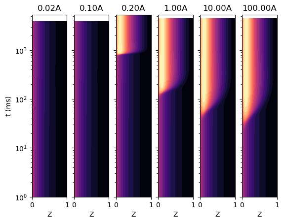
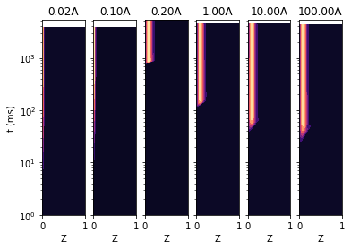

Transient Flamelet Example: Ignition Sensitivity to Rate Parameter
==================================================================

*This demo is part of Spitfire, with* `licensing and copyright info
here. <https://github.com/sandialabs/Spitfire/blob/master/license.md>`__

*Highlights*

-  Solving transient flamelet ignition trajectories
-  Observing sensitivity of the ignition behavior to a key reaction rate
   parameter

In this demonstration we use the ``integrate_to_steady`` method as in
previous notebooks, this time to look at how ignition behavior is
affected by the pre-exponential factor of a key chain-branching reaction
in hydrogen-air ignition. Cantera is used to load the nominal chemistry
and modify the reaction rate accordingly.

.. code:: ipython3

    import cantera as ct
    from spitfire import ChemicalMechanismSpec, Flamelet, FlameletSpec
    import matplotlib.pyplot as plt
    import numpy as np

.. code:: ipython3

    sol = ct.Solution('h2-burke.yaml', 'h2-burke')
    
    Tair = 1200.
    pressure = 101325.
    zstoich = 0.1
    chi_max = 1.e3
    npts_interior = 32
    
    k1mult_list = [0.02, 0.1, 0.2, 1.0, 10.0, 100.0]
    sol_dict = dict()
    
    max_time = 0.
    max_temp = 0.
    
    A0_original = np.copy(sol.reaction(0).rate.pre_exponential_factor)
    
    for i, k1mult in enumerate(k1mult_list):
        print(f'running {k1mult:.2f}A ...')
        r0 = sol.reaction(0)
        new_rate = ct.Arrhenius(k1mult * A0_original,
                                r0.rate.temperature_exponent,
                                r0.rate.activation_energy)
        new_rxn = ct.Reaction(r0.reactants, r0.products, new_rate)
        sol.modify_reaction(0, new_rxn)
    
        m = ChemicalMechanismSpec.from_solution(sol)
        air = m.stream(stp_air=True)
        air.TP = Tair, pressure
        fuel = m.mix_fuels_for_stoich_mixture_fraction(m.stream('TPX', (Tair, pressure, 'H2:1')), m.stream('TPX', (Tair, pressure, 'N2:1')), zstoich, air)
        fuel.TP = 300., pressure
    
        flamelet_specs = FlameletSpec(mech_spec=m, 
                                      initial_condition='unreacted',
                                      oxy_stream=air,
                                      fuel_stream=fuel,
                                      grid_points=npts_interior + 2,
                                      grid_cluster_intensity=4.,
                                      max_dissipation_rate=chi_max)
    
        ft = Flamelet(flamelet_specs)
        output = ft.integrate_to_steady(first_time_step=1.e-9)
    
        t = output.time_grid * 1.e3
        z = output.mixture_fraction_grid
        T = output['temperature']
        OH = output['mass fraction OH']
        max_time = max([max_time, np.max(t)])
        max_temp = max([max_temp, np.max(T)])
    
        sol_dict[k1mult] = (i, t, z, T, OH)
        
    print('done')

.. parsed-literal::

    running 0.02A ...
    running 0.10A ...
    running 0.20A ...
    running 1.00A ...
    running 10.00A ...
    running 100.00A ...
    done

Next we simply show the profiles of temperature and hydroxyl mass
fraction with the various rate parameters. We not only see the expected
decrease in ignition delay with larger pre-exponential factor, but also
that ignition does not occur at lower values as chain-branching is
entirely overwhelmed by dissipation.

.. code:: ipython3

    fig, axarray = plt.subplots(1, len(k1mult_list), sharex=True, sharey=True)
    
    for k1mult in k1mult_list:
        sol = sol_dict[k1mult]
        axarray[sol[0]].contourf(sol[2], sol[1] * 1.e3, sol[3],
                                 cmap=plt.get_cmap('magma'),
                                 levels=np.linspace(300., max_temp, 20))
        axarray[sol[0]].set_title(f'{k1mult:.2f}A')
        axarray[sol[0]].set_xlim([0, 1])
        axarray[sol[0]].set_ylim([1.e0, max_time * 1.e3])
        axarray[sol[0]].set_yscale('log')
        axarray[sol[0]].set_xlabel('Z')
    
    axarray[0].set_ylabel('t (ms)')
    plt.show()
    
    fig, axarray = plt.subplots(1, len(k1mult_list), sharex=True, sharey=True)
    
    print('Mass fraction OH profiles')
    
    for k1mult in k1mult_list:
        sol = sol_dict[k1mult]
        axarray[sol[0]].contourf(sol[2], sol[1] * 1.e3, sol[4],
                                 cmap=plt.get_cmap('magma'))
        axarray[sol[0]].set_title(f'{k1mult:.2f}A')
        axarray[sol[0]].set_xlim([0, 1])
        axarray[sol[0]].set_ylim([1.e0, max_time * 1.e3])
        axarray[sol[0]].set_yscale('log')
        axarray[sol[0]].set_xlabel('Z')
    
    axarray[0].set_ylabel('t (ms)')
    plt.show()

.. parsed-literal::

    Mass fraction OH profiles

