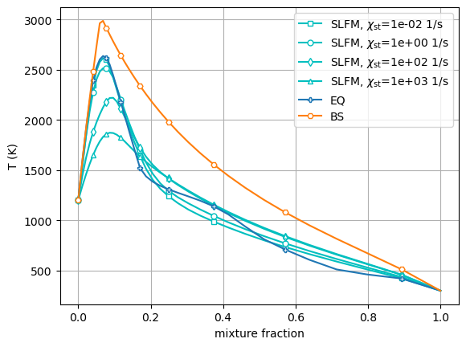
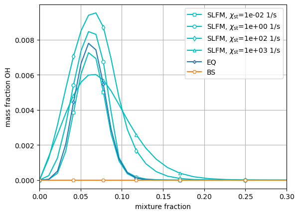
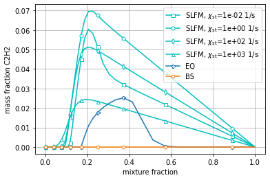

Tabulation API Example: Adiabatic Flamelet Models
=================================================

*This demo is part of Spitfire, with* `licensing and copyright info
here. <https://github.com/sandialabs/Spitfire/blob/master/license.md>`__

*Highlights*

-  Building adiabatic equilibrium, Burke-Schumann, and strained laminar
   flamelet (SLFM) models

In the introductory flamelet demonstration we used methods on the
``Flamelet`` class to compute steady and unsteady solutions to the
flamelet equations. We used these solutions to build SLFM and FPV
chemistry libraries. Here we use the following methods to directly build
similar libraries without having to even make a ``Flamelet`` instance.

-  adiabatic equilibrium: ``build_adiabatic_eq_library``
-  adiabatic Burke-Schumann: ``build_adiabatic_bs_library``
-  adiabatic SLFM: ``build_adiabatic_slfm_library``

.. code:: ipython3

    from spitfire import (ChemicalMechanismSpec, 
                          FlameletSpec, 
                          build_adiabatic_eq_library,
                          build_adiabatic_bs_library,
                          build_adiabatic_slfm_library)
    import matplotlib.pyplot as plt
    import numpy as np
    
    mech = ChemicalMechanismSpec(cantera_input='heptane-liu-hewson-chen-pitsch-highT.yaml', group_name='gas')
    
    pressure = 101325.
    
    air = mech.stream(stp_air=True)
    air.TP = 1200., pressure
    
    fuel = mech.stream('TPY', (300., pressure, 'NXC7H16:1'))
    
    flamelet_specs = FlameletSpec(mech_spec=mech, 
                                  initial_condition='equilibrium',
                                  oxy_stream=air,
                                  fuel_stream=fuel,
                                  grid_points=34)

With the flamelet specifications all set up, we next use the high-level
tabulation methods to easily build some flamelet models.

First up are the unstrained models - equilibrium (infinitely fast
chemistry) and Burke-Schumann (idealized single-step combustion).

.. code:: ipython3

    l_eq = build_adiabatic_eq_library(flamelet_specs, verbose=False)
    l_bs = build_adiabatic_bs_library(flamelet_specs, verbose=False)

Next up is the adiabatic strained laminar flamelet library. Note how
much easier this is than running the continuation loop over the
dissipation rate ourselves.

.. code:: ipython3

    l_sl = build_adiabatic_slfm_library(flamelet_specs,
                                        diss_rate_values=np.logspace(-2, 3, 6),
                                        diss_rate_ref='stoichiometric',
                                        diss_rate_log_scaled=True,
                                        verbose=False)

And now we visualize the results, showing the equilibrium and
Burke-Schumann profiles alongside the SLFM solutions at several values
of the dissipation rate. Note in particular the difference in OH and
acetylene production in the finite-strain profiles and the nonlinear
effects of the dissipation rate.

.. code:: ipython3

    chi_indices_plot = [0, 2, 4, 5]
    chi_values = l_sl.dim('dissipation_rate_stoich').values
    z = l_sl.dim('mixture_fraction').values
    
    for ix, marker in zip(chi_indices_plot, ['s', 'o', 'd', '^']):
        plt.plot(z, l_sl['temperature'][:, ix], 'c-',
                 marker=marker, markevery=4, markersize=5, markerfacecolor='w',
                 label='SLFM, $\\chi_{\\mathrm{st}}$=' + '{:.0e} 1/s'.format(chi_values[ix]))
    
    plt.plot(z, l_eq['temperature'], 'P-', markevery=4, markersize=5, markerfacecolor='w', label='EQ')
    plt.plot(z, l_bs['temperature'], 'H-', markevery=4, markersize=5, markerfacecolor='w', label='BS')
    
    plt.xlabel('mixture fraction')
    plt.ylabel('T (K)')
    plt.grid(True)
    plt.legend(loc='best')
    plt.show()
    
    for ix, marker in zip(chi_indices_plot, ['s', 'o', 'd', '^']):
        plt.plot(z, l_sl['mass fraction OH'][:, ix], 'c-',
                 marker=marker, markevery=4, markersize=5, markerfacecolor='w',
                 label='SLFM, $\\chi_{\\mathrm{st}}$=' + '{:.0e} 1/s'.format(chi_values[ix]))
    
    plt.plot(z, l_eq['mass fraction OH'], 'P-', markevery=4, markersize=5, markerfacecolor='w', label='EQ')
    plt.plot(z, l_bs['mass fraction OH'], 'H-', markevery=4, markersize=5, markerfacecolor='w', label='BS')
    
    plt.xlabel('mixture fraction')
    plt.ylabel('mass fraction OH')
    plt.xlim([0, 0.3])
    plt.grid(True)
    plt.legend(loc='best')
    plt.show()
    
    for ix, marker in zip(chi_indices_plot, ['s', 'o', 'd', '^']):
        plt.plot(z, l_sl['mass fraction C2H2'][:, ix], 'c-',
                 marker=marker, markevery=4, markersize=5, markerfacecolor='w',
                 label='SLFM, $\\chi_{\\mathrm{st}}$=' + '{:.0e} 1/s'.format(chi_values[ix]))
    
    plt.plot(z, l_eq['mass fraction C2H2'], 'P-', markevery=4, markersize=5, markerfacecolor='w', label='EQ')
    plt.plot(z, l_bs['mass fraction C2H2'], 'H-', markevery=4, markersize=5, markerfacecolor='w', label='BS')
    
    plt.xlabel('mixture fraction')
    plt.ylabel('mass fraction C2H2')
    plt.grid(True)
    plt.legend(loc='best')
    plt.show()

