Introduction to Flamelet Models & Spitfire
==========================================

*This demo is part of Spitfire, with*\ `licensing and copyright info
here. <https://github.com/sandialabs/Spitfire/blob/master/license.md>`__

*Highlights* - What is a flamelet? What is a ``Flamelet`` in Spitfire? -
Computing steady flamelets and transient extinction trajectories -
Building a steady laminar flamelet model (SLFM) table - Building a
flamelet progress variable (FPV) table

Introduction
------------

Tabulated chemistry models are the workhorse of large-scale turbulent
combustion simulations. They provide a practical means of incorporating
competition between combustion chemistry, turbulence, radiation, and
inter-phase interactions of combustion gases with sprays, coal, and
soot. A fundamental concept in various tabulated chemistry formulations
is that of the *flamelet*, a small, one-dimensional (usually) laminar
flame that cuts through surfaces where fuel and oxidizer mix in a
diffusion flame. Flamelet-based models provide a physics-based model
reduction that separates the fast and small-scale dynamics of a fire
from larger hydrodynamic scales, with the primary assumption that
molecular mixing and chemistry at the reaction front rapidly equilibrate
together. These processes can be affected by radiation and turbulence,
and there are plenty of combustion regimes where the assumptions of a
flamelet model are invalid.

Spitfire’s role is solving the flamelet equations and tabulating the
results for later use in fire simulations. The primary applications of
flamelet models built in Spitfire are pool fires and coal combustion,
but it has been used in a number of other ways. Spitfire can generate
adiabatic and nonadiabatic flamelet libraries, and built-in support for
presumed PDF turbulence modeling is being added.

The focus of this notebook is to introduce the ``Flamelet`` class and
show how to compute steady flamelet profiles and transient extinction
trajectories. With this we can then compose traditional SLFM and FPV
chemistry tables ourselves. Spitfire provides easier methods to generate
SLFM tables (general FPV tables will be added eventually), which we’ll
cover in later demonstrations.

The ``Flamelet`` Class
----------------------

An instance of Spitfire’s ``Flamelet`` class is defined by a set of
governing equations, parameter specifications, and a grid in the mixture
fraction dimension.

The “governing equations” refers to - terms in the interior equations -
boundary streams - initial conditions

The “parameter specifications” refers to - the scalar dissipation rate -
heat loss parameters (e.g., convection coefficient)

The ``FlameletSpec`` class exists to help build flamelets. Below we use
it to build several minimal ``Flamelet``\ s for an n-heptane/air
mixture.

.. code:: ipython3

    from spitfire import Flamelet, FlameletSpec, Library, Dimension, ChemicalMechanismSpec
    from spitfire import get_ct_solution_array
    import matplotlib.pyplot as plt
    import numpy as np

.. code:: ipython3

    mech = ChemicalMechanismSpec('heptane-liu-hewson-chen-pitsch-highT.xml', 'gas')
    
    air = mech.stream(stp_air=True)
    fuel = mech.stream('TPX', (372, air.P, 'NXC7H16:1'))

``FlameletSpec -> Flamelet``
~~~~~~~~~~~~~~~~~~~~~~~~~~~~

A ``Flamelet`` can be constructed from a ``FlameletSpec`` instance. This
is the best way to get help from an IDE that indexes your Python
interpreter for keywords. Minimally, a ``FlameletSpec`` needs the
chemical mechanism, an initial condition, the fuel and oxidizer streams,
and a number of grid points. Alternatively, one can pass a ``Library``
object as done below.

.. code:: ipython3

    flamelets = dict()
    
    fs_unreacted = FlameletSpec(mech_spec=mech, 
                                initial_condition='unreacted',
                                oxy_stream=air,
                                fuel_stream=fuel,
                                grid_points=64)
    flamelets['unreacted'] = Flamelet(fs_unreacted)

Direct ``Flamelet`` Construction
~~~~~~~~~~~~~~~~~~~~~~~~~~~~~~~~

A ``Flamelet`` can also be constructed by providing keywords to its
initializer, which internally are passed to a ``FlameletSpec``. This is
simply shorter than the above and not reusable.

.. code:: ipython3

    flamelets['equilibrium'] = Flamelet(mech_spec=mech, 
                                        initial_condition='equilibrium',
                                        oxy_stream=air,
                                        fuel_stream=fuel,
                                        grid_points=64)

A reusable variant of the above is how early Spitfire users created
``Flamelet`` objects - passing around a dictionary that simply gets
unpacked into keyword arguments. Again, this is internally equivalent to
the ``FlameletSpec`` path. The disadvantage here is not getting error
checking until you try to build the ``Flamelet`` itself.

.. code:: ipython3

    fs_burke_schumann_dict = dict(mech_spec=mech, 
                                  initial_condition='Burke-Schumann',
                                  oxy_stream=air,
                                  fuel_stream=fuel,
                                  grid_points=64)
    flamelets['Burke-Schumann'] = Flamelet(**fs_burke_schumann_dict)

Initial Conditions
------------------

Note above that we used the “unreacted,”equilibrium," and
“Burke-Schumann” strings for the ``initial_condition`` argument. The
temperature and fuel mass fraction profiles for these special states are
plotted below. An unreacted mixture is only mixed, with linear species
and enthalpy profiles. Equilibrium refers to the state with linear
enthalpy but allowed to reach chemical equilibrium (no effects of
mixing). The Burke-Schumann state is an idealized case of perfect,
irreversible combustion.

.. code:: ipython3

    for key in ['unreacted', 'equilibrium', 'Burke-Schumann']:
        flamelet = flamelets[key]
        plt.plot(flamelet.mixfrac_grid, flamelet.initial_temperature, '.-', label=key)
    plt.legend()
    plt.grid()
    plt.xlabel('mixture fraction')
    plt.ylabel('initial temperature (K)')
    plt.show()
    
    for key in ['unreacted', 'equilibrium', 'Burke-Schumann']:
        flamelet = flamelets[key]
        plt.plot(flamelet.mixfrac_grid, flamelet.initial_mass_fraction('NXC7H16'), '.-', label=key)
    plt.legend()
    plt.grid()
    plt.xlabel('mixture fraction')
    plt.ylabel('initial mass fraction n-heptane')
    plt.show()

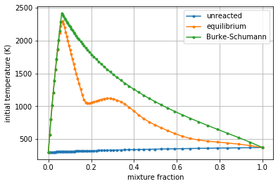

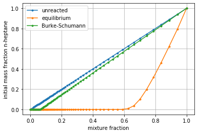

The Grid
--------

Carefully note in the above plots how the distribution of the grid
points is not uniform. When specifying only the number of grid points, a
clustered grid that focuses grid points near the stoichiometric mixture
fraction is made.

Below we specify the ``grid_type`` to be “uniform” instead of
“clustered” (the default value) and build another equilibrium flamelet.
Zooming in near the stoichiometric point with the highest curvature in
the temperature shows how the uniform grid misses this curvature. In
rare cases when dynamics in very rich mixtures are relevant, a uniform
grid ends up being the most efficient option, but most often the
clustered grid is far superior.

.. code:: ipython3

    flamelets['equilibrium-uniform'] = Flamelet(mech_spec=mech, 
                                                initial_condition='equilibrium',
                                                oxy_stream=air,fuel_stream=fuel,
                                                grid_points=64,
                                                grid_type='uniform')
    
    for key in ['equilibrium', 'equilibrium-uniform']:
        flamelet = flamelets[key]
        plt.plot(flamelet.mixfrac_grid, flamelet.initial_temperature, '.-', label=key)
    plt.legend()
    plt.grid()
    plt.xlabel('mixture fraction')
    plt.ylabel('initial temperature (K)')
    plt.xlim([0.05, 0.1])
    plt.ylim([1750, 2350])
    plt.show()

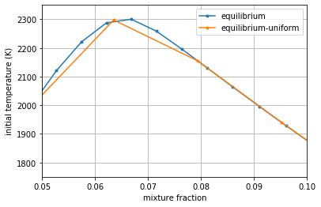

Getting a Steady Flamelet at Finite Dissipation
-----------------------------------------------

In the ``Flamelet`` instances above, we avoided specifying the scalar
dissipation rate, which leads to it being zero. To incorporate molecular
mixing, the dissipation rate can be specified a few ways: -
``max_dissipation_rate`` or ``stoich_dissipation_rate``, along with
``dissipation_rate_form`` as either “constant” or “Peters” (the default)
to use a specified functional form of the dissipation rate -
``dissipation_rate`` to directly provide an array of values

.. code:: ipython3

    flamelets['eq-Peters-st10Hz'] = Flamelet(FlameletSpec(mech_spec=mech, 
                                                          initial_condition='equilibrium',
                                                          oxy_stream=air,
                                                          fuel_stream=fuel,
                                                          grid_points=64,
                                                          stoich_dissipation_rate=10.0))
    flamelets['eq-Peters-max10Hz'] = Flamelet(FlameletSpec(mech_spec=mech, 
                                                           initial_condition='equilibrium',
                                                           oxy_stream=air,
                                                           fuel_stream=fuel,
                                                           grid_points=64,
                                                           max_dissipation_rate=10.0))
    flamelets['eq-constant-10Hz'] = Flamelet(FlameletSpec(mech_spec=mech, 
                                                          initial_condition='equilibrium',
                                                          oxy_stream=air,
                                                          fuel_stream=fuel,
                                                          grid_points=64,
                                                          stoich_dissipation_rate=10.0,
                                                          dissipation_rate_form='constant'))
    flamelets['eq-constant-10Hz-array'] = Flamelet(FlameletSpec(mech_spec=mech, 
                                                                initial_condition='equilibrium',
                                                                oxy_stream=air,
                                                                fuel_stream=fuel,
                                                                grid_points=64,
                                                                dissipation_rate=10.0 * np.ones(64)))

The ``compute_steady_state()`` Method
~~~~~~~~~~~~~~~~~~~~~~~~~~~~~~~~~~~~~

Now that we have flamelets with dissipation, the
``compute_steady_state()`` method can be used to compute the steady
temperature and mass fraction profiles that represent the balance
between molecular mixing and combustion chemistry. After calling this
method, the ``current_*`` properties for temperature, mass fractions,
etc. of the flamelet can be accessed.

In the following plots (the second simply zooms in on the first), you
can see the effect of dissipation, mostly to smooth out the equilibrium
profile as chemistry is balanced by mixing.

.. code:: ipython3

    for key in ['eq-Peters-st10Hz', 'eq-Peters-max10Hz', 'eq-constant-10Hz-array', 'eq-constant-10Hz']:
        flamelets[key].compute_steady_state()
    
        
    for key in ['unreacted', 'equilibrium', 'Burke-Schumann'] + \
               ['eq-Peters-st10Hz', 'eq-Peters-max10Hz', 'eq-constant-10Hz-array', 'eq-constant-10Hz']:
        flamelet = flamelets[key]
        plt.plot(flamelet.mixfrac_grid, flamelet.current_temperature, label=key)
    plt.legend()
    plt.grid()
    plt.xlabel('mixture fraction')
    plt.ylabel('temperature (K)')
    plt.show()
    
    for key in ['unreacted', 'equilibrium', 'Burke-Schumann'] + \
               ['eq-Peters-st10Hz', 'eq-Peters-max10Hz', 'eq-constant-10Hz-array', 'eq-constant-10Hz']:
        flamelet = flamelets[key]
        plt.plot(flamelet.mixfrac_grid, flamelet.current_temperature, label=key)
    plt.legend()
    plt.grid()
    plt.xlabel('mixture fraction')
    plt.ylabel('temperature (K)')
    plt.xlim([0.04, 0.2])
    plt.ylim([1000, 2500])
    plt.show()

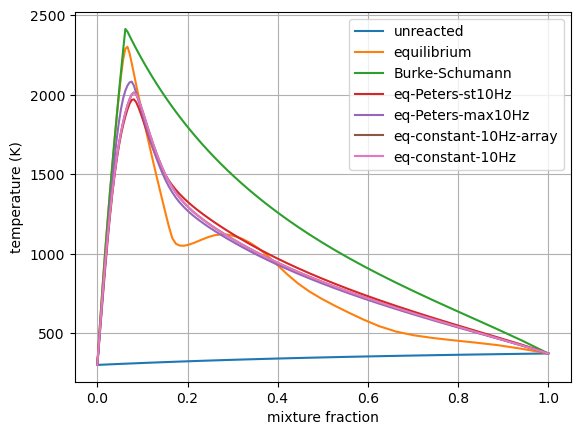

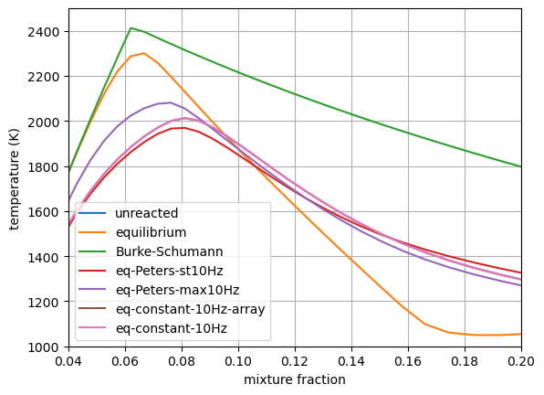

Transient Extinction
--------------------

Now we’re going to solve the transient flamelet equations to look in
detail at strain-induced extinction of a flamelet initially at chemical
equilibrium. The plots below show the transition from the equilibrium
profiles to the extinguished state.

.. code:: ipython3

    flamelet = Flamelet(FlameletSpec(mech_spec=mech, 
                                     initial_condition='equilibrium',
                                     oxy_stream=air,
                                     fuel_stream=fuel,
                                     grid_points=64,
                                     stoich_dissipation_rate=1.e3))
    
    output = flamelet.integrate_to_steady(write_log=True, first_time_step=1e-9)

.. parsed-literal::

    
     2021-02-25 13:09 : Spitfire running case with method: Kennedy/Carpenter ESDIRK64
    
    |number of  | simulation | time step  | diff. eqn. | total cpu  | cput per |
    |time steps | time (s)   | size (s)   | |residual| | time (s)   | step (ms)|
    ---------------------------------------------------------------------------|
    | 100       | 9.26e-07   | 2.95e-08   | 2.60e+05   | 1.88e+00   | 1.88e+01 |
    | 200       | 9.78e-06   | 1.49e-07   | 4.83e+04   | 4.21e+00   | 2.10e+01 |
    | 300       | 3.22e-05   | 5.43e-07   | 1.35e+04   | 7.21e+00   | 2.40e+01 |
    | 400       | 1.58e-04   | 2.70e-06   | 1.67e+02   | 1.03e+01   | 2.58e+01 |
    
    Integration successfully completed!
    
    Statistics:
    - number of time steps : 446
    - final simulation time: 0.000587475337460484
    - smallest time step   : 1e-09
    - average time step    : 1.3172092768172287e-06
    - largest time step    : 3.73510924976309e-05
    
      CPU time
    - total    (s) : 1.152887e+01
    - per step (ms): 2.584949e+01
    
      Nonlinear iterations
    - total   : 11480
    - per step: 25.7
    
      Linear iterations
    - total     : 11480
    - per step  : 25.7
    - per nliter: 1.0
    
      Jacobian setups
    - total     : 156
    - steps per : 2.9
    - nliter per: 73.6
    - liter per : 73.6
    
     2021-02-25 13:09 : Spitfire finished in 1.15288734e+01 seconds!
    

.. code:: ipython3

    plt.plot(output.mixture_fraction_values, output['temperature'].T[:, ::10])
    plt.plot(output.mixture_fraction_values, output['temperature'].T[:, 0], 'b-')
    plt.plot(output.mixture_fraction_values, output['temperature'].T[:, -1], 'k-')
    plt.grid()
    plt.xlabel('mixture fraction')
    plt.ylabel('temperature (K)')
    plt.show()
    
    plt.plot(output.mixture_fraction_values, output['mass fraction NXC7H16'].T[:, ::10])
    plt.plot(output.mixture_fraction_values, output['mass fraction NXC7H16'].T[:, 0], 'b-')
    plt.plot(output.mixture_fraction_values, output['mass fraction NXC7H16'].T[:, -1], 'k-')
    plt.grid()
    plt.xlabel('mixture fraction')
    plt.ylabel('mass fraction n-heptane')
    plt.show()
    
    
    plt.plot(output.mixture_fraction_values, output['mass fraction OH'].T[:, ::10])
    plt.plot(output.mixture_fraction_values, output['mass fraction OH'].T[:, 0], 'b-')
    plt.plot(output.mixture_fraction_values, output['mass fraction OH'].T[:, -1], 'k-')
    plt.grid()
    plt.xlabel('mixture fraction')
    plt.ylabel('mass fraction OH')
    plt.show()

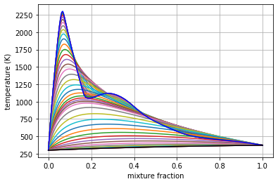

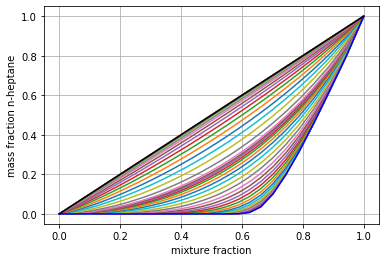

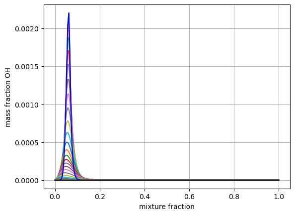

Parameter Continuation, Transient Extinction, and Progress Variable Tabulation
------------------------------------------------------------------------------

Now we combine the main ideas from this notebook to generate a steady
and transient extinction trajectory for our n-heptane/air mixture. We’ll
do parameter continuation in the stoichiometric dissipation rate until
we get near extinction, and then we’ll jump the dissipation rate and
capture the transient extinction event. Building atop this, we’ll
transform the steady and transient libraries into a single library built
atop the mixture fraction and the stoichiometric value of a progress
variable chosen as the mass fraction of CO2. This requires the source
term of CO2, which we compute with Cantera, leveraging Spitfire’s
``get_ct_solution_array()`` method.

Below the ``slfm_lib`` variable is made one value of
:math:`\chi_{\rm st}` at a time. As with standard SLFM, the extinction
dynamics are not included in the table.

.. code:: ipython3

    chi_values = np.logspace(-3, 2, 17)
    fs0 = FlameletSpec(mech_spec=mech, 
                       initial_condition='equilibrium',
                       oxy_stream=air,
                       fuel_stream=fuel,
                       grid_points=64,
                       stoich_dissipation_rate=chi_values[0])
    z_values = Flamelet(fs0).mixfrac_grid
    
    slfm_lib = Library(Dimension('mixture_fraction', z_values),
                       Dimension('dissipation_rate_stoich', chi_values, log_scaled=True))
    slfm_lib['temperature'] = slfm_lib.get_empty_dataset()
    slfm_lib['pressure'] = slfm_lib.get_empty_dataset()
    for s in mech.species_names:
        slfm_lib[f'mass fraction {s}'] = slfm_lib.get_empty_dataset()
    slfm_lib.extra_attributes['mech_spec'] = mech
    
    print(f'{"chi_st (Hz)":>12} | {"T_max (K)":<12}')
    print('-' * 27)
    
    for idx, chi_st in enumerate(chi_values):
        
        fs = fs0 if idx == 0 else FlameletSpec(library_slice=steady_lib, stoich_dissipation_rate=chi_st)
        f = Flamelet(fs)
        steady_lib = f.compute_steady_state()
        
        print(f'{chi_st:>12.1e} | {steady_lib["temperature"].max():<12.1f}')
        
        for prop in steady_lib.props:
            slfm_lib[prop][:, idx] = steady_lib[prop]
    print('-' * 27)
    
    fse = FlameletSpec(library_slice=slfm_lib[:, -1], stoich_dissipation_rate=chi_values[-1] * 10.)
    fext = Flamelet(fse)
    
    ext_lib = fext.integrate_to_steady(write_log=True)

.. parsed-literal::

     chi_st (Hz) | T_max (K)   
    ---------------------------
         1.0e-03 | 2237.9      
         2.1e-03 | 2233.3      
         4.2e-03 | 2225.9      
         8.7e-03 | 2215.1      
         1.8e-02 | 2200.7      
         3.7e-02 | 2182.8      
         7.5e-02 | 2161.6      
         1.5e-01 | 2138.5      
         3.2e-01 | 2117.9      
         6.5e-01 | 2092.6      
         1.3e+00 | 2069.1      
         2.7e+00 | 2038.9      
         5.6e+00 | 2001.7      
         1.2e+01 | 1961.1      
         2.4e+01 | 1910.2      
         4.9e+01 | 1840.0      
         1.0e+02 | 1729.9      
    ---------------------------
    
     2021-02-25 13:09 : Spitfire running case with method: Kennedy/Carpenter ESDIRK64
    
    |number of  | simulation | time step  | diff. eqn. | total cpu  | cput per |
    |time steps | time (s)   | size (s)   | |residual| | time (s)   | step (ms)|
    ---------------------------------------------------------------------------|
    | 100       | 9.69e-06   | 1.28e-07   | 4.25e+04   | 2.52e+00   | 2.52e+01 |
    | 200       | 2.29e-05   | 4.89e-07   | 1.95e+04   | 4.51e+00   | 2.25e+01 |
    | 300       | 1.22e-04   | 1.95e-06   | 6.35e+02   | 7.60e+00   | 2.53e+01 |
    
    Integration successfully completed!
    
    Statistics:
    - number of time steps : 363
    - final simulation time: 0.0006048045588230816
    - smallest time step   : 2.5051492225523748e-08
    - average time step    : 1.6661282612206103e-06
    - largest time step    : 3.877850229434712e-05
    
      CPU time
    - total    (s) : 9.151398e+00
    - per step (ms): 2.521046e+01
    
      Nonlinear iterations
    - total   : 10054
    - per step: 27.7
    
      Linear iterations
    - total     : 10054
    - per step  : 27.7
    - per nliter: 1.0
    
      Jacobian setups
    - total     : 195
    - steps per : 1.9
    - nliter per: 51.6
    - liter per : 51.6
    
     2021-02-25 13:09 : Spitfire finished in 9.15139817e+00 seconds!
    

.. code:: ipython3

    plt.plot(slfm_lib.mixture_fraction_values, slfm_lib['temperature'], 'b')
    plt.plot(ext_lib.mixture_fraction_values, ext_lib['temperature'].T[:, ::18], 'c')
    plt.grid()
    plt.xlabel('mixture fraction')
    plt.ylabel('temperature (K)')
    plt.show()

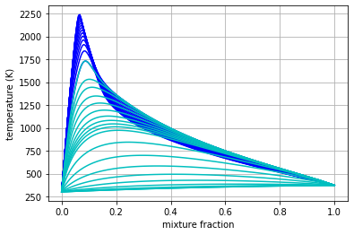

To combine the libraries and prepare for progress variable
identification, we first simply map onto :math:`\chi_{\rm st}(1+t)`,
where :math:`t` is the extinction time, for the second dimension to
ensure uniqueness.

.. code:: ipython3

    t_step = 18  # just to reduce the data size a little
    t_values_step = ext_lib.time_values[1::t_step]
    chi_opt = np.hstack((chi_values, chi_values[-1] *(1. + t_values_step)))
    
    combined_lib = Library(Dimension('mixture_fraction', z_values), Dimension('chi_opt', chi_opt))
    
    for prop in slfm_lib.props:
        combined_lib[prop] = combined_lib.get_empty_dataset()
        combined_lib[prop][:, :chi_values.size] = slfm_lib[prop][:, :chi_values.size]
        combined_lib[prop][:, chi_values.size:] = ext_lib[prop][1::t_step, :].T
    
    plt.plot(combined_lib.mixture_fraction_values, combined_lib['temperature'], 'g')
    plt.grid()
    plt.xlabel('mixture fraction')
    plt.ylabel('temperature (K)')
    plt.show()

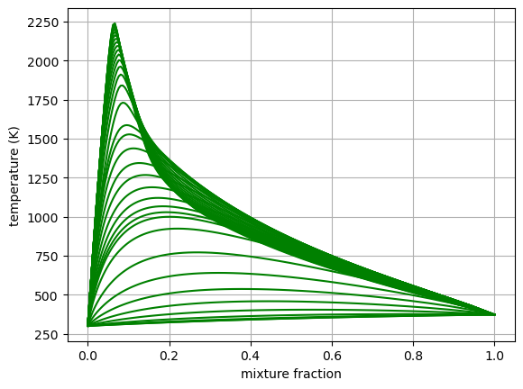

Now we build one-dimensional interpolation to compute stoichiometric
values of every tabulated property over the combined second dimension.
These will be used to define a progress variable.

.. code:: ipython3

    from scipy.interpolate import interp1d
    
    stoich_values = Library(Dimension('chi_opt', chi_opt))
    z_st = mech.stoich_mixture_fraction(fuel, air)
    
    for prop in combined_lib.props:
        stoich_values[prop] = stoich_values.get_empty_dataset()
        stoich_values[prop] = interp1d(combined_lib.mixture_fraction_values, 
                                       combined_lib[prop],
                                       axis=0)(z_st)

.. code:: ipython3

    for s in ['CO2', 'H2O', 'CO']:
        plt.plot(stoich_values[f'temperature'], stoich_values[f'mass fraction {s}'], label=s)
    plt.grid()
    plt.xlabel('stoich. temperature (K)')
    plt.ylabel('stoich. mass fraction')
    plt.legend()
    plt.show()

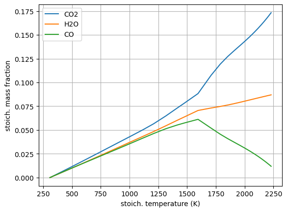

The above shows that CO2 and H2O, unlike CO, are admissible progress
variables as they vary monotonically from the high-temperature
equilibrium state to the extinguished state. Linear combinations of mass
fractions could be employed, but here we’ll keep things simple and just
use CO2.

.. code:: ipython3

    Y_CO2_st = stoich_values[f'mass fraction CO2']
    Y_CO2_st_scaled = (Y_CO2_st - Y_CO2_st.min()) / (Y_CO2_st.max() - Y_CO2_st.min())
    
    progvar_lib = Library(Dimension('mixture_fraction', z_values),
                          Dimension('scaled_st_Y_CO2', Y_CO2_st_scaled))
    
    for prop in combined_lib.props:
        progvar_lib[prop] = combined_lib[prop]

.. code:: ipython3

    plt.contourf(progvar_lib.mixture_fraction_grid,
                 progvar_lib.scaled_st_Y_CO2_grid,
                 progvar_lib['temperature'],
                 cmap='afmhot')
    plt.xlabel('$Z$')
    plt.ylabel('$C_{\\rm st}$')
    plt.colorbar()
    plt.show()

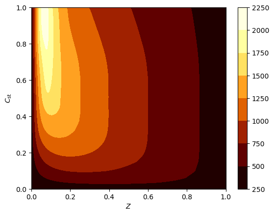

A requirement for the FPV tabulation is to tabulate the source term of
the progress variable. While Spitfire computes chemical source terms and
much more in order to solve flamelet problems, the most convenient way
of getting reaction rates and other thermochemical properties is to use
Cantera. For this, ``get_ct_solution_array``, which takes a mechanism
and library, can be used to obtain a ``SolutionArray`` object from
Cantera which acts like a single thermochemical state but loops over a
large number behind the scenes. So we can simply call
``net_production_rates`` to get the molar species production rates, and
then reshape them into the library.

.. code:: ipython3

    ct_array, lib_shape = get_ct_solution_array(mech, progvar_lib)
    
    co2_idx = mech.species_index('CO2')
    co2_mw = mech.molecular_weight('CO2')
    
    progvar_lib['prod rate CO2'] = co2_mw * ct_array.net_production_rates[:, co2_idx].reshape(lib_shape)
    progvar_lib['C source'] = progvar_lib['prod rate CO2'] / (Y_CO2_st.max() - Y_CO2_st.min())

.. code:: ipython3

    plt.contourf(progvar_lib.mixture_fraction_grid,
                 progvar_lib.scaled_st_Y_CO2_grid,
                 progvar_lib['C source'],
                 cmap='coolwarm')
    plt.colorbar()
    plt.xlabel('$Z$')
    plt.ylabel('$C_{\\rm st}$')
    plt.show()

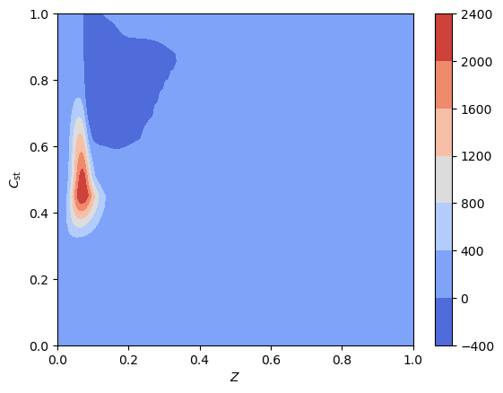

Conclusions
-----------

In this demonstration we’ve covered the basics of specifying a flamelet
model with initialization options, dissipation rate forms, and grid
types. Following this we solved the steady and transient flamelet
equations, ultimately performing parameter continuation to build an SLFM
library, and combined with a transient extinction calculation to build
an FPV library.

