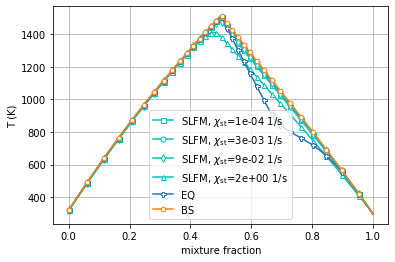
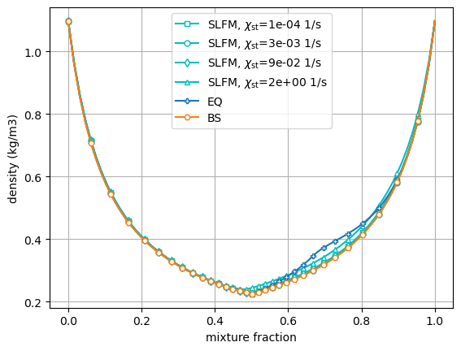
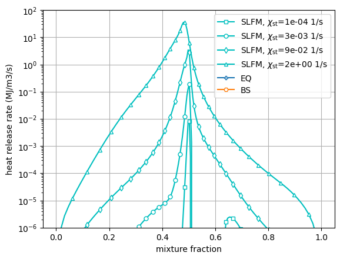
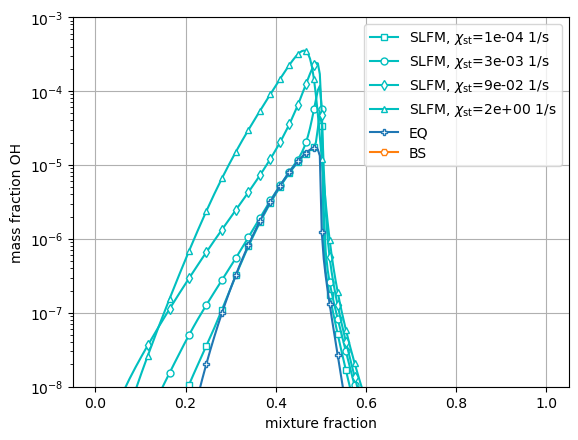

Tabulation API Example: Methane Shear Layer
===========================================

*This demo is part of Spitfire, with* `licensing and copyright info
here. <https://github.com/sandialabs/Spitfire/blob/master/license.md>`__

In this demonstration we show how to build several adiabatic chemistry
models for running a flow-resolved shear layer DNS calculation. We can
easily dilute the methane fuel with Nitrogen to set the stoichiometric
mixture fraction to 0.5, and further set the density of the air stream
to control the momentum ratio across the shear layer. Spitfire and
Cantera make it easy to set this up. After generating the tables we use
Cantera to compute quantities like the density and the chemical heat
release rate.

.. code:: ipython3

    from spitfire import (ChemicalMechanismSpec,
                          FlameletSpec,
                          build_adiabatic_eq_library, 
                          build_adiabatic_bs_library, 
                          build_adiabatic_slfm_library)
    import matplotlib.pyplot as plt
    import numpy as np

.. code:: ipython3

    mech = ChemicalMechanismSpec(cantera_input='methane-lu30.yaml', group_name='methane-lu30')
    
    pressure = 101325.
    
    ch4 = mech.stream('TPY', (298., pressure, 'CH4:1'))
    n2 = mech.stream('TPY', (298., pressure, 'N2:1'))
    air = mech.stream(stp_air=True)

Next we mix the methane and nitrogen streams so that the stoichiometric
mixture fraction (with air as the oxidizer) is 0.5, using a built-in
Spitfire method.

Then the densities of the fuel and air streams are equated with the
Cantera ``DP`` (density and pressure) setting, allowing the temperature
to change.

.. code:: ipython3

    fuel = mech.mix_fuels_for_stoich_mixture_fraction(ch4, n2, 0.5, air)
    air.DP = fuel.density, pressure

Next we set up our flamelet specifications and build equilibrium,
Burke-Schumann, and SLFM libraries with the high-level API.

Note that in this example we set ``verbose=True``, which shows
tabulation progress, and ``solver_verbose=False``, which hides internal
details of the solvers, on the SLFM call. Setting
``solver_verbose=True`` to see internal solver details would show that
this configuration, because the high stoichiometric mixture fraction
leads to an extremely weak flame, is challenging to solve. The most
aggressive solvers try and fail on this problem and it ultimately is
solved (less quickly) by a transient approach to the steady state with
implicit Runge-Kutta methods. Typically this is unnecessary.

.. code:: ipython3

    flamelet_specs = FlameletSpec(mech_spec=mech, 
                                  initial_condition='equilibrium',
                                  oxy_stream=air,
                                  fuel_stream=fuel,
                                  grid_points=128)
    
    l_eq = build_adiabatic_eq_library(flamelet_specs, verbose=False)
    l_bs = build_adiabatic_bs_library(flamelet_specs, verbose=False)
    l_sl = build_adiabatic_slfm_library(flamelet_specs,
                                        diss_rate_values=np.logspace(-4, np.log10(2), 36),
                                        diss_rate_ref='stoichiometric',
                                        verbose=True,
                                        solver_verbose=False)

.. parsed-literal::

    ----------------------------------------------------------------------------------
    building adiabatic SLFM library
    ----------------------------------------------------------------------------------
    - mechanism: methane-lu30.yaml
    - 30 species, 184 reactions
    - stoichiometric mixture fraction: 0.500
    ----------------------------------------------------------------------------------
       1/  36 (chi_stoich =  1.0e-04 1/s) 

.. parsed-literal::

     converged in   4.14 s, T_max = 1505.4
       2/  36 (chi_stoich =  1.3e-04 1/s)  converged in   0.05 s, T_max = 1504.8
       3/  36 (chi_stoich =  1.8e-04 1/s)  converged in   0.08 s, T_max = 1504.5
       4/  36 (chi_stoich =  2.3e-04 1/s)  converged in   0.11 s, T_max = 1504.1
       5/  36 (chi_stoich =  3.1e-04 1/s)  converged in   1.80 s, T_max = 1503.7
       6/  36 (chi_stoich =  4.1e-04 1/s)  converged in   1.68 s, T_max = 1503.2
       7/  36 (chi_stoich =  5.5e-04 1/s)  converged in   0.04 s, T_max = 1502.8
       8/  36 (chi_stoich =  7.2e-04 1/s)  converged in   0.99 s, T_max = 1502.2
       9/  36 (chi_stoich =  9.6e-04 1/s)  converged in   0.05 s, T_max = 1501.6
      10/  36 (chi_stoich =  1.3e-03 1/s)  converged in   0.06 s, T_max = 1501.0
      11/  36 (chi_stoich =  1.7e-03 1/s)  converged in   0.05 s, T_max = 1500.2
      12/  36 (chi_stoich =  2.2e-03 1/s)  converged in   0.05 s, T_max = 1499.4
      13/  36 (chi_stoich =  3.0e-03 1/s)  converged in   0.04 s, T_max = 1498.6
      14/  36 (chi_stoich =  4.0e-03 1/s)  converged in   0.04 s, T_max = 1497.6
      15/  36 (chi_stoich =  5.3e-03 1/s)  converged in   0.06 s, T_max = 1496.5
      16/  36 (chi_stoich =  7.0e-03 1/s)  converged in   0.08 s, T_max = 1495.2
      17/  36 (chi_stoich =  9.3e-03 1/s)  converged in   0.05 s, T_max = 1493.8
      18/  36 (chi_stoich =  1.2e-02 1/s)  converged in   0.05 s, T_max = 1492.3
      19/  36 (chi_stoich =  1.6e-02 1/s)  converged in   0.06 s, T_max = 1490.6
      20/  36 (chi_stoich =  2.2e-02 1/s)  converged in   0.06 s, T_max = 1488.9
      21/  36 (chi_stoich =  2.9e-02 1/s)  converged in   0.06 s, T_max = 1487.0
      22/  36 (chi_stoich =  3.8e-02 1/s)  converged in   0.05 s, T_max = 1485.0
      23/  36 (chi_stoich =  5.1e-02 1/s)  converged in   0.05 s, T_max = 1482.9
      24/  36 (chi_stoich =  6.7e-02 1/s)  converged in   0.07 s, T_max = 1480.4
      25/  36 (chi_stoich =  8.9e-02 1/s)  converged in   0.06 s, T_max = 1477.9
      26/  36 (chi_stoich =  1.2e-01 1/s)  converged in   0.07 s, T_max = 1475.2
      27/  36 (chi_stoich =  1.6e-01 1/s)  converged in   0.06 s, T_max = 1472.2
      28/  36 (chi_stoich =  2.1e-01 1/s)  converged in   0.06 s, T_max = 1468.7
      29/  36 (chi_stoich =  2.8e-01 1/s)  converged in   0.08 s, T_max = 1464.8
      30/  36 (chi_stoich =  3.7e-01 1/s)  converged in   0.08 s, T_max = 1460.2
      31/  36 (chi_stoich =  4.9e-01 1/s)  converged in   0.11 s, T_max = 1455.2
      32/  36 (chi_stoich =  6.4e-01 1/s)  converged in   0.08 s, T_max = 1449.6
      33/  36 (chi_stoich =  8.6e-01 1/s)  converged in   0.10 s, T_max = 1442.6
      34/  36 (chi_stoich =  1.1e+00 1/s)  converged in   0.09 s, T_max = 1434.7
      35/  36 (chi_stoich =  1.5e+00 1/s)  converged in   0.10 s, T_max = 1424.6
      36/  36 (chi_stoich =  2.0e+00 1/s)  converged in   0.11 s, T_max = 1411.1
    ----------------------------------------------------------------------------------
    library built in  11.12 s
    ----------------------------------------------------------------------------------

.. code:: ipython3

    from spitfire import get_ct_solution_array
    from cantera import gas_constant as Ru
    
    def add_density_to_library(lib):
        ctsol, shape = get_ct_solution_array(mech, lib)
        lib['density'] = ctsol.density_mass.reshape(shape)
        
    def add_hrr_to_library(lib):
        ctsol, shape = get_ct_solution_array(mech, lib)
        
        w = ctsol.net_production_rates
        h = ctsol.standard_enthalpies_RT * Ru * np.array([ctsol.T]).T
        
        lib['heat_release_rate'] = - np.sum(w * h, axis=1).reshape(shape)

.. code:: ipython3

    for l in [l_bs, l_eq, l_sl]:
        add_density_to_library(l)
        add_hrr_to_library(l)

.. code:: ipython3

    chi_indices_plot = [0, 12, 24, 35]
    chi_values = l_sl.dim('dissipation_rate_stoich').values
    z = l_sl.dim('mixture_fraction').values
    
    for ix, marker in zip(chi_indices_plot, ['s', 'o', 'd', '^']):
        plt.plot(z, l_sl['temperature'][:, ix], 'c-',
                 marker=marker, markevery=4, markersize=5, markerfacecolor='w',
                 label='SLFM, $\\chi_{\\mathrm{st}}$=' + '{:.0e} 1/s'.format(chi_values[ix]))
    
    plt.plot(z, l_eq['temperature'], 'P-', markevery=4, markersize=5, markerfacecolor='w', label='EQ')
    plt.plot(z, l_bs['temperature'], 'H-', markevery=4, markersize=5, markerfacecolor='w', label='BS')
    
    plt.xlabel('mixture fraction')
    plt.ylabel('T (K)')
    plt.grid(True)
    plt.legend(loc='best')
    plt.show()
    
    for ix, marker in zip(chi_indices_plot, ['s', 'o', 'd', '^']):
        plt.plot(z, l_sl['density'][:, ix], 'c-',
                 marker=marker, markevery=4, markersize=5, markerfacecolor='w',
                 label='SLFM, $\\chi_{\\mathrm{st}}$=' + '{:.0e} 1/s'.format(chi_values[ix]))
    
    plt.plot(z, l_eq['density'], 'P-', markevery=4, markersize=5, markerfacecolor='w', label='EQ')
    plt.plot(z, l_bs['density'], 'H-', markevery=4, markersize=5, markerfacecolor='w', label='BS')
    
    plt.xlabel('mixture fraction')
    plt.ylabel('density (kg/m3)')
    plt.grid(True)
    plt.legend(loc='best')
    plt.show()
    
    for ix, marker in zip(chi_indices_plot, ['s', 'o', 'd', '^']):
        plt.plot(z, l_sl['heat_release_rate'][:, ix] / 1.e6, 'c-',
                 marker=marker, markevery=4, markersize=5, markerfacecolor='w',
                 label='SLFM, $\\chi_{\\mathrm{st}}$=' + '{:.0e} 1/s'.format(chi_values[ix]))
    
    plt.plot(z, l_eq['heat_release_rate'] / 1.e6, 'P-', markevery=4, markersize=5, markerfacecolor='w', label='EQ')
    plt.plot(z, l_bs['heat_release_rate'] / 1.e6, 'H-', markevery=4, markersize=5, markerfacecolor='w', label='BS')
    
    plt.yscale('log')
    plt.ylim([1e-6, 1e2])
    plt.xlabel('mixture fraction')
    plt.ylabel('heat release rate (MJ/m3/s)')
    plt.grid(True)
    plt.legend(loc='best')
    plt.show()
    
    plt.figure()
    for ix, marker in zip(chi_indices_plot, ['s', 'o', 'd', '^']):
        plt.plot(z, l_sl['mass fraction OH'][:, ix], 'c-',
                 marker=marker, markevery=4, markersize=5, markerfacecolor='w',
                 label='SLFM, $\\chi_{\\mathrm{st}}$=' + '{:.0e} 1/s'.format(chi_values[ix]))
    
    plt.plot(z, l_eq['mass fraction OH'], 'P-', markevery=4, markersize=5, markerfacecolor='w', label='EQ')
    plt.plot(z, l_bs['mass fraction OH'], 'H-', markevery=4, markersize=5, markerfacecolor='w', label='BS')
    
    plt.yscale('log')
    plt.ylim([1e-8, 1e-3])
    plt.xlabel('mixture fraction')
    plt.ylabel('mass fraction OH')
    plt.grid(True)
    plt.legend(loc='best')
    plt.show()

