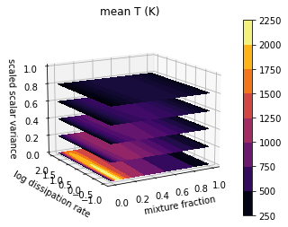
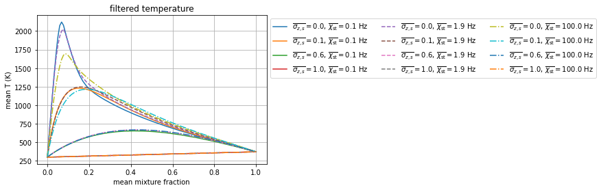

Tabulation API Example: Presumed PDF SLFM Tables
================================================

*This demo is part of Spitfire, with*\ `licensing and copyright info
here. <https://github.com/sandialabs/Spitfire/blob/master/license.md>`__

*Highlights* - Building presumed PDF adiabatic and nonadiabatic SFLM
libraries for turbulent flows - Using Spitfire’s wrapper around the
Python interface of
```TabProps`` <https://multiscale.utah.edu/software/>`__ to easily
extend tables with clipped Gaussian and Beta PDFs

Tabulated chemistry models can often be split into two pieces: a
*reaction* model and a *mixing* model. The reaction model describes
small scale laminar flame structure, for instance equilibrium (fast
chemistry) or diffusion-reaction (SLFM), possibly perturbed by radiative
heat losses. A mixing model is unnecessary in a CFD simulation when the
flow is laminar or when all scales of turbulence are resolved as in
direct numerical simulation (DNS). In Reynolds-averaged Navier-Stokes
(RANS) or large eddy simulation (LES), however, small scales are modeled
instead of being resolved by the mesh. Here a mixing model is necessary
to account for turbulence-chemistry interaction on subgrid scales.

In RANS and LES, typically two statistical moments of conserved scalars
are transported on the mesh and the mixing model accounts for
unresolved, or subgrid, heterogeneity. A mixing model accomplishes this
by describing the statistical distribution of the subgrid scalar field.
Spitfire and the `Python interface of the ``TabProps``
code <https://multiscale.utah.edu/software/>`__ can be combined to build
reaction models and then incorporate presumed PDF mixing models.

The Reaction Models
-------------------

First we’ll build the reaction models for an n-heptane/air system
following prior demonstrations.

.. code:: ipython3

    from spitfire import (ChemicalMechanismSpec, 
                          Library,
                          FlameletSpec, 
                          build_adiabatic_slfm_library,
                          build_nonadiabatic_defect_transient_slfm_library)
    import matplotlib.pyplot as plt
    import numpy as np
    
    mech = ChemicalMechanismSpec(cantera_xml='heptane-liu-hewson-chen-pitsch-highT.xml', 
                                 group_name='gas')
    
    pressure = 101325.
    
    air = mech.stream(stp_air=True)
    fuel = mech.stream('TPY', (372., pressure, 'NXC7H16:1'))
    
    flamelet_specs = FlameletSpec(mech_spec=mech, 
                                  initial_condition='equilibrium',
                                  oxy_stream=air,
                                  fuel_stream=fuel,
                                  grid_points=34)
    
    l_ad = build_adiabatic_slfm_library(flamelet_specs,
                                        diss_rate_values=np.logspace(-1, 2, 8),
                                        diss_rate_ref='stoichiometric',
                                        verbose=False)
    
    l_na = build_nonadiabatic_defect_transient_slfm_library(flamelet_specs,
                                                            diss_rate_values=np.logspace(-1, 2, 8),
                                                            diss_rate_ref='stoichiometric',
                                                            n_defect_st=16,
                                                            integration_args={'transient_tolerance': 1.e-12})
    # note here: the transient_tolerance is specified to avoid seeing "failure" messages,
    # but in absence of this flag, Spitfire will automatically iterate after failures to obtain a solution


.. parsed-literal::

    ----------------------------------------------------------------------------------
    building nonadiabatic (defect) SLFM library
    ----------------------------------------------------------------------------------
    - mechanism: heptane-liu-hewson-chen-pitsch-highT.xml
    - 38 species, 105 reactions
    - stoichiometric mixture fraction: 0.062
    ----------------------------------------------------------------------------------
    ----------------------------------------------------------------------------------
    building adiabatic SLFM library
    ----------------------------------------------------------------------------------
    - mechanism: heptane-liu-hewson-chen-pitsch-highT.xml
    - 38 species, 105 reactions
    - stoichiometric mixture fraction: 0.062
    ----------------------------------------------------------------------------------
       1/   8 (chi_stoich =  1.0e-01 1/s)  converged in   0.66 s, T_max = 2122.1
       2/   8 (chi_stoich =  2.7e-01 1/s)  converged in   0.01 s, T_max = 2089.8
       3/   8 (chi_stoich =  7.2e-01 1/s)  converged in   0.01 s, T_max = 2055.4
       4/   8 (chi_stoich =  1.9e+00 1/s)  converged in   0.06 s, T_max = 2027.5
       5/   8 (chi_stoich =  5.2e+00 1/s)  converged in   0.07 s, T_max = 1984.7
       6/   8 (chi_stoich =  1.4e+01 1/s)  converged in   0.08 s, T_max = 1924.2
       7/   8 (chi_stoich =  3.7e+01 1/s)  converged in   0.07 s, T_max = 1840.6
       8/   8 (chi_stoich =  1.0e+02 1/s)  converged in   0.10 s, T_max = 1695.0
    ----------------------------------------------------------------------------------
    library built in   1.19 s
    ----------------------------------------------------------------------------------
    expanding (transient) enthalpy defect dimension ...
    chi_st =  1.0e-01 1/s converged in   7.03 s
    chi_st =  2.7e-01 1/s converged in   6.60 s
    chi_st =  7.2e-01 1/s converged in   6.45 s
    chi_st =  1.9e+00 1/s converged in   6.05 s
    chi_st =  5.2e+00 1/s converged in   5.96 s
    chi_st =  1.4e+01 1/s converged in   6.52 s
    chi_st =  3.7e+01 1/s converged in   7.72 s
    chi_st =  1.0e+02 1/s converged in   6.91 s
    ----------------------------------------------------------------------------------
    enthalpy defect dimension expanded in  53.25 s
    ----------------------------------------------------------------------------------
    Structuring enthalpy defect dimension ... 
    Initializing ... Done.
    Interpolating onto structured grid ... 
    Progress: 0%--10%--20%--30%--40%--50%--60%--70%--80%--100%
    Structured enthalpy defect dimension built in   3.28 s
    ----------------------------------------------------------------------------------
    library built in  57.74 s
    ----------------------------------------------------------------------------------


Tabulated Properties
--------------------

Running a CFD calculation requires fluid properties such as the
viscosity, heat capacity, and enthalpy. These are computed on the
laminar reaction model and are then integrated with the presumed PDF. So
before applying the presumed PDF mixing model we make new libraries with
just a few properties likely necessary for the simulation. We typically
don’t need to tabulate the entire set of mass fractions, so we’ll remove
them to save time.

.. code:: ipython3

    from spitfire import get_ct_solution_array
    import copy
    
    def tabulate_properties(TY_lib):
        ct_sol, lib_shape = get_ct_solution_array(mech, TY_lib)
        prop_lib = copy.copy(TY_lib)
        prop_lib.remove(*prop_lib.props)
        
        prop_lib['temperature'] = ct_sol.T.reshape(lib_shape)
        prop_lib['viscosity'] = ct_sol.viscosity.reshape(lib_shape)
        prop_lib['enthalpy'] = ct_sol.enthalpy_mass.reshape(lib_shape)
        prop_lib['heat_capacity_cp'] = ct_sol.cp_mass.reshape(lib_shape)
    
        return prop_lib
    
    
    prop_ad = tabulate_properties(l_ad)
    prop_na = tabulate_properties(l_na)

Presumed PDFs
-------------

First, we’ll use TabProps to evaluate the clipped Gaussian and
:math:`\beta` PDFs for some represenative means and variances. Note the
major differences between the PDF types at higher variances and near the
boundaries. The poor behavior of the :math:`\beta` PDF in these regimes
makes it substantially harder to integrate than the clipped Gaussian.

.. code:: ipython3

    from pytabprops import ClippedGaussMixMdl, BetaMixMdl
    
    ztest = np.linspace(0, 1, 1000)
    
    cg = ClippedGaussMixMdl(201, 201, False)
    bp = BetaMixMdl()
    
    zmean = 0.38
    for i, zsvar in enumerate([0.05, 0.1, 0.2, 0.25, 0.28]):
        bp.set_mean(zmean)
        bp.set_scaled_variance(zsvar)
        plt.plot(ztest, bp.get_pdf(ztest), 'b--', label='$\\beta-PDF$' if i == 0 else None)
        cg.set_mean(zmean)
        cg.set_scaled_variance(zsvar)
        plt.plot(ztest, cg.get_pdf(ztest), 'g-', label='ClipGauss' if i == 0 else None)
    plt.title(f'mean {zmean:.2f} w/multiple variances')
    plt.xlabel('input')
    plt.ylabel('PDF')
    plt.grid()
    plt.legend()
    plt.show()
    
    zsvar = 0.12
    for i, zmean in enumerate([0.15, 0.3, 0.5]):
        bp.set_mean(zmean)
        bp.set_scaled_variance(zsvar)
        plt.plot(ztest, bp.get_pdf(ztest), 'b--', label='$\\beta-PDF$' if i == 0 else None)
        cg.set_mean(zmean)
        cg.set_scaled_variance(zsvar)
        plt.plot(ztest, cg.get_pdf(ztest), 'g-', label='ClipGauss' if i == 0 else None)
    plt.title(f'scaled variance {zsvar:.2f} w/multiple means')
    plt.xlabel('input')
    plt.ylabel('PDF')
    plt.grid()
    plt.legend()
    plt.show()


.. image:: tabulation_api_presumed_pdf_files/tabulation_api_presumed_pdf_5_0.png


.. image:: tabulation_api_presumed_pdf_files/tabulation_api_presumed_pdf_5_1.png


Incorporating the Mixing Model: Clipped Gaussian and :math:`\beta` PDFs
-----------------------------------------------------------------------

Spitfire provides the ``apply_mixing_model`` which takes an existing
``Library``, for instance those computed above, and incorporates subgrid
variation for all dimensions and adds the (default) suffix ``_mean``.

Spitfire provides two optimized PDF integrators from TabProps, the
clipped Gaussian (``'ClipGauss'``) and the beta PDF (``'Beta'``). These
PDFs and their integrals are challenging to implement and TabProps’
implementation is excellent. In addition these, Spitfire allows you to
“roll your own” PDF integrator, a feature to be shown in following
demonstrations.

.. code:: ipython3

    from spitfire import apply_mixing_model, PDFSpec
    
    scaled_variance_values = np.array([0, 0.001, 0.01, 0.1, 0.2, 0.4, 0.6, 0.8, 0.9, 1.0])
    
    mixing_spec = {'mixture_fraction': PDFSpec(pdf='ClipGauss', scaled_variance_values=scaled_variance_values)}
    
    t_cg_prop_ad = apply_mixing_model(prop_ad, mixing_spec, verbose=True)
    t_cg_prop_na = apply_mixing_model(prop_na, mixing_spec, verbose=True)


.. parsed-literal::

    scaled_scalar_variance_mean: computing 10880 integrals... completed in 1.7 seconds, average = 6231 integrals/s.
    scaled_scalar_variance_mean: computing 174080 integrals... completed in 26.3 seconds, average = 6609 integrals/s.


Now take a quick look at the tables. Input dimensions have been suffixed
with ``_mean`` and the scalar variance (its scaled form that varies
between 0 and 1) is incorporated as the final dimension. Futher, the
``extra_attributes`` dictionary that holds library metadata saves the
``mixing_spec`` dictionary for later reference.

.. code:: ipython3

    print(t_cg_prop_ad)
    print(t_cg_prop_na)


.. parsed-literal::

    
    Spitfire Library with 3 dimensions and 4 properties
    ------------------------------------------
    1. Dimension "mixture_fraction_mean" spanning [0.0, 1.0] with 34 points
    2. Dimension "dissipation_rate_stoich_mean" spanning [0.1, 100.0] with 8 points
    3. Dimension "scaled_scalar_variance_mean" spanning [0.0, 1.0] with 10 points
    ------------------------------------------
    temperature         , min = 300.0 max = 2122.0969552261395
    viscosity           , min = 1.2370131775920866e-05 max = 6.906467776682997e-05
    enthalpy            , min = -1739935.6849118916 max = 1901.8191601112546
    heat_capacity_cp    , min = 1011.3329912202539 max = 2422.2079033534937
    Extra attributes: {'mech_spec': <spitfire.chemistry.mechanism.ChemicalMechanismSpec object at 0x7fb4465fe050>, 'mixing_spec': {'mixture_fraction': <spitfire.chemistry.tabulation.PDFSpec object at 0x7fb459b7a350>, 'dissipation_rate_stoich': <spitfire.chemistry.tabulation.PDFSpec object at 0x7fb459b7a2d0>}}
    ------------------------------------------
    
    
    Spitfire Library with 4 dimensions and 4 properties
    ------------------------------------------
    1. Dimension "mixture_fraction_mean" spanning [0.0, 1.0] with 34 points
    2. Dimension "dissipation_rate_stoich_mean" spanning [0.1, 100.0] with 8 points
    3. Dimension "enthalpy_defect_stoich_mean" spanning [-2140792.9007149865, 0.0] with 16 points
    4. Dimension "scaled_scalar_variance_mean" spanning [0.0, 1.0] with 10 points
    ------------------------------------------
    temperature         , min = 299.99999999999994 max = 2122.0969552261395
    viscosity           , min = 1.2370131775920852e-05 max = 6.906467776682997e-05
    enthalpy            , min = -2521386.931029486 max = 1901.8191601113012
    heat_capacity_cp    , min = 1011.3329912202539 max = 2422.2079033534937
    Extra attributes: {'mech_spec': <spitfire.chemistry.mechanism.ChemicalMechanismSpec object at 0x7fb45ebb4110>, 'mixing_spec': {'mixture_fraction': <spitfire.chemistry.tabulation.PDFSpec object at 0x7fb459b7a350>, 'dissipation_rate_stoich': <spitfire.chemistry.tabulation.PDFSpec object at 0x7fb459e46d90>, 'enthalpy_defect_stoich': <spitfire.chemistry.tabulation.PDFSpec object at 0x7fb459e46d50>}}
    ------------------------------------------
    


.. code:: ipython3

    from mpl_toolkits.mplot3d import axes3d
    from matplotlib.colors import Normalize

To finish things off we can show some simple visualiations of the data.

.. code:: ipython3

    fig = plt.figure()
    ax = fig.gca(projection='3d')
    z = np.squeeze(t_cg_prop_ad.mixture_fraction_mean_grid[:, :, 0])
    x = np.squeeze(np.log10(t_cg_prop_ad.dissipation_rate_stoich_mean_grid[:, :, 0]))
    v_list = t_cg_prop_ad.scaled_scalar_variance_mean_values
    for idx in [7, 6, 5, 4, 0]:
        p = ax.contourf(z, x, np.squeeze(t_cg_prop_ad['temperature'][:, :, idx]), 
                        offset=v_list[idx], 
                        cmap='inferno',
                        norm=Normalize(300, 2200))
    plt.colorbar(p)
    ax.view_init(elev=14, azim=-120)
    ax.set_zlim([0, 1])
    ax.set_xlabel('mixture fraction')
    ax.set_ylabel('log dissipation rate')
    ax.set_zlabel('scaled scalar variance')
    ax.set_title('mean T (K)')
    plt.show()





.. code:: ipython3

    j = 0
    chi = t_cg_prop_ad.dissipation_rate_stoich_mean_values[j]
    for i in range(0, t_cg_prop_ad.scaled_scalar_variance_mean_npts, 3):
        svar = t_cg_prop_ad.scaled_scalar_variance_mean_values[i]
        plt.plot(t_cg_prop_ad.mixture_fraction_mean_values, np.squeeze(t_cg_prop_ad['temperature'][:, j, i]),
                 '-',
                 label='$\\overline{\sigma_{z,s}}=$'+f'{svar}'+', $\\overline{\\chi_{\\rm st}}=$'+f'{chi:.1f} Hz')
    j = 3
    chi = t_cg_prop_ad.dissipation_rate_stoich_mean_values[j]
    for i in range(0, t_cg_prop_ad.scaled_scalar_variance_mean_npts, 3):
        svar = t_cg_prop_ad.scaled_scalar_variance_mean_values[i]
        plt.plot(t_cg_prop_ad.mixture_fraction_mean_values, np.squeeze(t_cg_prop_ad['temperature'][:, j, i]),
                 '--',
                 label='$\\overline{\sigma_{z,s}}=$'+f'{svar}'+', $\\overline{\\chi_{\\rm st}}=$'+f'{chi:.1f} Hz')
    j = 7
    chi = t_cg_prop_ad.dissipation_rate_stoich_mean_values[j]
    for i in range(0, t_cg_prop_ad.scaled_scalar_variance_mean_npts, 3):
        svar = t_cg_prop_ad.scaled_scalar_variance_mean_values[i]
        plt.plot(t_cg_prop_ad.mixture_fraction_mean_values, np.squeeze(t_cg_prop_ad['temperature'][:, j, i]),
                 '-.',
                 label='$\\overline{\sigma_{z,s}}=$'+f'{svar}'+', $\\overline{\\chi_{\\rm st}}=$'+f'{chi:.1f} Hz')
    plt.xlabel('mean mixture fraction')
    plt.ylabel('mean T (K)')
    plt.title('filtered temperature')
    plt.grid()
    plt.legend(bbox_to_anchor=(1, 1), loc='upper left', ncol=3)
    plt.show()





