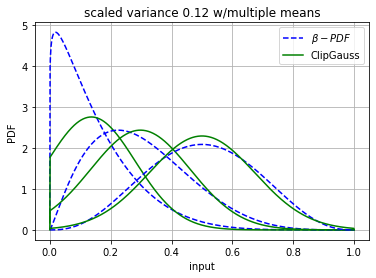
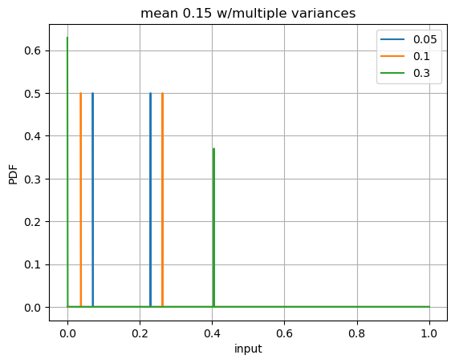
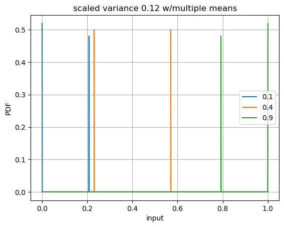
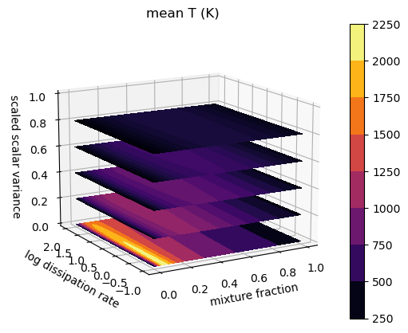
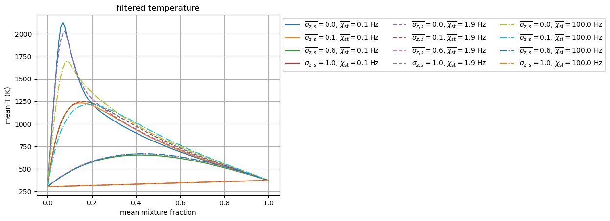
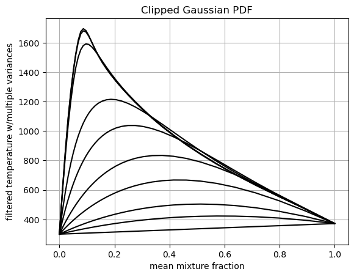
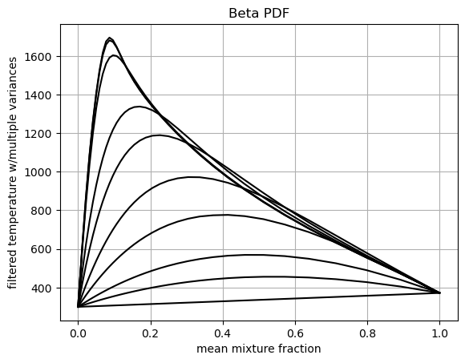
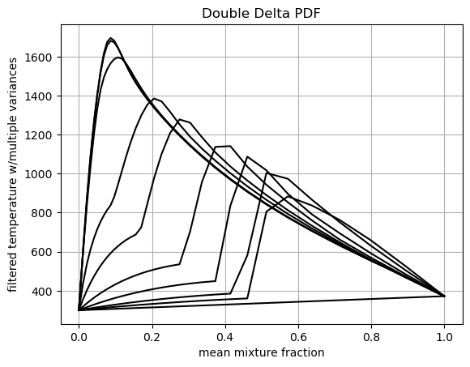

Tabulation API Example: Presumed PDF SLFM Tables
================================================

*This demo is part of Spitfire, with*\ `licensing and copyright info
here. <https://github.com/sandialabs/Spitfire/blob/master/license.md>`__

*Highlights*

- Building presumed PDF adiabatic and nonadiabatic SFLM libraries for turbulent flows

- Using Spitfire’s wrapper around the Python interface of ``TabProps`` <https://multiscale.utah.edu/software/> to easily extend tables with clipped Gaussian and Beta PDFs

In this demo, we build reaction models and then incorporate the presumed PDF mixing models outlined in the mixing model documentation.

The Reaction Models
-------------------

First we’ll build the reaction models for an n-heptane/air system
following prior demonstrations.

.. code:: ipython3

    from spitfire import (ChemicalMechanismSpec, 
                          Library,
                          FlameletSpec, 
                          build_adiabatic_slfm_library,
                          build_nonadiabatic_defect_transient_slfm_library)
    import matplotlib.pyplot as plt
    import numpy as np
    
    mech = ChemicalMechanismSpec(cantera_xml='heptane-liu-hewson-chen-pitsch-highT.xml', 
                                 group_name='gas')
    
    pressure = 101325.
    
    air = mech.stream(stp_air=True)
    fuel = mech.stream('TPY', (372., pressure, 'NXC7H16:1'))
    
    flamelet_specs = FlameletSpec(mech_spec=mech, 
                                  initial_condition='equilibrium',
                                  oxy_stream=air,
                                  fuel_stream=fuel,
                                  grid_points=34)
    
    l_ad = build_adiabatic_slfm_library(flamelet_specs,
                                        diss_rate_values=np.logspace(-1, 2, 8),
                                        diss_rate_ref='stoichiometric',
                                        verbose=False)
    
    l_na = build_nonadiabatic_defect_transient_slfm_library(flamelet_specs,
                                                            diss_rate_values=np.logspace(-1, 2, 8),
                                                            diss_rate_ref='stoichiometric',
                                                            n_defect_st=16,
                                                            integration_args={'transient_tolerance': 1.e-12})
    # note here: the transient_tolerance is specified to avoid seeing "failure" messages,
    # but in absence of this flag, Spitfire will automatically iterate after failures to obtain a solution

.. parsed-literal::

    ----------------------------------------------------------------------------------
    building nonadiabatic (defect) SLFM library
    ----------------------------------------------------------------------------------
    - mechanism: heptane-liu-hewson-chen-pitsch-highT.xml
    - 38 species, 105 reactions
    - stoichiometric mixture fraction: 0.062
    ----------------------------------------------------------------------------------
    ----------------------------------------------------------------------------------
    building adiabatic SLFM library
    ----------------------------------------------------------------------------------
    - mechanism: heptane-liu-hewson-chen-pitsch-highT.xml
    - 38 species, 105 reactions
    - stoichiometric mixture fraction: 0.062
    ----------------------------------------------------------------------------------
       1/   8 (chi_stoich =  1.0e-01 1/s)  converged in   0.68 s, T_max = 2122.1
       2/   8 (chi_stoich =  2.7e-01 1/s)  converged in   0.01 s, T_max = 2089.8
       3/   8 (chi_stoich =  7.2e-01 1/s)  converged in   0.01 s, T_max = 2055.4
       4/   8 (chi_stoich =  1.9e+00 1/s)  converged in   0.07 s, T_max = 2027.5
       5/   8 (chi_stoich =  5.2e+00 1/s)  converged in   0.08 s, T_max = 1984.7
       6/   8 (chi_stoich =  1.4e+01 1/s)  converged in   0.08 s, T_max = 1924.2
       7/   8 (chi_stoich =  3.7e+01 1/s)  converged in   0.08 s, T_max = 1840.6
       8/   8 (chi_stoich =  1.0e+02 1/s)  converged in   0.11 s, T_max = 1695.0
    ----------------------------------------------------------------------------------
    library built in   1.27 s
    ----------------------------------------------------------------------------------
    expanding (transient) enthalpy defect dimension ...
    chi_st =  1.0e-01 1/s converged in  13.95 s
    chi_st =  2.7e-01 1/s converged in  13.38 s
    chi_st =  7.2e-01 1/s converged in  13.06 s
    chi_st =  1.9e+00 1/s converged in  12.70 s
    chi_st =  5.2e+00 1/s converged in  12.90 s
    chi_st =  1.4e+01 1/s converged in  12.35 s
    chi_st =  3.7e+01 1/s converged in  15.03 s
    chi_st =  1.0e+02 1/s converged in  14.13 s
    ----------------------------------------------------------------------------------
    enthalpy defect dimension expanded in 107.50 s
    ----------------------------------------------------------------------------------
    Structuring enthalpy defect dimension ... 
    Initializing ... Done.
    Interpolating onto structured grid ... 
    Progress: 0%--10%--20%--30%--40%--50%--60%--70%--80%--100%
    Structured enthalpy defect dimension built in   3.35 s
    ----------------------------------------------------------------------------------
    library built in 112.14 s
    ----------------------------------------------------------------------------------

Tabulated Properties
--------------------

Running a CFD calculation requires fluid properties such as the
viscosity, heat capacity, and enthalpy. These are computed on the
laminar reaction model and are then integrated with the presumed PDF. So
before applying the presumed PDF mixing model we make new libraries with
just a few properties likely necessary for the simulation. We typically
don’t need to tabulate the entire set of mass fractions, so we’ll remove
them to save time.

.. code:: ipython3

    from spitfire import get_ct_solution_array
    import copy
    
    def tabulate_properties(TY_lib):
        ct_sol, lib_shape = get_ct_solution_array(mech, TY_lib)
        prop_lib = copy.copy(TY_lib)
        prop_lib.remove(*prop_lib.props)
        
        prop_lib['temperature'] = ct_sol.T.reshape(lib_shape)
        prop_lib['viscosity'] = ct_sol.viscosity.reshape(lib_shape)
        prop_lib['enthalpy'] = ct_sol.enthalpy_mass.reshape(lib_shape)
        prop_lib['heat_capacity_cp'] = ct_sol.cp_mass.reshape(lib_shape)
    
        return prop_lib
    
    
    prop_ad = tabulate_properties(l_ad)
    prop_na = tabulate_properties(l_na)

Presumed PDFs
-------------

First, we’ll use TabProps to evaluate the clipped Gaussian and
:math:`\beta` PDFs for some representative means and variances. Note the
major differences between the PDF types at higher variances and near the
boundaries. The poor behavior of the :math:`\beta` PDF in these regimes
makes it substantially harder to integrate than the clipped Gaussian.

.. code:: ipython3

    from spitfire import BetaPDF, ClipGaussPDF
    
    ztest = np.linspace(0, 1, 1000)
    
    cg = ClipGaussPDF()
    bp = BetaPDF()
    
    zmean = 0.38
    for i, zsvar in enumerate([0.05, 0.1, 0.2, 0.25, 0.28]):
        bp.set_mean(zmean)
        bp.set_scaled_variance(zsvar)
        plt.plot(ztest, bp.get_pdf(ztest), 'b--', label='$\\beta-PDF$' if i == 0 else None)
        cg.set_mean(zmean)
        cg.set_scaled_variance(zsvar)
        plt.plot(ztest, cg.get_pdf(ztest), 'g-', label='ClipGauss' if i == 0 else None)
    plt.title(f'mean {zmean:.2f} w/multiple variances')
    plt.xlabel('input')
    plt.ylabel('PDF')
    plt.grid()
    plt.legend()
    plt.show()
    
    zsvar = 0.12
    for i, zmean in enumerate([0.15, 0.3, 0.5]):
        bp.set_mean(zmean)
        bp.set_scaled_variance(zsvar)
        plt.plot(ztest, bp.get_pdf(ztest), 'b--', label='$\\beta-PDF$' if i == 0 else None)
        cg.set_mean(zmean)
        cg.set_scaled_variance(zsvar)
        plt.plot(ztest, cg.get_pdf(ztest), 'g-', label='ClipGauss' if i == 0 else None)
    plt.title(f'scaled variance {zsvar:.2f} w/multiple means')
    plt.xlabel('input')
    plt.ylabel('PDF')
    plt.grid()
    plt.legend()
    plt.show()

.. image:: tabulation_api_presumed_pdf_files/tabulation_api_presumed_pdf_5_0.png

Another PDF supported in Spitfire is a ``DoubleDeltaPDF`` shown below.
To be precise, what we show below is not the actual double delta PDF but
its integral.

.. code:: ipython3

    from spitfire import DoubleDeltaPDF
    
    ztest = np.linspace(0, 1, 1000)
    colors = ['k','r','b']
    
    ddelta = DoubleDeltaPDF()
    
    zmean = 0.15
    for i, zsvar in enumerate([0.05, 0.1, 0.3]):
        ddelta.set_mean(zmean)
        ddelta.set_scaled_variance(zsvar)
        nonzero_points = np.array([ddelta.find_bounds()[0],ddelta.find_bounds()[1]])
        zfull = np.sort(np.hstack((ztest, nonzero_points)))
        plt.plot(zfull, ddelta.get_pdf(zfull), '-', label=str(zsvar))
    plt.title(f'mean {zmean:.2f} w/multiple variances')
    plt.xlabel('input')
    plt.ylabel('PDF')
    plt.grid()
    plt.legend()
    plt.show()
    
    zsvar = 0.12
    for i, zmean in enumerate([0.1, 0.4, 0.9]):
        ddelta.set_mean(zmean)
        ddelta.set_scaled_variance(zsvar)
        nonzero_points = np.array([ddelta.find_bounds()[0],ddelta.find_bounds()[1]])
        zfull = np.sort(np.hstack((ztest, nonzero_points)))
        plt.plot(zfull, ddelta.get_pdf(zfull), '-', label=str(zmean))
    plt.title(f'scaled variance {zsvar:.2f} w/multiple means')
    plt.xlabel('input')
    plt.ylabel('PDF')
    plt.grid()
    plt.legend()
    plt.show()

Incorporating the Mixing Model: PDFs supported by Spitfire
----------------------------------------------------------

Spitfire provides the ``apply_mixing_model`` which takes an existing
``Library``, for instance those computed above, and incorporates subgrid
variation for all dimensions and adds the (default) suffix ``_mean``.

Spitfire provides optimized PDF integrators for the following PDFs:

- clipped Gaussian (``'ClipGauss'``)

- :math:`\beta` PDF (``'Beta'``)

- double delta PDF (``'DoubleDelta'``)

Tabprops handles integration of the clipped Gaussian while
``scipy.integrate.quad`` handles integration of the Beta PDF. The
DoubleDelta PDF allows for analytic solutions. In addition to these
supported PDFs, Spitfire allows you to “roll your own” PDF integrator, a
feature to be shown in following demonstrations.

When calling ``apply_mixing_model`` on particularly large laminar
libraries, speedup through parallelism can be achieved when ``num_procs`` is greater than 1 
by setting ``parallel_type`` in the ``PDFSpec`` to one of the following options:

- ``'property'``: parallelize over properties

- ``'property-mean'``: parallelize over mean and properties

- ``'property-variance'``: parallelize over variance and properties

- ``'full'``: parallelize over mean, variance, and properties

- ``'default'``: use the fastest parallel method on average depending on the pdf

.. code:: ipython3

    from spitfire import apply_mixing_model, PDFSpec
    
    scaled_variance_values = np.array([0, 0.001, 0.01, 0.1, 0.2, 0.4, 0.6, 0.8, 0.9, 1.0])
    
    mixing_spec = {'mixture_fraction': PDFSpec(pdf='ClipGauss', scaled_variance_values=scaled_variance_values)}
    
    t_cg_prop_ad = apply_mixing_model(prop_ad, mixing_spec, verbose=True)
    t_cg_prop_na = apply_mixing_model(prop_na, mixing_spec, verbose=True)

.. parsed-literal::

    scaled_scalar_variance_mean: computing 10880 integrals... completed in 2.9 seconds, average = 3759 integrals/s.
    scaled_scalar_variance_mean: computing 174080 integrals... completed in 42.5 seconds, average = 4098 integrals/s.

Now take a quick look at the tables. Input dimensions have been suffixed
with ``_mean`` and the scalar variance (its scaled form that varies
between 0 and 1) is incorporated as the final dimension. Futher, the
``extra_attributes`` dictionary that holds library metadata saves the
``mixing_spec`` dictionary for later reference.

.. code:: ipython3

    print(t_cg_prop_ad)
    print(t_cg_prop_na)

.. parsed-literal::

    
    Spitfire Library with 3 dimensions and 4 properties
    ------------------------------------------
    1. Dimension "mixture_fraction_mean" spanning [0.0, 1.0] with 34 points
    2. Dimension "dissipation_rate_stoich_mean" spanning [0.1, 100.0] with 8 points
    3. Dimension "scaled_scalar_variance_mean" spanning [0.0, 1.0] with 10 points
    ------------------------------------------
    temperature         , min = 300.0 max = 2122.096955226145
    viscosity           , min = 1.2370131775920866e-05 max = 6.906467776682902e-05
    enthalpy            , min = -1739935.6849118916 max = 1901.8191601112542
    heat_capacity_cp    , min = 1011.3329912202539 max = 2422.2079033535088
    Extra attributes: {'mech_spec': <spitfire.chemistry.mechanism.ChemicalMechanismSpec object at 0x7f5f929b5a90>, 'mixing_spec': {'mixture_fraction': <spitfire.chemistry.tabulation.PDFSpec object at 0x7f5f92a2cfd0>, 'dissipation_rate_stoich': <spitfire.chemistry.tabulation.PDFSpec object at 0x7f5f92a2cc10>}}
    ------------------------------------------
    
    
    Spitfire Library with 4 dimensions and 4 properties
    ------------------------------------------
    1. Dimension "mixture_fraction_mean" spanning [0.0, 1.0] with 34 points
    2. Dimension "dissipation_rate_stoich_mean" spanning [0.1, 100.0] with 8 points
    3. Dimension "enthalpy_defect_stoich_mean" spanning [-2140766.3110727593, 0.0] with 16 points
    4. Dimension "scaled_scalar_variance_mean" spanning [0.0, 1.0] with 10 points
    ------------------------------------------
    temperature         , min = 299.99999999999994 max = 2122.096955226145
    viscosity           , min = 1.2370131775920852e-05 max = 6.906467776682902e-05
    enthalpy            , min = -2521383.376793081 max = 1901.8191601113015
    heat_capacity_cp    , min = 1011.3329912202539 max = 2422.2079033535088
    Extra attributes: {'mech_spec': <spitfire.chemistry.mechanism.ChemicalMechanismSpec object at 0x7f5f900e7a50>, 'mixing_spec': {'mixture_fraction': <spitfire.chemistry.tabulation.PDFSpec object at 0x7f5f92a2cfd0>, 'dissipation_rate_stoich': <spitfire.chemistry.tabulation.PDFSpec object at 0x7f5f92a8af10>, 'enthalpy_defect_stoich': <spitfire.chemistry.tabulation.PDFSpec object at 0x7f5f900cd9d0>}}
    ------------------------------------------
    

.. code:: ipython3

    from mpl_toolkits.mplot3d import axes3d
    from matplotlib.colors import Normalize

To finish things off we can show some simple visualiations of the data.

.. code:: ipython3

    fig = plt.figure()
    ax = fig.gca(projection='3d')
    z = np.squeeze(t_cg_prop_ad.mixture_fraction_mean_grid[:, :, 0])
    x = np.squeeze(np.log10(t_cg_prop_ad.dissipation_rate_stoich_mean_grid[:, :, 0]))
    v_list = t_cg_prop_ad.scaled_scalar_variance_mean_values
    for idx in [7, 6, 5, 4, 0]:
        p = ax.contourf(z, x, np.squeeze(t_cg_prop_ad['temperature'][:, :, idx]), 
                        offset=v_list[idx], 
                        cmap='inferno',
                        norm=Normalize(300, 2200))
    plt.colorbar(p)
    ax.view_init(elev=14, azim=-120)
    ax.set_zlim([0, 1])
    ax.set_xlabel('mixture fraction')
    ax.set_ylabel('log dissipation rate')
    ax.set_zlabel('scaled scalar variance')
    ax.set_title('mean T (K)')
    plt.show()

.. code:: ipython3

    j = 0
    chi = t_cg_prop_ad.dissipation_rate_stoich_mean_values[j]
    for i in range(0, t_cg_prop_ad.scaled_scalar_variance_mean_npts, 3):
        svar = t_cg_prop_ad.scaled_scalar_variance_mean_values[i]
        plt.plot(t_cg_prop_ad.mixture_fraction_mean_values, np.squeeze(t_cg_prop_ad['temperature'][:, j, i]),
                 '-',
                 label='$\\overline{\sigma_{z,s}}=$'+f'{svar}'+', $\\overline{\\chi_{\\rm st}}=$'+f'{chi:.1f} Hz')
    j = 3
    chi = t_cg_prop_ad.dissipation_rate_stoich_mean_values[j]
    for i in range(0, t_cg_prop_ad.scaled_scalar_variance_mean_npts, 3):
        svar = t_cg_prop_ad.scaled_scalar_variance_mean_values[i]
        plt.plot(t_cg_prop_ad.mixture_fraction_mean_values, np.squeeze(t_cg_prop_ad['temperature'][:, j, i]),
                 '--',
                 label='$\\overline{\sigma_{z,s}}=$'+f'{svar}'+', $\\overline{\\chi_{\\rm st}}=$'+f'{chi:.1f} Hz')
    j = 7
    chi = t_cg_prop_ad.dissipation_rate_stoich_mean_values[j]
    for i in range(0, t_cg_prop_ad.scaled_scalar_variance_mean_npts, 3):
        svar = t_cg_prop_ad.scaled_scalar_variance_mean_values[i]
        plt.plot(t_cg_prop_ad.mixture_fraction_mean_values, np.squeeze(t_cg_prop_ad['temperature'][:, j, i]),
                 '-.',
                 label='$\\overline{\sigma_{z,s}}=$'+f'{svar}'+', $\\overline{\\chi_{\\rm st}}=$'+f'{chi:.1f} Hz')
    plt.xlabel('mean mixture fraction')
    plt.ylabel('mean T (K)')
    plt.title('filtered temperature')
    plt.grid()
    plt.legend(bbox_to_anchor=(1, 1), loc='upper left', ncol=3)
    plt.show()

Below, we compare the convolution of a property using the different
supported PDFs. We will pick a single property profile.

.. code:: ipython3

    prop = 'temperature'
    sampled_lib = Library(prop_ad.dims[0])
    sampled_lib[prop] = Library.copy(prop_ad)[prop][:,-1]
    
    t_cg_T_ad = apply_mixing_model(sampled_lib, {'mixture_fraction': PDFSpec(pdf='ClipGauss', scaled_variance_values=scaled_variance_values)}, verbose=True)
    t_bp_T_ad = apply_mixing_model(sampled_lib, {'mixture_fraction': PDFSpec(pdf='Beta', scaled_variance_values=scaled_variance_values)}, verbose=True)
    t_dd_T_ad = apply_mixing_model(sampled_lib, {'mixture_fraction': PDFSpec(pdf='DoubleDelta', scaled_variance_values=scaled_variance_values)}, verbose=True)

.. parsed-literal::

    scaled_scalar_variance_mean: computing 340 integrals... completed in 0.2 seconds, average = 1961 integrals/s.
    scaled_scalar_variance_mean: computing 340 integrals... completed in 3.9 seconds, average = 86 integrals/s.
    scaled_scalar_variance_mean: computing 340 integrals... completed in 0.0 seconds, average = 35079 integrals/s.

.. code:: ipython3

    for i in range(scaled_variance_values.size):
        plt.plot(t_cg_T_ad.mixture_fraction_mean_values, t_cg_T_ad[prop][:, i], 'k-')
    plt.xlabel('mean mixture fraction')
    plt.ylabel('filtered '+prop+' w/multiple variances')
    plt.title('Clipped Gaussian PDF')
    plt.grid()
    plt.show()
    
    for i in range(scaled_variance_values.size):
        plt.plot(t_bp_T_ad.mixture_fraction_mean_values, t_bp_T_ad[prop][:, i], 'k-')
    plt.xlabel('mean mixture fraction')
    plt.ylabel('filtered '+prop+' w/multiple variances')
    plt.title('Beta PDF')
    plt.grid()
    plt.show()
    
    for i in range(scaled_variance_values.size):
        plt.plot(t_dd_T_ad.mixture_fraction_mean_values, t_dd_T_ad[prop][:, i], 'k-')
    plt.xlabel('mean mixture fraction')
    plt.ylabel('filtered '+prop+' w/multiple variances')
    plt.title('Double Delta PDF')
    plt.grid()
    plt.show()

All PDFs, :math:`P(\phi)`, must satisfy the following integrals:

1. :math:`1 = \int_{-\infty}^\infty P(\phi) \mathrm{d}\phi`

2. :math:`\bar{\phi} = \int_{-\infty}^\infty \phi P(\phi) \mathrm{d}\phi`

3. :math:`\sigma_{\phi}^2 = \int_{-\infty}^\infty (\phi - \bar{\phi})^2 P(\phi) \mathrm{d}\phi`

Spitfire provides the function ``compute_pdf_max_integration_errors``
for computing the relative errors in satisfying those integrals. This is
useful when determining acceptable parameters for the :math:`\beta`-PDF,
for example. Below we show the relative errors using the default values
for the ``BetaPDF`` parameters.

.. code:: ipython3

    from spitfire import compute_pdf_max_integration_errors
    
    svars = np.array([0., 1.e-5, 6.e-4, 1.e-3, 0.1, 0.5, 0.8, 0.86, 0.9, 0.95, 1.])
    means = np.hstack((0,np.logspace(-5,0,100)))
    
    pdf = BetaPDF(scaled_variance_max_integrate=0.86, 
                  scaled_variance_min_integrate=6.e-4, 
                  mean_boundary_integrate=6.e-5)
    
    print(compute_pdf_max_integration_errors(pdf, means, svars))

.. parsed-literal::

    (0.0005913180615271241, 2.4555011311778803e-06, 0.009900892069395257)

