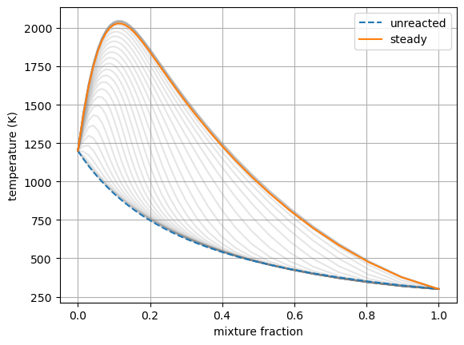
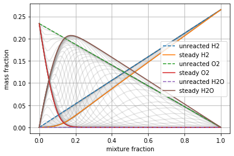
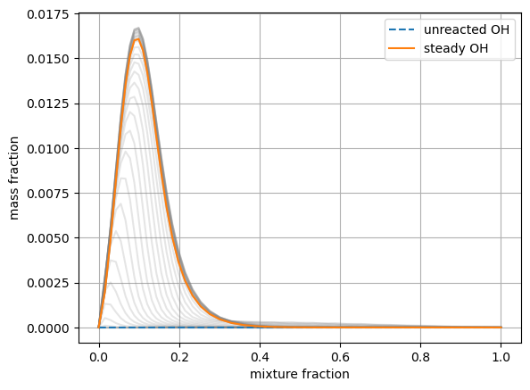
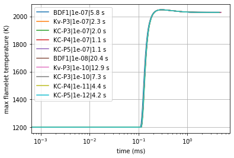
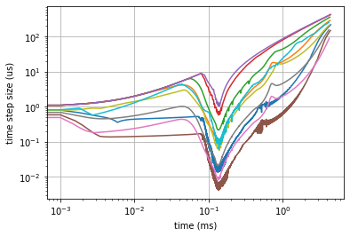
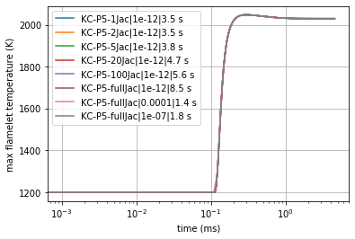
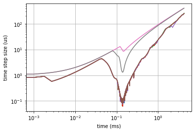

Transient Flamelet Example: Ignition and Advanced Time Integration
==================================================================

*This demo is part of Spitfire, with*\ `licensing and copyright info
here. <https://github.com/sandialabs/Spitfire/blob/master/license.md>`__

*Highlights* - Computing a transient ignition trajectory - Advanced time
integration parameters

Introduction
------------

In this demonstration we repeatedly compute the ignition trajectory of a
hydrogen flamelet, using different time steppers, target errors for
adaptive time step selection, and more.

.. code:: ipython3

    from spitfire import ChemicalMechanismSpec, FlameletSpec, Flamelet
    import cantera as ct
    import matplotlib.pyplot as plt
    import numpy as np
    from time import perf_counter

Just as a reminder, here we build the chemical mechanism instace from a
Cantera solution instead of simply providing the XML file and group name
directly. Either works, but sometimes you might already have a Cantera
solution available.

Following that, we build a preheated air stream and a fuel mixture of
Nitrogen and Hydrogen that gives a chosen stoichiometric mixture
fraction. These are sent to a ``FlameletSpec`` object for later.

.. code:: ipython3

    sol = ct.Solution('h2-burke.xml', 'h2-burke')
    mech = ChemicalMechanismSpec.from_solution(sol)
    
    Tair = 1200.
    pressure = 101325.
    zstoich = 0.1
    
    air = mech.stream(stp_air=True)
    air.TP = Tair, pressure
    fuel = mech.mix_fuels_for_stoich_mixture_fraction(mech.stream('X', 'H2:1'), mech.stream('X', 'N2:1'), zstoich, air)
    fuel.TP = 300., pressure
    
    flamelet_specs = FlameletSpec(mech_spec=mech, 
                                  initial_condition='unreacted',
                                  oxy_stream=air,
                                  fuel_stream=fuel,
                                  grid_points=34,
                                  max_dissipation_rate=1.e3)

Baseline Ignition Trajectory
----------------------------

First, we’ll simply call ``integrate_to_steady`` without any parameters
to compute a flamelet ignition trajectory with the default time
integration settings.

.. code:: ipython3

    ft = Flamelet(flamelet_specs)
    output = ft.integrate_to_steady()

.. code:: ipython3

    for i in range(0, output.time_values.size, 20):
        plt.plot(output.mixture_fraction_values, output['temperature'][i, :], color='gray', alpha=0.2)
    plt.plot(output.mixture_fraction_values, output['temperature'][0, :], '--', label='unreacted')
    plt.plot(output.mixture_fraction_values, output['temperature'][-1, :], label='steady')
    plt.grid()
    plt.xlabel('mixture fraction')
    plt.ylabel('temperature (K)')
    plt.legend()
    plt.show()
    
    for i in range(0, output.time_values.size, 20):
        plt.plot(output.mixture_fraction_values, output['mass fraction H2'][i, :], color='gray', alpha=0.2)
        plt.plot(output.mixture_fraction_values, output['mass fraction O2'][i, :], color='gray', alpha=0.2)
        plt.plot(output.mixture_fraction_values, output['mass fraction H2O'][i, :], color='gray', alpha=0.2)
    plt.plot(output.mixture_fraction_values, output['mass fraction H2'][0, :], '--', label='unreacted H2')
    plt.plot(output.mixture_fraction_values, output['mass fraction H2'][-1, :], label='steady H2')
    plt.plot(output.mixture_fraction_values, output['mass fraction O2'][0, :], '--',label='unreacted O2')
    plt.plot(output.mixture_fraction_values, output['mass fraction O2'][-1, :], label='steady O2')
    plt.plot(output.mixture_fraction_values, output['mass fraction H2O'][0, :],'--', label='unreacted H2O')
    plt.plot(output.mixture_fraction_values, output['mass fraction H2O'][-1, :], label='steady H2O')
    plt.grid()
    plt.xlabel('mixture fraction')
    plt.ylabel('mass fraction')
    plt.legend()
    plt.show()
    
    for i in range(0, output.time_values.size, 20):
        plt.plot(output.mixture_fraction_values, output['mass fraction OH'][i, :], color='gray', alpha=0.2)
    plt.plot(output.mixture_fraction_values, output['mass fraction OH'][0, :], '--', label='unreacted OH')
    plt.plot(output.mixture_fraction_values, output['mass fraction OH'][-1, :], label='steady OH')
    plt.grid()
    plt.xlabel('mixture fraction')
    plt.ylabel('mass fraction')
    plt.legend()
    plt.show()

Time Steppers and Target Error
------------------------------

Now we import some of Spitfire’s built-in time stepping methods. These
include BDF-1 (Backward Euler) and some implicit Runge-Kutta methods of
orders 3-5. The ``SimpleNewtonSolver`` is needed as the nonlinear solver
for the implicit time methods.

.. code:: ipython3

    from spitfire import (SimpleNewtonSolver,
                          BackwardEulerS1P1Q1,
                          KennedyCarpenterS6P4Q3,
                          KvaernoS4P3Q2,
                          KennedyCarpenterS4P3Q2,
                          KennedyCarpenterS8P5Q4)

To run with a custom stepper, provide the ``stepper_type`` argument. A
related parameter in these adaptive steppers is the
``transient_tolerance``, which should be decreased to improve accuracy
through smaller time steps. This parameter relates to efficiency through
the order of the integration technique - for first-order (P1) Backward
Euler the relationship is linear and a ten times reduction in the
tolerance should roughly correspond to a ten times increase in run time.
For the P3, P4, and P5 methods, however, a factor of ten increase in run
time can enable a tolerance 1000, 10000, and 100000 times smaller,
respectively. This gives high-order methods a dramatic advantage in
solving to extreme accuracy, and in practice their better stability also
makes them faster at computing flamelet solutions without concern of
error.

Below we iterate over some combinations of methods and tolerances,
followed by some results and discussion.

.. code:: ipython3

    output_dict = dict()
    
    for name, method, tol in [('BDF1', BackwardEulerS1P1Q1, 1e-7),
                              ('Kv-P3', KvaernoS4P3Q2, 1e-7),
                              ('KC-P3', KennedyCarpenterS4P3Q2, 1e-7),
                              ('KC-P4', KennedyCarpenterS6P4Q3, 1e-7),
                              ('KC-P5', KennedyCarpenterS8P5Q4, 1e-7),
                              ('BDF1', BackwardEulerS1P1Q1, 1e-8),
                              ('Kv-P3', KvaernoS4P3Q2, 1e-10),
                              ('KC-P3', KennedyCarpenterS4P3Q2, 1e-10),
                              ('KC-P4', KennedyCarpenterS6P4Q3, 1e-11),
                              ('KC-P5', KennedyCarpenterS8P5Q4, 1e-12)]:
        print(f'Running w/{name:5}, tolerance {tol:5.1e} ... ', end='')
        
        tic = perf_counter()
        ft = Flamelet(flamelet_specs)
        the_output = ft.integrate_to_steady(stepper_type=method, transient_tolerance=tol)
        dcput = perf_counter() - tic
        nsteps = the_output.time_values.size
        output_dict[(name, tol)] = (the_output, nsteps, dcput)
        
        print(f'done in {nsteps:5} time steps in {dcput:4.1f} s, mean cput/step of {dcput*1e3/nsteps:3.1f} ms')

.. parsed-literal::

    Running w/BDF1 , tolerance 1.0e-07 ... done in  5199 time steps in  5.8 s, mean cput/step of 1.1 ms
    Running w/Kv-P3, tolerance 1.0e-07 ... done in   872 time steps in  2.3 s, mean cput/step of 2.7 ms
    Running w/KC-P3, tolerance 1.0e-07 ... done in   396 time steps in  2.0 s, mean cput/step of 5.0 ms
    Running w/KC-P4, tolerance 1.0e-07 ... done in   153 time steps in  1.1 s, mean cput/step of 7.2 ms
    Running w/KC-P5, tolerance 1.0e-07 ... done in   112 time steps in  1.1 s, mean cput/step of 9.5 ms
    Running w/BDF1 , tolerance 1.0e-08 ... done in 16227 time steps in 20.4 s, mean cput/step of 1.3 ms
    Running w/Kv-P3, tolerance 1.0e-10 ... done in  8580 time steps in 12.9 s, mean cput/step of 1.5 ms
    Running w/KC-P3, tolerance 1.0e-10 ... done in  3677 time steps in  7.3 s, mean cput/step of 2.0 ms
    Running w/KC-P4, tolerance 1.0e-11 ... done in  1169 time steps in  4.4 s, mean cput/step of 3.7 ms
    Running w/KC-P5, tolerance 1.0e-12 ... done in   774 time steps in  4.2 s, mean cput/step of 5.5 ms

From the plot of maximum flamelet temperature, we can see that the
ignition delay time seems similar across all of the methods and target
errors. This is a typical observation in transient flamelet models - a
solution that stays stable will usually be sufficiently accurate (in
terms of time integration error - other errors are still relevant).

Some interesting observations can be made from the efficiency numbers.

1. Higher-order methods are the fastest for a given tolerance, both for
   high, stability-limited values and lower values meant for accurate
   simulations.
2. Higher-order methods require more CPU time per step but take fewer
   steps.
3. Higher-order methods are significantly faster at computing solutions
   with lower tolerances
4. Decreasing the tolerance decreases the CPU time per step

The first three conclusions are not surprising, but the fourth one is
confusing at first. The reason the CPU time per step decreases with
tolerance is that Spitfire, similarly to other advanced ODE solvers, not
only adaptively changes the time step size but also adaptively
evaluates/factorizes the Jacobian matrix. Expensive calculations with
the Jacobian are kept to a minimum, and can be minimized further when
the error tolerance is lower. This is because smaller time steps fail
less frequently and give smoother behavior when nonlinear transients
appear suddenly. Jacobian reuse is why KC-P4 (Spitfire’s default
stepper) is nearly twice as fast per time step at the lower tolerance
(:math:`10^{-11}`) than the higher one - however, the increase in time
step count does still increase the runtime.

The second plot below shows the time step size history for each solver.
Observe especially how BDF-1 with tolerance of :math:`10^{-8}` requires
the smallest step size, compared to the higher-order methods with much
lower tolerances. The fifth-order method (KC-P5) is always taking a time
step at least an order of magnitude larger, even at a tolerance of
:math:`10^{-12}`.

.. code:: ipython3

    for name, transient_tol in output_dict:
        output, nsteps, dcput = output_dict[(name, transient_tol)]
        plt.semilogx(output.time_values * 1.e3, np.max(output['temperature'], axis=1), label=f'{name}|{transient_tol}|{dcput:.1f} s')
    plt.grid()
    plt.xlabel('time (ms)')
    plt.ylabel('max flamelet temperature (K)')
    plt.legend()
    plt.show()
    
    for name, transient_tol in output_dict:
        output, nsteps, dcput = output_dict[(name, transient_tol)]
        t = output.time_values
        dt = t[1:] - t[:-1]
        plt.loglog(t[:-1] * 1.e3, dt * 1.e6, label=f'{name}/{transient_tol:.1e} | {dcput:.1f} s')
    plt.grid()
    plt.xlabel('time (ms)')
    plt.ylabel('time step size (us)')
    plt.show()

Jacobian/Preconditioner Reuse
-----------------------------

We can roughly control the degree of Jacobian/preconditioner reuse with
the ``maximum_steps_per_jacobian`` argument to ``integrate_to_steady``,
which maps to the ``linear_setup_rate`` argument in Spitfire’s
``odesolve`` method. Setting this argument to 1 means we always
re-evaluate the Jacobian on every time step. Setting it to 20, for
instance, simply means that a maximum of 20 steps can occur between
re-evaluation/factorization. The default setting in
``integrate_to_steady`` is 10, and while it is tempting to increase it
further, this can negatively impact stability and force smaller time
steps during nonlinear transients.

Other parameters such as ``time_step_increase_factor_to_force_jacobian``
and ``time_step_decrease_factor_to_force_jacobian`` to ``odesolve`` can
be used to control Jacobian/preconditioner reuse.

Also we can build the nonlinear solver differently. The
``SimpleNewtonSolver`` class can be built with the
``evaluate_jacobian_every_iter`` argument set to True. This can be
provided through ``integrate_to_steady`` with the
``extra_nlsolver_args`` argument (takes a dictionary of keyword
arguments to be passed to the nonlinear solver construction). This goes
a step further than ``maximum_steps_per_jacobian=1``, never reusing the
Jacobian matrix even between nonlinear solver iterations. This improves
stability quite a bit, and reduces nonlinear iteration count, but for
larger mechanisms (more species) this is extremely costly. For hydrogen,
however, it’s still pretty cheap and works out well in the end.

Below we run the fifth-order method with different values of
``maximum_steps_per_jacobian`` and then with the Jacobian re-evaluated
at every Newton iteration. This enables us to get past the
:math:`10^{-7}` tolerance limit imposed by stability on the lagged
Jacobian runs, leading to very fast solutions. I’ll repeat it though -
this option is much slower (take a look at the CPU time per step) and is
impractical for larger mechanisms where the Jacobian
evaluation/factorization is the dominant cost.

.. code:: ipython3

    for name, method, tol, mspj, nlsa in [('KC-P5-1Jac', KennedyCarpenterS8P5Q4, 1e-12, 1, dict()),
                                          ('KC-P5-2Jac', KennedyCarpenterS8P5Q4, 1e-12, 2, dict()),
                                          ('KC-P5-5Jac', KennedyCarpenterS8P5Q4, 1e-12, 5, dict()),
                                          ('KC-P5-20Jac', KennedyCarpenterS8P5Q4, 1e-12, 20, dict()),
                                          ('KC-P5-100Jac', KennedyCarpenterS8P5Q4, 1e-12, 100, dict()),
                                          ('KC-P5-fullJac', KennedyCarpenterS8P5Q4, 1e-12, 1, {'evaluate_jacobian_every_iter': True}),]:
        print(f'Running w/{name:15}, tolerance {tol:5.1e} ... ', end='')
        tic = perf_counter()
        ft = Flamelet(flamelet_specs)
        the_output = ft.integrate_to_steady(stepper_type=method, 
                                            transient_tolerance=tol, 
                                            maximum_steps_per_jacobian=mspj,
                                            extra_nlsolver_args=nlsa)
        dcput = perf_counter() - tic
        nsteps = the_output.time_values.size
        output_dict[(name, tol)] = (the_output, nsteps, dcput)
        print(f'done in {nsteps:5} time steps in {dcput:4.1f} s, mean cput/step of {dcput*1e3/nsteps:3.1f} ms')

.. parsed-literal::

    Running w/KC-P5-1Jac     , tolerance 1.0e-12 ... done in   776 time steps in  3.5 s, mean cput/step of 4.5 ms
    Running w/KC-P5-2Jac     , tolerance 1.0e-12 ... done in   774 time steps in  3.5 s, mean cput/step of 4.6 ms
    Running w/KC-P5-5Jac     , tolerance 1.0e-12 ... done in   769 time steps in  3.8 s, mean cput/step of 5.0 ms
    Running w/KC-P5-20Jac    , tolerance 1.0e-12 ... done in   778 time steps in  4.7 s, mean cput/step of 6.1 ms
    Running w/KC-P5-100Jac   , tolerance 1.0e-12 ... done in   780 time steps in  5.6 s, mean cput/step of 7.2 ms
    Running w/KC-P5-fullJac  , tolerance 1.0e-12 ... done in   773 time steps in  8.5 s, mean cput/step of 11.0 ms

.. code:: ipython3

    for name, method, tol, mspj, nlsa in [('KC-P5-fullJac', KennedyCarpenterS8P5Q4, 1e-4, 1, {'evaluate_jacobian_every_iter': True}),
                                          ('KC-P5-fullJac', KennedyCarpenterS8P5Q4, 1e-7, 1, {'evaluate_jacobian_every_iter': True})]:
        print(f'Running w/{name:15}, tolerance {tol:5.1e} ... ', end='')
        tic = perf_counter()
        ft = Flamelet(flamelet_specs)
        the_output = ft.integrate_to_steady(stepper_type=method, 
                                            transient_tolerance=tol, 
                                            maximum_steps_per_jacobian=mspj,
                                            extra_nlsolver_args=nlsa)
        dcput = perf_counter() - tic
        nsteps = the_output.time_values.size
        output_dict[(name, tol)] = (the_output, nsteps, dcput)
        print(f'done in {nsteps:5} time steps in {dcput:4.1f} s, mean cput/step of {dcput*1e3/nsteps:3.1f} ms')

.. parsed-literal::

    Running w/KC-P5-fullJac  , tolerance 1.0e-04 ... done in    72 time steps in  1.4 s, mean cput/step of 19.2 ms
    Running w/KC-P5-fullJac  , tolerance 1.0e-07 ... done in   106 time steps in  1.8 s, mean cput/step of 17.4 ms

.. code:: ipython3

    for name, transient_tol in output_dict:
        if 'KC-P5' in name and 'Jac' in name:
            output, nsteps, dcput = output_dict[(name, transient_tol)]
            plt.semilogx(output.time_values * 1.e3, np.max(output['temperature'], axis=1), label=f'{name}|{transient_tol}|{dcput:.1f} s')
    plt.grid()
    plt.xlabel('time (ms)')
    plt.ylabel('max flamelet temperature (K)')
    plt.legend()
    plt.show()
    
    for name, transient_tol in output_dict:
        if 'KC-P5' in name and 'Jac' in name:
            output, nsteps, dcput = output_dict[(name, transient_tol)]
            t = output.time_values
            dt = t[1:] - t[:-1]
            plt.loglog(t[:-1] * 1.e3, dt * 1.e6, label=f'{name}/{transient_tol:.1e} | {dcput:.1f} s')
    plt.grid()
    plt.xlabel('time (ms)')
    plt.ylabel('time step size (us)')
    plt.show()

Conclusions
-----------

In this notebook we’ve solved a transient flamelet ignition problem with
a number of different time integration settings. There’s more that can
be modified but these are the major options. We’ve shown the merit of
high-order methods provided by Spitfire and shown some results regarding
Jacobian/preconditioner reuse.

