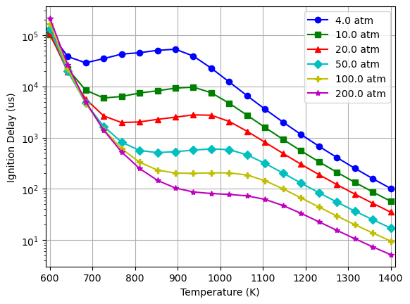

Ignition Delay Profiles for a Two-Stage Ignition Fuel
=====================================================

*This demo is part of Spitfire, with* `licensing and copyright info
here. <https://github.com/sandialabs/Spitfire/blob/master/license.md>`__

*Highlights*

-  Computing the ignition delay of a DME-air mixture for a range of
   temperatures and pressures

Introduction
------------

This demonstration shows how to use Spitfire to compute the ignition
delay of a homogeneous mixture. Next, we vary the temperature and
pressure to show the surprising ’’negative temperature coefficient”
(NTC) behavior in fuels that undergo two-stage ignition.

.. code:: ipython3

    from spitfire import ChemicalMechanismSpec, HomogeneousReactor
    import matplotlib.pyplot as plt

After some imports, we load up a dimethyl ether (DME) ignition mechanism
and blend equal parts DME/methane with air to obtain a stoichiometric
mixture.

.. code:: ipython3

    mech = ChemicalMechanismSpec(cantera_input='dme-bhagatwala.yaml', group_name='dme-bhagatwala')
    
    air = mech.stream(stp_air=True)
    fuel = mech.stream('X', 'CH3OCH3:1, CH4:1')
    
    blend = mech.mix_for_equivalence_ratio(1.0, fuel, air)

Computing Ignition Delay
------------------------

Next we specify the temperature and pressure of the mixture, put it into
a constant-pressure reactor, and use ``compute_ignition_delay()``.

.. code:: ipython3

    from cantera import one_atm
    
    blend.TP = 1200, 4 * one_atm
    
    r = HomogeneousReactor(mech, blend, 'isobaric', 'adiabatic', 'closed')
    tau = r.compute_ignition_delay()
    print(f'Ignition delay for {blend.T:.1f} K, {blend.P / one_atm:.1f} atm is {tau*1e3:.2f} ms')

.. parsed-literal::

    Ignition delay for 1200.0 K, 4.0 atm is 1.01 ms

Plotting Ignition Delay over T, P
---------------------------------

Now simply loop over temperature and pressure, resetting the blend
temperature and pressure as we go. Note that we specify
``first_time_step=1.e-9`` for ``compute_ignition_delay()``. This is
important for time integrator stability for the largest pressures which
ignite very early. The default initial time step of
:math:`10^{-6}\,{\rm s}` is a bit too large there.

.. code:: ipython3

    from numpy import linspace, zeros_like
    from time import perf_counter as timer

.. code:: ipython3

    temperature_list = linspace(600., 1400., 20)
    pressure_atm_list = [4., 10., 20., 50., 100., 200.]
    tau_list = zeros_like(temperature_list)
    
    colors_list  = ['b', 'g', 'r', 'c', 'y', 'm']
    markers_list = ['o', 's', '^', 'D', 'P', '*']
    
    fig = plt.figure()
    ax  = plt.gca()
    ax.set_xlabel('Temperature (K)')
    ax.set_ylabel('Ignition Delay (us)')
    ax.set_xlim([temperature_list.min() - 10, temperature_list.max() + 10])
    plt.ion()
    
    
    for pressure, marker, color in zip(pressure_atm_list, markers_list, colors_list):
        for idx, temperature in enumerate(temperature_list):
            blend.TP = temperature, pressure * one_atm
            r = HomogeneousReactor(mech, blend, 'isobaric', 'adiabatic', 'closed')
            tau_list[idx] = r.compute_ignition_delay(first_time_step=1.e-9)
        ax.semilogy(temperature_list, tau_list * 1.e6, '-' + color + marker, label='{:.1f} atm'.format(pressure))
    
    plt.legend()
    plt.grid()
    plt.show()

Fuels such as DME and biodiesel are of interest partially due to their
low-temperature ignition pathways (advantageous for pollutant reduction)
but their chemistry is extremely complex. A reasonable first expectation
is that increasing temperature and pressure should always increase a
mixture’s overall reactivity, thus *decreasing* its ignition delay. This
is typically observed with most fuels (pressure is not trivial though -
even hydrogen-air mixtures show nonmonotonic behavior with pressure
variation - see CK Law’s combustion text for an excellent description).
However here we see increases in the ignition delay with temperature in
a range of temperatures, which seems to be pressure-dependent. This is
called “negative temperature coefficient” behavior and is due to
degenerate chain branching in the low-temperature chemical pathways.
It’s a very complex subject, and being able to quickly simulate ignition
behavior to match experimental data is a crucial aspect of our
understanding.

Conclusions
-----------

This notebook shows how to compute ignition delays of homogeneous
mixtures. This is a common task in chemical mechanism development for
combustion, and Spitfire makes it relatively painless.

