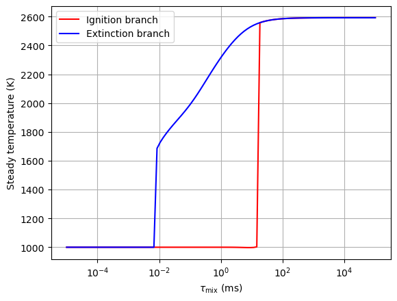
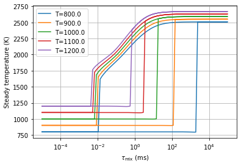
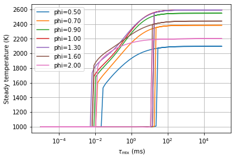

Steady State Multiplicity in n-heptane/air Mixtures
===================================================

*This demo is part of Spitfire, with* `licensing and copyright info
here. <https://github.com/sandialabs/Spitfire/blob/master/license.md>`__

*Highlights*

-  Solving for the steady ignition and extinction trajectories of a
   heptane-air mixture, which show the existence of multiple steady
   states and path-dependence
-  Observing the sensitivity of ignition/extinction behavior to
   temperature and stoichiometry

Introduction
------------

An interesting feature of combustion chemistry is that the balance of
homogeneous chemistry and transport processes (most often molecular
mixing) can take many forms. In an open homogeneous reactor with a
particular residence time, this means that multiple steady states can
exist for the same residence time - depending on “how you got there.”

In this demo we show this for a mixture of n-heptane and air. We’re
effectively performing continuation in the residence time, starting at a
very low value (very intense flow), letting the mixture equilibrate, and
then slightly giving the reactor more residence time. As we go,
eventually the mixture will be able to sustain chain branching chemistry
and ignite. Approaching an infinite residence time corresponds to
reaching the unperturbed chemical equilibrium state.

We just computed the ignition branch - to compute the extinction branch
we simply go backwards and very slowly take the residence time to zero.
At some point the chemistry will not be able to sustain losses to the
flow and the flame will extinguish. When the residence time gets to
zero, we’ll simply see the reactor outflow be exactly the feed stream -
there is no time for chemistry to occur.

The interesting feature here is that the critical residence time for
ignition is *not* the same as the critical value for extinction. It
takes more dissipation through transport mechansims to extinguish a
flame than what will admit ignition. In a way it makes sense - ignition
fundamentally alters the mixture by providing a pool of radical species,
after which extinction requires those to be removed faster than they are
produced.

.. code:: ipython3

    from spitfire import ChemicalMechanismSpec, HomogeneousReactor
    import matplotlib.pyplot as plt
    import numpy as np
    
    mech = ChemicalMechanismSpec('heptane-liu-hewson-chen-pitsch-highT.yaml', 'gas')

So that we could easily run different chemistries, temperatures,
pressures, etc., a function that returns the ignition and extinction
branches is helpful. The steady temperature is provided, but mass
fractions of certain species, explosive eigenvalues, reaction rates, and
more could all be post-processed and observed in addition.

.. code:: ipython3

    def get_trajectories(mech, T, P, fuel, phi, tau_values):
        tau_list = np.hstack([tau_values, tau_values[::-1]])
        T_list = np.zeros_like(tau_list)
    
        mix = mech.mix_for_equivalence_ratio(phi, mech.stream('X', fuel), mech.stream(stp_air=True))
        mix.TP = T, P
        feed = mech.copy_stream(mix)
    
        for idx, tau in enumerate(tau_list):
            r = HomogeneousReactor(mech, mix, 
                                   'isobaric',
                                   'adiabatic', 
                                   'open', 
                                   mixing_tau=tau, 
                                   feed_temperature=feed.T,
                                   feed_mass_fractions=feed.Y)
            output = r.integrate_to_steady(steady_tolerance=1e-8)
            T_list[idx] = output['temperature'][-1]
            mix.TPY = r.current_temperature, r.current_pressure, r.current_mass_fractions
        
        return tau_list, T_list

Ignition/Extinction Branches of stoichiometric n-heptane/air at 1000 K, 1 atm
-----------------------------------------------------------------------------

To show the presence of ignition and extinction, and the presence of
multiple steady states for a range of :math:`\tau_{\rm mix}`, we simply
show the steady reactor temperature over the residence time, for both
the ignition and extinction branches.

.. code:: ipython3

    ntau = 100
    tau_values = np.logspace(-8, 2, ntau)
    
    tau_list, T_list = get_trajectories(mech, 1000., 101325., 'NXC7H16:1', 1.0, tau_values)

.. code:: ipython3

    plt.semilogx(tau_list[:ntau] * 1.e3, T_list[:ntau], 'r', label='Ignition branch')
    plt.semilogx(tau_list[ntau:] * 1.e3, T_list[ntau:], 'b', label='Extinction branch')
    plt.xlabel('$\\tau_{\\rm mix}$ (ms)')
    plt.ylabel('Steady temperature (K)')
    plt.grid()
    plt.legend()
    plt.show()

Dependence on Temperature
-------------------------

Now we simply take the above analysis for stoichiometric mixtures and
repeat it for a range of temperatures.

.. code:: ipython3

    for T in [800, 900, 1000, 1100, 1200]:
        tau_list, T_list = get_trajectories(mech, T, 101325., 'NXC7H16:1', 1.0, tau_values)
        plt.semilogx(tau_list * 1.e3, T_list, label=f'T={T:.1f}')
    plt.xlabel('$\\tau_{\\rm mix}$ (ms)')
    plt.ylabel('Steady temperature (K)')
    plt.grid()
    plt.legend()
    plt.show()

An interesting observation here is that while the ignition point is
highly sensitive to temperature, the extinction behavior is much more
consistent.

Dependence on Equivalence Ratio
-------------------------------

Now we’ll see how varying the equivalence ratio affects
ignition/extinction.

.. code:: ipython3

    for phi in [0.5, 0.7, 0.9, 1.0, 1.3, 1.6, 2.0]:
        tau_list, T_list = get_trajectories(mech, 1000., 101325., 'NXC7H16:1', phi, tau_values)
        plt.semilogx(tau_list * 1.e3, T_list, label=f'phi={phi:.2f}')
    plt.xlabel('$\\tau_{\\rm mix}$ (ms)')
    plt.ylabel('Steady temperature (K)')
    plt.grid()
    plt.legend()
    plt.show()

Interestingly, sensitivity to stoichiometry is almost nonexistent in the
critical residence times for ignition and extinction. An important
caveat at this point is that this chemical mechanism could be reduced in
size and optimized for a limited range of temperatures, pressures,
equivalence ratios, and combustion regimes (e.g., nonpremixed vs
premixed/homogeneous).

Conclusions
-----------

In this notebook we’ve generated a number of ignition-extinction
trajectories for mixtures of n-heptane and air, and observed the
sensitivity of the steady state multiplicity to temperature and
stoichiometry.

