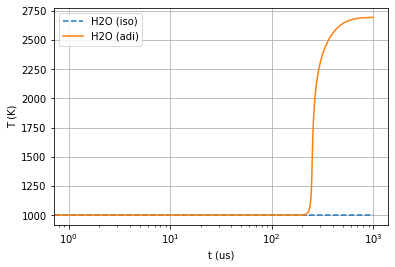
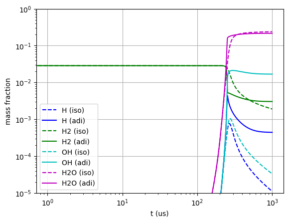
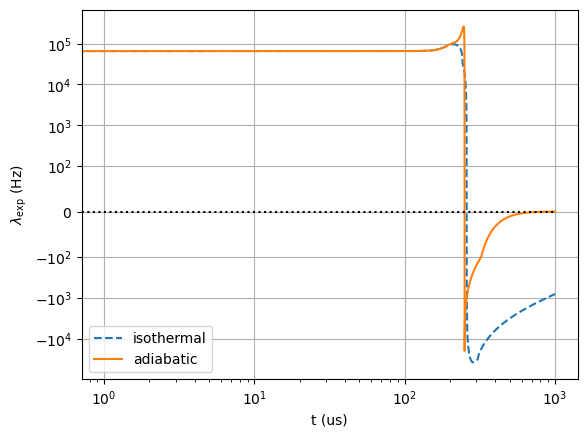
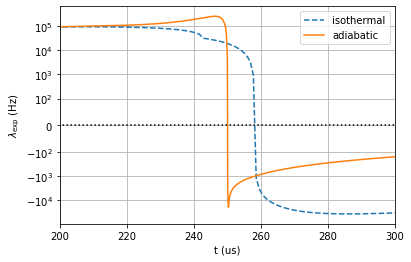
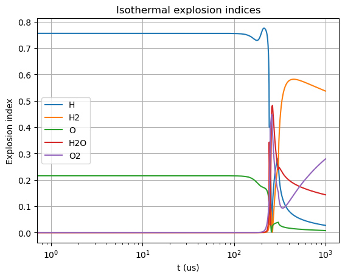
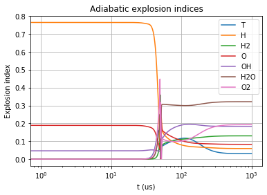
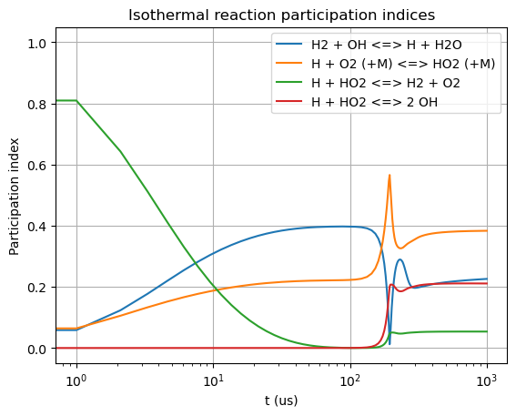
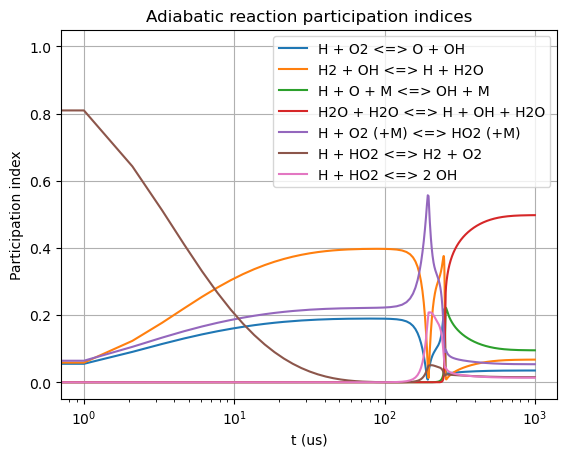

Explosive Mode Analysis of Isothermal vs Adiabatic Reactors
===========================================================

*This demo is part of Spitfire, with*\ `licensing and copyright info
here. <https://github.com/sandialabs/Spitfire/blob/master/license.md>`__

*Highlights* - Simulating the ignition of a hypothetical isothermal
reactor - How to compute quantities relevant to explosive mode analysis
- Comparing isothermal (chemical feedback) vs adiabatic (thermal *and*
chemical feedback) ignition

Introduction
------------

In this demonstration, we’ll take a brief look at chemical explosive
mode analsis (CEMA) of simple hydrogen-air reactors. One reactor is a
typical isobaric, adiabatic system, while the other is a hypothetical
isothermal reactor - heat release is instantaneously dissipated and the
mixture is kept at its initial temperature. The isothermal reactor will
still “ignite” in the sense that self-catalyzing chain reactions will
occur as a pool of radical species is built up. While this chemical
feedback loop will remain, the thermal feedback, wherein heat release
further accelerates combustion, is removed.

.. code:: ipython3

    from spitfire import ChemicalMechanismSpec, HomogeneousReactor
    import matplotlib.pyplot as plt
    import numpy as np
    
    mech = ChemicalMechanismSpec('h2-burke.xml', 'h2-burke')
    
    air = mech.stream(stp_air=True)
    fuel = mech.stream('X', 'H2:1')
    
    mix = mech.mix_for_equivalence_ratio(1.0, fuel, air)
    mix.TP = 1000., 101325.

Now simply set up the two reactors and integrate them a bit in time.

.. code:: ipython3

    isothermal_reactor = HomogeneousReactor(mech, mix, 'isobaric', 'isothermal', 'closed')
    adiabatic_reactor = HomogeneousReactor(mech, mix, 'isobaric', 'adiabatic', 'closed')
    
    iso = isothermal_reactor.integrate_to_time(1.e-3)
    adi = adiabatic_reactor.integrate_to_time(1.e-3)

Chemical Explosive Mode Analysis
--------------------------------

CEMA is a technique of assessing chemical behavior through
eigenvalue/eigenvector analysis of the chemical source Jacobian matrix.
Feedback cycles such as chemical and thermal runaway in ignition show up
as eigenvalues with positive real part. CEMA is fundamentally limited to
locally linear analysis, which complicates multidimensional problems
where molecular mixing couples nontrivially with explosive chemical
modes. However, for homogeneous reactor models, CEMA is ideal.

Spitfire makes it easy to compute some CEMA-related quantities. Simply
import the ``explosive_mode_analysis`` method and provide it with a
mechanism and a ``Library`` object from a reactor, flamelet, tabulated
chemistry builder, or your own creation.

The fundamental quantity in CEMA is the “explosive eigenvalue,” which is
the largest real part of nonzero eigenvalues. Determining what counts as
a nonzero value is an unresolved issue. Zero eigenvalues exist due to
elemental conservation, and mass/energy conservation for closed
reactors, and a problem is certainty of the eigenvalues (number of valid
digits) because the matrix is singular. Numerical eigensolvers will not
yield many signficiant digits. Spitfire simply calls any eigenvalue of
magnitude less than :math:`10^{-4}` a zero. A more precise definition
would be great for CEMA research but seems unlikely.

In addition to the explosive eigenvalue, you can also request “explosion
indices,” which are normalized components of species and temperature on
the eigenvector corresponding to the explosive mode. Further,
“participation indices” are those components mapped back through
stoichiometry to elementary chemical reactions.

A final note: certain fuels such as DME and biodiesel, discussed in
another reactor demonstration, yield two explosive eigenvalues when
low-temperature ignition pathways are active. Spitfire can easily
incorporate this secondary mode and its explosion/participation indices
- just set a few extra arguments. Hydrogen does not admit a significant
secondary explosive mode, so we turn it off here (it is off by default).

.. code:: ipython3

    iso = explosive_mode_analysis(mech, iso, 'isobaric', 'isothermal',
                                  compute_explosion_indices=True,
                                  compute_participation_indices=True,
                                  include_secondary_mode=False)
    
    adi = explosive_mode_analysis(mech, adi, 'isobaric', 'adiabatic',
                                  compute_explosion_indices=True,
                                  compute_participation_indices=True,
                                  include_secondary_mode=False)

.. code:: ipython3

    plt.semilogx(iso.time_values * 1.e6, iso['temperature'], '--', label=f'{s} (iso)')
    plt.semilogx(adi.time_values * 1.e6, adi['temperature'], '-', label=f'{s} (adi)')
    plt.ylabel('T (K)')
    plt.xlabel('t (us)')
    plt.legend()
    plt.grid()
    plt.show()
    
    for s, c in [('H', 'b'), ('H2', 'g'), ('OH', 'c'), ('H2O', 'm')]:
        plt.loglog(iso.time_values * 1.e6, iso[f'mass fraction {s}'], c + '--', label=f'{s} (iso)')
        plt.loglog(adi.time_values * 1.e6, adi[f'mass fraction {s}'], c + '-', label=f'{s} (adi)')
    plt.ylabel('mass fraction')
    plt.xlabel('t (us)')
    plt.legend()
    plt.grid()
    plt.ylim([1e-5, 1e0])
    plt.show()
    
    plt.semilogx(iso.time_values * 1.e6, iso['cema-lexp1'], '--', label='isothermal')
    plt.semilogx(adi.time_values * 1.e6, adi['cema-lexp1'], '-', label='adiabatic')
    plt.semilogx(iso.time_values * 1.e6, np.zeros_like(iso.time_values), 'k:')
    plt.ylabel('$\\lambda_{\\rm exp}$ (Hz)')
    plt.xlabel('t (us)')
    plt.yscale('symlog', linthreshy=1e2)
    plt.legend()
    plt.grid()
    plt.show()
    
    plt.semilogy(iso.time_values * 1.e6, iso['cema-lexp1'], '--', label='isothermal')
    plt.semilogy(adi.time_values * 1.e6, adi['cema-lexp1'], '-', label='adiabatic')
    plt.semilogy(iso.time_values * 1.e6, np.zeros_like(iso.time_values), 'k:')
    plt.ylabel('$\\lambda_{\\rm exp}$ (Hz)')
    plt.xlabel('t (us)')
    plt.yscale('symlog', linthreshy=1e2)
    plt.xlim([2e2, 3e2])
    plt.legend()
    plt.grid()
    plt.show()
    

These preliminary results show a surprising degree of similarity between
the adiabatic and isothermal reactors. The reason is fairly clear though
- the induction phase of the adiabatic reactor is entirely isothermal!
This isn’t always the case - larger fuel breakdown during induction is
endothermic - but for hydrogen the only real difference shows up when
the temperature starts to rise. The final figure above shows the
explosive eigenvalue of the adiabatic reactor rapidly rising to a peak
while the isothermal eigenvalue dies out. Both see the eigenvalue
transition to a negative value, indicating the approach to a stable
equilibrium state, although the adiabatic reactor, due to its much
higher temperature, equilibrates much faster.

Next we look at the explosion and participation indices.

.. code:: ipython3

    for name in ['T'] + mech.species_names[:-1]:
        ei = iso['cema-ei1 ' + name]
        if np.max(ei) > 0.1:
            plt.semilogx(iso.time_values * 1.e6, ei, label=name)
    plt.ylabel('Explosion index')
    plt.xlabel('t (us)')
    plt.legend()
    plt.grid()
    plt.title('Isothermal explosion indices')
    plt.show()
    
    for name in ['T'] + mech.species_names[:-1]:
        ei = adi['cema-ei1 ' + name]
        if np.max(ei) > 0.1:
            plt.semilogx(adi.time_values * 1.e6, ei, label=name)
    plt.ylabel('Explosion index')
    plt.xlabel('t (us)')
    plt.legend()
    plt.grid()
    plt.title('Adiabatic explosion indices')
    plt.show()
    
    
    for i in range(mech.n_reactions):
        pi = iso['cema-pi1 ' + str(i)]
        if np.max(pi) > 0.2:
            plt.semilogx(iso.time_values * 1.e6, pi,
                         label=mech.gas.reaction_equation(i))
    plt.ylabel('Participation index')
    plt.xlabel('t (us)')
    plt.legend()
    plt.grid()
    plt.title('Isothermal reaction participation indices')
    plt.show()
    
    for i in range(mech.n_reactions):
        pi = adi['cema-pi1 ' + str(i)]
        if np.max(pi) > 0.2:
            plt.semilogx(adi.time_values * 1.e6, pi,
                         label=mech.gas.reaction_equation(i))
    plt.ylabel('Participation index')
    plt.xlabel('t (us)')
    plt.legend()
    plt.grid()
    plt.title('Adiabatic reaction participation indices')
    plt.show()

The index analysis shows the relevant species and the importance of
temperature in the explosive mode. Both reactors see the hydrogen
radical playing the largest role during induction, due to its role as
the leading chain carrier in chemical runaway. When ignition peaks,
thermal runaway is indicated by the role of temperature in the adiabatic
reactor’s explosive mode. If you have interest in chain reaction
mechanisms, CK Law’s book *Combustion Physics* has an excellent
description of hydrogen ignition that would go nicely with this
demonstration. You might wonder why the results appear to contain
“noise” as if experiments - as suggested above, eigen-analysis of a
singular matrix is not numerically precise and jumps as seen above where
the eigenvalue transitions are expected.

Conclusions
-----------

This notebook shows how Spitfire enables chemical explosive mode
analysis, and showed some interesting comparisons between adiabatic and
isothermal reactor models.

