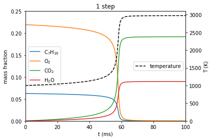
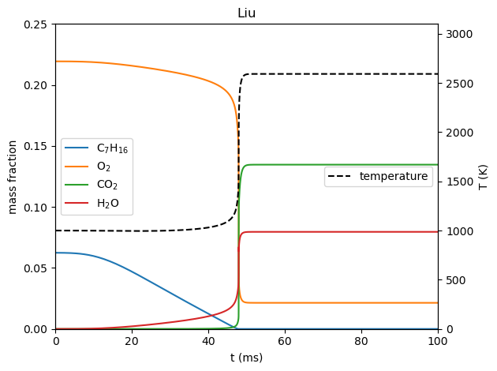
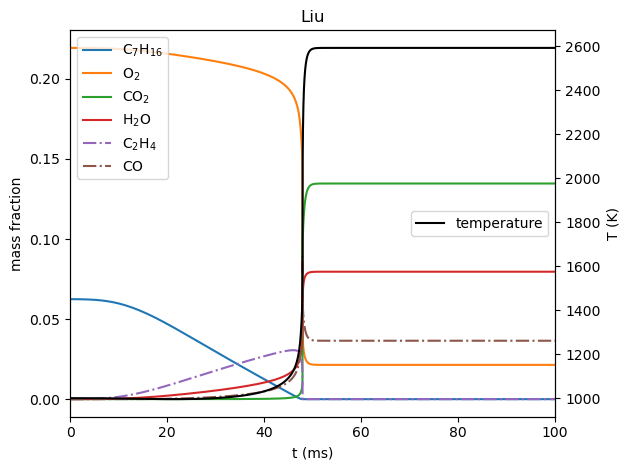

One-step Ignition Mechanism for n-heptane/air Combustion
========================================================

*This demo is part of Spitfire, with*\ `licensing and copyright info
here. <https://github.com/sandialabs/Spitfire/blob/master/license.md>`__

*Highlights* - Building a simple mechanism from Python with Cantera -
Comparing n-heptane ignition behavior for two reaction mechanisms

Introduction
------------

This demonstration shows how to build a reaction mechanism, here a
simple one-step global combustion reaction for n-heptane, using Cantera.
We then use Spitfire to simulate homogeneous ignition of an
h-heptane/air mixture, with both the one-step reaction mechanism and a
kinetics model from Liu et al. (*Effects on Strain Rate on High-Pressure
Nonpremixed N-Heptane Autoignition in Counterflow*, Comb. Flame, 137,
320-339, 2004.).

.. code:: ipython3

    from spitfire import ChemicalMechanismSpec, HomogeneousReactor
    import cantera as ct
    import matplotlib.pyplot as plt

Building the Mechanism
----------------------

Specifying the Reaction
~~~~~~~~~~~~~~~~~~~~~~~

Cantera provides several formats for chemical reaction mechanism - see
`here <https://cantera.org/tutorials/input-files.html>`__ for the
details. We use the CTI format below to create the following reaction
and its non-elementary rate expression. A standard Arrhenius rate
constant is employed.

.. math::

   2\mathrm{C}_7\mathrm{H}_{16} \, + 22\mathrm{O}_2 \, \rightarrow 14\mathrm{CO}_2 \, + 16\mathrm{H}_2\mathrm{O}

.. math::

   \mathrm{rate} = 2\cdot10^{7}\exp\left(-\frac{30 \mathrm{kcal}/\mathrm{mol}}{RT}\right)\langle\mathrm{C}_7\mathrm{H}_{16}\rangle^{0.25}\langle\mathrm{O}_2\rangle^{1.5}

An advantage to building this mechanism in Python is that we could
easily test a range of parameters such as the activation energy or
pre-exponential factor. We could even build a reactor into an
optimization loop to identify an optimal one-step reaction rate in some
sense.

.. code:: ipython3

    reaction_cti = '''
    reaction(
    '2 NXC7H16 + 22 O2 => 14 CO2 + 16 H2O', 
    [2e7, 0, (30.0, 'kcal/mol')], 
    order='NXC7H16:0.25 O2:1.5')
    '''

Specifying Species Properties
~~~~~~~~~~~~~~~~~~~~~~~~~~~~~

Now we need to specify thermodynamic properties - molecular weights and
heat capacity polynomials over temperature. We obtain these from the Liu
et al. mechanism. Below we build the ``species_list`` to contain the
Cantera ``Species`` objects required for the one-step mechanism.

.. code:: ipython3

    species_in_model = ['NXC7H16', 'O2', 'H2O', 'CO2', 'N2']
    
    liu_xml_file = 'heptane-liu-hewson-chen-pitsch-highT.xml'
    species_data = ct.Species.listFromFile(liu_xml_file)
    
    species_list = list()
    for sp in species_data:
        if sp.name in species_in_model:
            species_list.append(sp)

Combine for a Cantera ``Solution``
~~~~~~~~~~~~~~~~~~~~~~~~~~~~~~~~~~

Now the final step - build a Cantera ``Solution`` that includes the
listed species and the reaction(s) defined above.

.. code:: ipython3

    s = ct.Solution(thermo='IdealGas',
                    kinetics='GasKinetics',
                    species=species_list,
                    reactions=[ct.Reaction.fromCti(reaction_cti)])

Comparing Ignition Behavior
---------------------------

Now we create Spitfire ``ChemicalMechanismSpec`` objects, which can be
done with the ``Solution`` object as follows, or with the XML as we’ve
done before (which we use below to build the Liu mechanism holder).

Given the mechanisms, we can now build ``HomogeneousReactor`` instances
filled with stoichiometric n-heptane/air mixtures, and integrate them
for 100 ms, which will encompass an ignition event from a sparked
mixture at 1000 K and atmospheric pressure. Major species and
temperature are plotted over time in the following figures.

.. code:: ipython3

    mech_1step = ChemicalMechanismSpec.from_solution(s)
    mech_liu = ChemicalMechanismSpec(cantera_xml=xml_file_for_species, group_name='gas')
    
    solutions = dict()
    
    for mech, name in [(mech_1step, '1 step'), 
                       (mech_liu, 'Liu')]:
        
        fuel = mech.stream('X', 'NXC7H16:1')
        air = mech.stream(stp_air=True)
    
        mix = mech.mix_for_equivalence_ratio(phi=1., fuel=fuel, oxy=air)
        mix.TP = 1000, 101325
    
        reactor = HomogeneousReactor(mech_spec=mech,
                                     initial_mixture=mix,
                                     configuration='isobaric',
                                     heat_transfer='adiabatic',
                                     mass_transfer='closed')
    
        solutions[name] = reactor.integrate_to_time(0.1)

.. code:: ipython3

    for name in solutions:
        solution = solutions[name]
        t = solution.time_values * 1.e3
    
        fig, axY = plt.subplots()
    
        axY.plot(t, solution['mass fraction NXC7H16'], label='$\\mathrm{C}_7\\mathrm{H}_{16}$')
        axY.plot(t, solution['mass fraction O2'], label='$\\mathrm{O}_2$')
        axY.plot(t, solution['mass fraction CO2'], label='$\\mathrm{CO}_2$')
        axY.plot(t, solution['mass fraction H2O'], label='$\\mathrm{H}_2\\mathrm{O}$')
        axY.legend(loc='center left')
        axY.set_ylabel('mass fraction')
        axY.set_xlim([0, 100])
        axY.set_ylim([0, 0.25])
        axY.set_xlabel('t (ms)')
    
        axT = axY.twinx()
        axT.plot(t, solution['temperature'], 'k--', label='temperature')
        axT.set_ylabel('T (K)')
        axT.set_ylim([0, 3100])
        axT.legend(loc='center right')
    
        plt.title(name)
        fig.tight_layout()
        plt.show()

The plots above suggest several key differences between the one-step and
more detailed reaction mechanisms.

-  The one-step mechanism predicts that the ignited mixture is hotter
   (~400 K) and contains more CO2. The simplified chemistry represents
   idealized combustion, with all hydrogen going to H2O and all carbon
   going to CO2.
-  The more detailed mechanism predicts breakdown of the n-heptane in
   the fuel during the induction phase.

The following plot shows the Liu et al. results, this time including the
ethylene (C2H4) and carbon monoxide (CO) mass fractions to show the
breakdown of n-heptane into smaller hydrocarbons and to make up the
difference in CO2 prediction from the one-step model.

.. code:: ipython3

    solution = solutions['Liu']
    t = solution.time_values * 1.e3
    
    fig, axY = plt.subplots()
    
    axY.plot(t, solution['mass fraction NXC7H16'], label='$\\mathrm{C}_7\\mathrm{H}_{16}$')
    axY.plot(t, solution['mass fraction O2'], label='$\\mathrm{O}_2$')
    axY.plot(t, solution['mass fraction CO2'], label='$\\mathrm{CO}_2$')
    axY.plot(t, solution['mass fraction H2O'], label='$\\mathrm{H}_2\\mathrm{O}$')
    axY.plot(t, solution['mass fraction C2H4'], '-.', label='$\\mathrm{C}_2\\mathrm{H}_4$')
    axY.plot(t, solution['mass fraction CO'], '-.', label='$\\mathrm{CO}$')
    axY.legend(loc='upper left')
    axY.set_ylabel('mass fraction')
    axY.set_xlim([0, 100])
    axY.set_xlabel('t (ms)')
    
    axT = axY.twinx()
    axT.plot(t, solution['temperature'], 'k-', label='temperature')
    axT.set_ylabel('T (K)')
    axT.legend(loc='center right')
    
    plt.title(name)
    fig.tight_layout()
    plt.show()

Conclusions
-----------

This notebook has briefly showcased the use of Cantera to build reaction
mechanisms from Python, and the use of Spitfire to compare ignition
behavior of two n-heptane combustion mechanisms.

