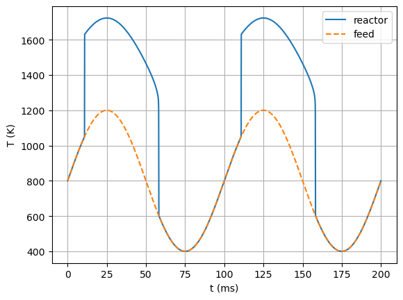

A Time-Dependent Flow Reactor: Periodic Ignition/Extinction
===========================================================

*This demo is part of Spitfire, with*\ `licensing and copyright info
here. <https://github.com/sandialabs/Spitfire/blob/master/license.md>`__

*Highlights* - How to add time-dependence to a ``HomogeneousReactor``
model

Introduction
------------

This demonstration considers a reactor model with a slowly oscillating
feed temperature. The frequency of this oscillation is low enough that
it triggers repeated ignition/extinction events. Time-dependence is
introduced with a Python ``lambda`` function.

.. code:: ipython3

    from spitfire import ChemicalMechanismSpec, HomogeneousReactor
    import matplotlib.pyplot as plt
    import numpy as np

.. code:: ipython3

    mech = ChemicalMechanismSpec(cantera_xml='h2-burke.xml', group_name='h2-burke')
    
    air = mech.stream(stp_air=True)
    fuel = mech.stream('X', 'H2:1')
    
    mix = mech.mix_for_equivalence_ratio(1.0, fuel, air)
    mix.TP = 800., 101325.

Time-dependent Feed Temperature
-------------------------------

Unlike reactors in simpler demonstrations, this reactor involves flow
(``mass_transfer='open'``), and Spitfire requires the residence time
(``mixing_tau``) and feed stream, specified through the
``feed_temperature`` and ``feed_mass_fractions`` arguments. Any of these
arguments can be functions of time, as shown below for the feed
temperature.

Next we simply integrate this reactor over a time period - two periods
of oscillation of the feed temperature.

.. code:: ipython3

    feed = mech.copy_stream(mix)
    feed_temperature_fxn = lambda t: 800. + 400. * np.sin(2. * np.pi * 10. * t)
    
    reactor = HomogeneousReactor(mech, mix,
                                 configuration='isobaric',
                                 heat_transfer='adiabatic',
                                 mass_transfer='open',
                                 mixing_tau=1.e-5,
                                 feed_temperature=feed_temperature_fxn,
                                 feed_mass_fractions=feed.Y)
    
    output = reactor.integrate_to_time(0.2, transient_tolerance=1.e-10)
    
    times = output.time_values
    
    plt.plot(times * 1.e3, output['temperature'], '-', label='reactor')
    plt.plot(times * 1.e3, feed_temperature_fxn(times), '--', label='feed')
    
    plt.ylabel('T (K)')
    plt.xlabel('t (ms)')
    plt.legend()
    plt.grid()
    
    plt.show()

While it’s clear that the reactor ignites on the upswing of the feed
temperature, and is extinguished on the downswing, we could also
visualize the chemcial composition. The output from the integration is a
``Library`` object, with a single dimension of time, which we can simply
print to see all the fields available.

.. code:: ipython3

    print(output)

.. parsed-literal::

    
    Spitfire Library with 1 dimensions and 13 properties
    ------------------------------------------
    1. Dimension "time" spanning [0.0, 0.2] with 3400 points
    ------------------------------------------
    temperature         , min = 400.00023760816015 max = 1723.4172921512559
    pressure            , min = 101325.0 max = 101325.0
    mass fraction HE    , min = -5.551115123125783e-16 max = 7.771561172376096e-16
    mass fraction H     , min = 0.0 max = 0.004325863975340061
    mass fraction H2    , min = 0.006810714712865773 max = 0.028634460764729135
    mass fraction O     , min = 0.0 max = 0.015190690085155157
    mass fraction OH    , min = 0.0 max = 0.01517887950146069
    mass fraction H2O   , min = 0.0 max = 0.15018436327110132
    mass fraction O2    , min = 0.06530244961447292 max = 0.22726263049348533
    mass fraction HO2   , min = 0.0 max = 0.00029422117189264844
    mass fraction H2O2  , min = 0.0 max = 5.528833951840396e-06
    mass fraction N2    , min = 0.7441029087417855 max = 0.7441029087417855
    mass fraction AR    , min = 0.0 max = 0.0
    Extra attributes: {}
    ------------------------------------------
    

.. code:: ipython3

    for s in ['H2', 'H2O', 'O2', 'H', 'OH']:
        plt.plot(times * 1.e3, output[f'mass fraction {s}'], label=s)
    
    plt.ylabel('mass fraction')
    plt.xlabel('t (ms)')
    plt.legend()
    plt.grid()
    
    plt.show()

.. image:: oscillating_ignition_extinction_files/oscillating_ignition_extinction_8_0.png

Conclusions
-----------

This notebook shows how to incorporate mass flow in a reactor model and
have the temperature of the feed stream vary with time.

