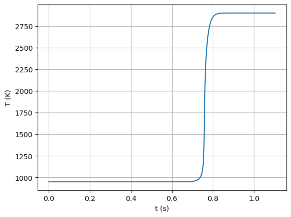
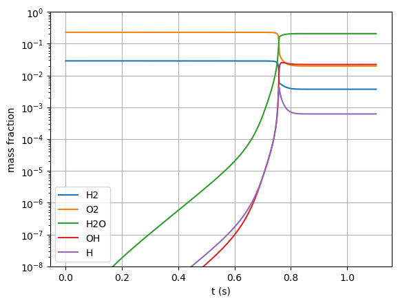

Setting up Thermochemistry Calculations with Cantera and Spitfire
=================================================================

*This demo is part of Spitfire, with* `licensing and copyright info
here. <https://github.com/sandialabs/Spitfire/blob/master/license.md>`__

*Highlights*

-  Importing thermochemistry data with Cantera
-  A hydrogen-air ignition calculation

Introduction
------------

Building reactor models of chemical processes starts with acquiring
thermochemistry data of the different chemical species involved and the
set of reactions they undergo. To manage mechanism data, Spitfire uses
the Python interface of `Cantera <https://cantera.org/>`__. It is highly
recommended that advanced users become familiar with Cantera’s Python
interface, not only for using Spitfire but also for the wealth of useful
capabilities provided directly by Cantera.

Mechanism data can be passed to Spitfire in any way that it can be
provided to Cantera. This can be done with either a database or manually
in Python.

1. Provide a Cantera YAML/CTI/XML file (YAML format is now Cantera’s
   preference)
2. Build a mechanism programmatically with Cantera’s Python interface

Griffon
-------

One of the key research topics involved in Spitfire’s earliest
developments was the design of numerical methods for complex chemistry
problems. For this reason all reaction rates and sensitivities (for
Jacobian matrices) are evaluated in the Griffon code, an internal C++
library of Spitfire. Griffon is the “engine” for thermochemistry with
Spitfire that is wrapped by Cython code and precompiled into the
``spitfire.griffon`` package. Griffon computes reaction rates and
right-hand sides and analytical Jacobian matrices for reactors and
flamelets in addition to some optimized solvers (e.g., a linear solver
for flamelet models).

``HomogeneousReactor``
----------------------

While Griffon’s functionality is largely made available to users,
Spitfire provides Python classes to simplify the solution of canonical
reactors (``HomogeneneousReactor`` in ``spitfire.chemistry.reactors``).
Python classes are also provided for non-premixed flamelets
(``Flamelet`` in ``spitfire.chemistry.flamelet``), and three-stream
flamelets have undergone a small amount of development. Flamelet models
will be discussed in detail in other tutorials.

A number of reactor models are available, namely all possibly
combinations of the following characteristics:

-  **configuration**: constant-pressure (isobaric) or constant-volume
   (isochoric)
-  **heat transfer**: adiabatic, isothermal, or diathermal (radiative
   and convective heat transfer) walls
-  **mass transfer**: closed or open reactors with an imposed feed
   stream and residence time

Parameters such as the residence time, feed stream, or heat transfer
parameters (e.g., external convection temperature) may be specied as
arbitrary functions of time.

``ChemicalMechanismSpec``
-------------------------

In order to use Griffon functions or the reactor and flamelet classes,
Spitfire provides the ``ChemicalMechanismSpec`` class to interface with
Cantera data. In the cell below we import this class and build an
instance with the ``h2-burke.yaml`` Cantera file, which contains data
for hydrogen combustion. The “group_name” argument tells Cantera which
phase to use in its input file (some contain several options with
different groups of species or different transport properties).

.. code:: ipython3

    from spitfire import ChemicalMechanismSpec
    
    mech = ChemicalMechanismSpec(cantera_input='h2-burke.yaml', group_name='h2-burke')

Streams and Mixing
------------------

The next step is to make a mixture of hydrogen and air and “spark” it to
a high temperature to ignite. To make streams of reactants the mechanism
provides the ``stream`` method. This produces an instance of a Cantera
``Quantity``, which you can create without the ``ChemicalMechanismSpec``
if you know Cantera well.

Below we make a stream of pure hydrogen at 300 K and one atmosphere, and
a stream of air at standard temperature and pressure. Note that the
``'TPX'`` string is a Cantera detail: see `Cantera’s
documentation <https://www.cantera.org/docs/sphinx/html/cython/importing.html#cantera.Quantity>`__
for more details regarding stream initialiation and all the various
options.

.. code:: ipython3

    h2 = mech.stream('TPX', (300, 101325, 'H2:1'))
    air = mech.stream(stp_air=True)

Now we take these streams and mix them so that the resultant stream is a
stoichiometric mixture which has an `equivalence
ratio <https://en.wikipedia.org/wiki/Air%E2%80%93fuel_ratio#Fuel%E2%80%93air_equivalence_ratio_(%CF%95)>`__
of one. We then set the temperature and pressure.

.. code:: ipython3

    mix = mech.mix_for_equivalence_ratio(1.0, h2, air)
    mix.TP = 950., 101325.

Building The Reactor
--------------------

To build a ``HomogeneousReactor`` we now simply provide the
``ChemicalMechanismSpec`` object (which contains things like a Cantera
``Solution`` object and a Griffon objec) and the ``mix`` stream we made
above which is the initial state of the reactor. We also provide the
configuration, heat transfer, and mass transfer settings. For adiabatic
and closed reactors these settings are pretty limited but for more
complicated reactors there will be more arguments needed.

Integrating in Time
-------------------

We can integrate the reactor in time towards a steady state with the
``integrate_to_steady`` method below, which can take all kinds of
arguments to control details of the time-stepping. Without any arguments
it simply uses the defaults to integrate a reactor until a steady state
is obtained.

.. code:: ipython3

    from spitfire import HomogeneousReactor
    
    r = HomogeneousReactor(mech, mix,
                           configuration='isochoric',
                           heat_transfer='adiabatic',
                           mass_transfer='closed')
    
    output = r.integrate_to_steady()

Plotting variables over time
----------------------------

The ``output`` variable above that was returned by the reactor
integration is a Spitfire ``Library`` object that will be discussed in
greater detail in later notebooks (it is critical when solving flamelets
to build tabulated chemistry models). To plot the temperature of the
reactor over time, for instance, you can simply use the following code.

The output from the reactor ``integrate*`` call contains temperature,
all of the species mass fractions, and for an isochoric reactor the
density (for isobaric the pressure will be included so the thermodynamic
state can be reconstructed from the output alone). This means we can
plot several mass fractions as follows.

.. code:: ipython3

    import matplotlib.pyplot as plt
    
    plt.figure()
    plt.plot(output.time_values * 1e3, output['temperature'])
    plt.xlabel('t (s)')
    plt.ylabel('T (K)')
    plt.grid()
    plt.show()

.. code:: ipython3

    for s in ['H2', 'O2', 'H2O', 'OH', 'H']:
        plt.semilogy(output.time_values * 1e3, output['mass fraction ' + s], label=s)
    plt.xlabel('t (s)')
    plt.ylabel('mass fraction')
    plt.ylim([1e-8, 1])
    plt.grid()
    plt.legend(loc='best')
    plt.show()

Post-processing quantities
--------------------------

To compute quantities like reaction rates, species production rates,
enthalpy, pressure, etc. on the solution trajectory returned by
``integrate_to_steady`` we can use the ``spitfire.chemistry.analysis``
package. To facilitate the use of Cantera’s Python interface, use the
``get_ct_solution_array`` method to return a Cantera ``SolutionArray``
that can compute quantities across a range of states just like a Cantera
``Quantity`` or ``Solution`` object. Note the ``shape`` output from the
function can be used to reshape and add newly computed properties to the
output library (this is much more important later on for tabulated
chemistry models).

.. code:: ipython3

    from spitfire import get_ct_solution_array
    
    ctsol, shape = get_ct_solution_array(mech, output)

Now we’ll plot the rate of the important chain-branching reaction,
``H + O2 <-> O + OH``, which happens to be the 0-th reaction in this
mechanism, alongside the temperature on a twin axis.

.. code:: ipython3

    qcb = ctsol.net_rates_of_progress[:, 0]
    
    fig, ax1 = plt.subplots()
    ax1.semilogy(output.time_values * 1e3, qcb, label='rate')
    ax1.set_xlabel('t (s)')
    ax1.set_ylabel(f'net rate of {mech.gas.reaction(0).equation}')
    ax1.legend(loc='center left')
    
    ax2 = ax1.twinx()
    ax2.plot(output.time_values * 1e3, output['temperature'], 'g--', label='temperature')
    ax2.set_ylabel('T (K)')
    ax2.legend(loc='lower right')
    
    ax1.grid()
    fig.tight_layout()
    plt.show()

.. image:: thermochemistry_Cantera_Spitfire_griffon_files/thermochemistry_Cantera_Spitfire_griffon_15_0.png

Conclusions
-----------

This notebook has introduced the use of Spitfire to solve a simple
reactor model and the use of Cantera to load mechanism data and
post-process thermochemical quantities on computed solutions. More
detailed options for reactor simulations will be presented in the next
notebooks.

