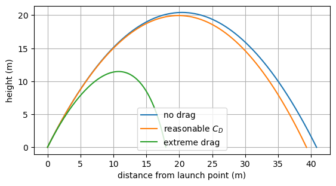
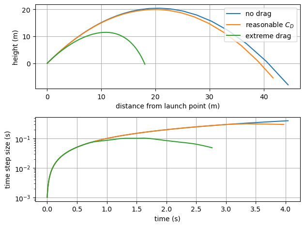

Adaptive step size and custom stopping criteria for cannonball trajectories
===========================================================================

*This demo is part of Spitfire, with* `licensing and copyright info
here. <https://github.com/sandialabs/Spitfire/blob/master/license.md>`__

*Highlights*

-  using adaptive time-stepping to solve nonlinear problems
-  defining a custom stopping rule to automatically stop time-stepping
   when the cannonball has landed

Introduction
------------

This example solves for the trajectories of cannonballs launched with
drag effects that make the problem nonlinear. The governing equations
for the positions and velocities in the :math:`x` and :math:`y`
directions, respectively, are

.. math::

   \frac{\mathrm{d}}{\mathrm{d}t}
   \begin{pmatrix}
   x \\ 
   y \\
   v_x \\
   v_y
   \end{pmatrix}
   =
   \begin{pmatrix}
   v_x \\ 
   v_y \\
   -\frac{1}{2}\rho_f C_d \frac{A}{\rho V} v_x^2 \\
   -g - \frac{1}{2}\rho_f C_d \frac{A}{\rho V} v_y^2
   \end{pmatrix}

where :math:`g` is the gravitational acceleration constant, :math:`C_d`
is the drag coefficient, :math:`\rho_f` is the air density, :math:`\rho`
is the cannonball density, and :math:`A=4\pi r^2` and
:math:`V=4/3 \pi r^3` are the surface area and volume of the cannonball
which has radius :math:`r`. We’re ignoring the effects of buoyancy in
this example we’re modeling cannonballs in air and the density
difference is large enough.

Solving this system of equations in Spitfire uses largely the same
classes and methods already presented in other notebooks. We’ll start by
defining the right-hand side as a function of time and the solution
vector. We include the drag coefficient in the first method defined,
``ode_rhs``, so that we can more easily modify it to study the effects
of drag. Given a value of ``c_d`` we’ll write a ``lambda`` to provide
the ``Governor`` a function of time and the solution vector alone.

.. code:: ipython3

    import numpy as np
    
    rf = 1.23                         # fluid density, kg/m3
    ro = 7.86e3                       # object (cannonball) density, kg/m3
    g = 9.8                           # gravitational constant, m/s2
    r = 4. * 2.54 / 100.              # cannonball radius, m
    A = 4. * np.pi * r * r            # surface area, m2
    V = np.pi * r * r * r * 4. / 3.   # volume, m3
        
    def ode_rhs(t, q, c_d):
        vel_x = q[2]
        vel_y = q[3]
        
        f = 0.5 * rf * c_d * A / (ro * V)
        
        return np.array([vel_x,
                         vel_y,
                         -f * vel_x * vel_x,
                         -g - f * vel_y * vel_y])

Custom stopping criteria: stopping when the cannonball lands
------------------------------------------------------------

The next task is to make a custom stopping rule - we only want to
integrate in time until the cannonball has landed. To facilitate this we
write a function of the state vector that returns ``True`` when the
integration should *stop*. The function below checks that the object’s
center is lower than its radius off of the ground and that it currently
is falling to the ground with negative :math:`y`-velocity (otherwise the
laungh point would be caught immediately).

Inside ``odesolve`` the stopping criteria is called as

::

   stop_criteria(current_time, current_state, residual, number_of_time_steps)

where ``residual`` is the norm of the right-hand side (meant to be used
to stop at steady state when the system has stopped evolving) and the
other arguments should be fairly clear. It is important that your custom
rule takes these arguments in the order above. You can use ``*args`` and
``**kwargs`` as below, however, to simplify things.

.. code:: ipython3

    def object_has_landed(t, state, *args, **kwargs):
        vel_y = state[1]
        pos_y = state[3]
        return pos_y < r and vel_y < 0

To use the custom stopping criteria we pass it to the ``stop_criteria``
keyword argument of ``odesolve``.

Now we solve the problem for several values of the drag coefficient and
plot the results. First we use the classical fourth-order Runge-Kutta
method with a constant time step, chosen simply by guessing what might
be an appropriate value.

.. code:: ipython3

    from spitfire import odesolve, RK4ClassicalS4P4
    import matplotlib.pyplot as plt
    
    drag_coeff_dict = {'no drag': 0.0, 'reasonable $C_D$': 0.5, 'extreme drag': 20.}
    
    q0 = np.array([0., 0., 10., 20.])  # initial condition
    
    for key in drag_coeff_dict:
        c_d = drag_coeff_dict[key]
    
        t, q = odesolve(lambda t, y: ode_rhs(t, y, c_d),
                        q0,
                        save_each_step=True,
                        step_size=1.e-3,
                        method=RK4ClassicalS4P4(),
                        stop_criteria=object_has_landed)
        plt.plot(q[:, 0], q[:, 1], label=key)
    
    plt.axis('scaled')
    plt.xlabel('distance from launch point (m)')
    plt.ylabel('height (m)')
    plt.grid()
    plt.legend(loc='best')
    plt.show()

Adaptive time-stepping
----------------------

Above we had to guess at a value for the time step. Choosing a time step
of one millisecond works well enough, but if we choose
:math:`\Delta t=0.1\,s`, which doesn’t sound particularly unreasonable,
the methods fail to stop near the point of impact.

A key aspect of effective differential equation solvers is adaptive
time-stepping, which is commonly (and in Spitfire) performed with
error-control techniques. These techniques use embedded error
estimation, meaning low-cast methods of assessing how accurate the
solution is (locally). Methods for doing this exist in both linear
multistep and Runge-Kutta methods.

Spitfire provides several methods with error estimates to enable
adaptive time-stepping, for which a `PI
controller <https://en.wikipedia.org/wiki/PID_controller>`__ is
available to adapt the time step to maintain the error near a particular
target. Next we use the well-known ``CashKarpS6P5Q4`` method (see
[https://en.wikipedia.org/wiki/Cash–Karp_method]) and the PI controller
to solve the problem without having to choose an arbitrary time step. We
do initialize the time step size to a guessed value, although this is
typically far easier to do than pick a fixed step size for the entire
simulation. We also explicitly provide the target error for the
controller and a maximum step size in this case.

The trajectory plot shows that the solutions are at least reasonable and
that the time step is varied quite differently for the case with extreme
drag that is particularly nonlinear near the impact point. In the
drag-free case the time step simply ramps up to the maximum value, while
the other cases see the step size decrease as the object is nearing the
ground and the acceleration is increasing (higher :math:`y`-velocity
magnitude leading to stronger drag forces).

.. code:: ipython3

    from spitfire import CashKarpS6P5Q4, PIController
    
    figure, axarray = plt.subplots(2, 1)
    
    for key in drag_coeff_dict:
        c_d = drag_coeff_dict[key]
        
        t, q = odesolve(lambda t, y: ode_rhs(t, y, c_d),
                        q0,
                        save_each_step=True,
                        step_size=PIController(target_error=1.e-8, first_step=1.e-3, max_step=1.e0),
                        method=CashKarpS6P5Q4(),
                        stop_criteria=object_has_landed)
        dt = t[1:] - t[:-1]
        axarray[0].plot(q[:, 0], q[:, 1], label=key)
        axarray[1].semilogy(t[:-1], dt)
    
    axarray[0].set_xlabel('distance from launch point (m)')
    axarray[0].set_ylabel('height (m)')
    axarray[1].set_xlabel('time (s)')
    axarray[1].set_ylabel('time step size (s)')
    for ax in axarray:
        ax.grid()
    axarray[0].legend(loc='best')
    plt.tight_layout()
    plt.show()

Conclusion
----------

This notebook has shown how to construct user-defined termination rules
and use adaptive time-stepping to solve problems where simply guessing a
fixed time step size or final simulation time are infeasible or
inefficient. Adaptive time-stepping is helpful in solving nonlinear and
stiff problems, and it is a key ingredient of Spitfire’s solvers for
complex chemistry problems that will be covered later.

