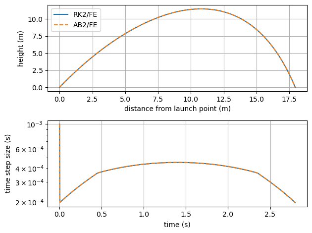
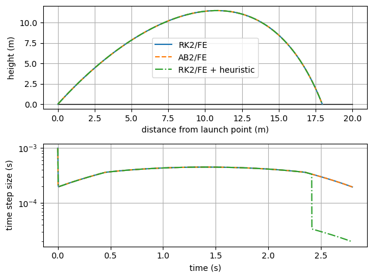

User-defined adaptive time-stepping methods
===========================================

*This demo is part of Spitfire, with* `licensing and copyright info
here. <https://github.com/sandialabs/Spitfire/blob/master/license.md>`__

*Highlights*

-  building an adaptive Adams-Bashforth2 method for adaptive
   time-stepping
-  using details of the solution (instead of an error estimate) to
   control the time step

Introduction
------------

This example solves the cannonball trajectory problem used in another
notebook that introduced adaptive time-stepping and custom termination
rules (stopping integration when the cannonball hits the ground). Here
we build an explicit linear multistep method that can solve this problem
with adaptive time-stepping. The class is coded completely in our
notebook and used with Spitfire internal time-stepping and step control
algorithms as if it were provided out of the box.

Following that we code another new stepper that uses an estimate of
time-stepper error when the cannonball is first launched but later
switches to a heuristic that reduces the step size as the object nears
the ground. This enables us to obtain very accurate measures of the
distance the object travels (the impact point) without slowing down the
entire simulation. This is a very unusual way to control a time step but
the abstraction in Spitfire’s time integration framework allows it.

First we’ll do some setup - see the first demo with cannonball
trajectories to learn more about this code.

.. code:: ipython3

    import numpy as np
    import matplotlib.pyplot as plt
    
    rf = 1.23                         # fluid density, kg/m3
    ro = 7.86e3                       # object (cannonball) density, kg/m3
    g = 9.8                           # gravitational constant, m/s2
    r = 4. * 2.54 / 100.              # cannonball radius, m
    A = 4. * np.pi * r * r            # surface area, m2
    V = np.pi * r * r * r * 4. / 3.   # volume, m3
        
    def ode_rhs(t, q, c_d):
        vel_x = q[2]
        vel_y = q[3]
        
        f = 0.5 * rf * c_d * A / (ro * V)
        
        return np.array([vel_x,
                         vel_y,
                         -f * vel_x * vel_x,
                         -g - f * vel_y * vel_y])
    
    def object_has_landed(t, state, *args, **kwargs):
        vel_y = state[1]
        pos_y = state[3]
        return pos_y < r and vel_y < 0

Variable-step AB2 Method
------------------------

We now implement the variable-step second-order Adams-Bashforth method.
In a previous notebook we coded up the fixed-step variant which is a
little simpler. For the variable step method the update is

.. math::  y^{n+1} = y^{n} + (\Delta t)^n\left((1-C) r(t^n,y^n) + C r(t^{n-1},y^{n-1})\right) 

where :math:`C = -(\Delta t)^n/(2(\Delta t)^{n-1})`.

In order to use this method for adaptive time-stepping, we need some way
to estimate the error of a time step. A simple, asymptotically correct
way to do this is to compute a first-order update with the forward Euler
method,

.. math::  y^{n+1,FE} = y^{n} + (\Delta t)^n r(t^n,y^n)

and then use the difference, :math:`|y^{n+1}-y^{n+1,FE}|`, as the error
estimate. To feed this to Spitfire we then add the ``temporal_error``
field in the ``StepOutput`` instance returned by ``single_step``, as in
the code below.

.. code:: ipython3

    from spitfire.time.methods import StepOutput, TimeStepperBase
    
    class AB2FE(TimeStepperBase):
        def __init__(self):
            super().__init__(name='Adams-Bashforth-2 w/FE error', order=2, is_adaptive=True)
            self._rhs_nm1 = None
            self._dt_nm1 = None
    
        def single_step(self, state, t, dt, rhs, *args, **kwargs):
            rhs_n = rhs(t, state)
            
            if self._rhs_nm1 is None:
                update = dt * rhs_n   # if first step, use Forward Euler
                error = 1e-2          # an arbitrary value that only impacts the first step
            else:
                C = -0.5 * dt / self._dt_nm1
                update = dt * ((1. - C) * rhs_n + C * self._rhs_nm1)
                error = np.linalg.norm(update - dt * rhs_n, ord=np.inf)
            
            self._dt_nm1 = np.copy(dt)
            self._rhs_nm1 = np.copy(rhs_n)
            return StepOutput(solution_update=update, temporal_error=error)

Now we’ll solve the problem with our new ``AB2FE`` method and Spitfire’s
``ExpTrapezoidalS2P2Q1`` method that does a similar technique (involving
the trapezoidal and forward Euler methods) to make sure our
implementation looks good.

.. code:: ipython3

    from spitfire import odesolve, ExpTrapezoidalS2P2Q1, PIController
    
    controller = PIController(target_error=1.e-6, first_step=1.e-3, max_step=1.e-1)
    
    q0 = np.array([0., 0., 10., 20.])  # initial condition
    c_d = 20.
    
    t_rk2, q_rk2 = odesolve(lambda t, y: ode_rhs(t, y, c_d),
                            q0,
                            save_each_step=True,
                            step_size=controller,
                            method=ExpTrapezoidalS2P2Q1(),
                            stop_criteria=object_has_landed)
    
    t_ab2, q_ab2 = odesolve(lambda t, y: ode_rhs(t, y, c_d),
                            q0,
                            save_each_step=True,
                            step_size=controller,
                            method=AB2FE(),
                            stop_criteria=object_has_landed)
    
    figure, axarray = plt.subplots(2, 1)
    
    axarray[0].plot(q_rk2[:, 0], q_rk2[:, 1], '-', label='RK2/FE')
    axarray[0].plot(q_ab2[:, 0], q_ab2[:, 1], '--', label='AB2/FE')
    axarray[1].semilogy(t_rk2[:-1], t_rk2[1:] - t_rk2[:-1], '-')
    axarray[1].semilogy(t_ab2[:-1], t_ab2[1:] - t_ab2[:-1], '--')
    
    axarray[0].set_xlabel('distance from launch point (m)')
    axarray[0].set_ylabel('height (m)')
    axarray[1].set_xlabel('time (s)')
    axarray[1].set_ylabel('time step size (s)')
    for ax in axarray:
        ax.grid()
    axarray[0].legend(loc='best')
    plt.tight_layout()
    plt.show()

A heuristic to refine :math:`\Delta t` near the landing point
=============================================================

The following class defines the trapezoidal method that uses forward
Euler to obtain an estimate of time error, and which adds in a
artificial error multiplier to increase the error when the cannonball is
nearing impact with the ground. This is done to refine the time step as
we get to the impact point, which is perhaps something we want to
resolve more accurately.

.. code:: ipython3

    class RK2FE_PlusHeuristic(TimeStepperBase):
        def __init__(self):
            super().__init__(name='ERK2(1) w/trajectory heuristic', order=2, is_adaptive=True)
    
        def single_step(self, state, t, dt, rhs, *args, **kwargs):
            k1 = rhs(t, state)
            k2 = rhs(t + dt, state + dt * k1)
            weighted_rhs_1 = k1
            weighted_rhs_2 = 0.5 * (k1 + k2)
            temporal_error = np.linalg.norm(dt * (weighted_rhs_2 - weighted_rhs_1), ord=np.inf)
            
            # now include the heuristic in the error estimate
            y = state[1]
            v_y = state[3]
            temporal_error *= 100. if v_y < 0. and y < 6.0 else 1.
            
            return StepOutput(solution_update=dt * weighted_rhs_2, temporal_error=temporal_error)

Using this method to compute time steps and errors for the PI stepsize
controller produces the results below. Note that the time step drops
significantly when the :math:`y`-velocity is negative and the height is
below six meters. This should improve accuracy of the method near the
landing point, but it really isn’t too noticeable here unless you really
zoom in. Zooming in *does* show that time integration terminates at a
position much closer to the impact of the cannonball on the ground.

Another thing to think about is that we’re using a second-order time
integration scheme in this case - if we use a fourth-order scheme the
time step will *decrease less* after we add the artifical error
multiplier because the error changes more sharply with the time step
size. In the end a better way to get more accuracy out of our time
integration is to simply use a higher-order method and a smaller target
error - the value of higher-order methods is precisely when an extremely
accurate solution is desired. However there may be some cases where
artificial error multipliers such as this could be valuable - perhaps
around sharp, nonlinear ignition or extinction dynamics in complex
chemistry problems (in which case one could add error multipliers based
on the temperature or its rate of change, for instance).

.. code:: ipython3

    t_rk2mod, q_rk2mod = odesolve(lambda t, y: ode_rhs(t, y, c_d),
                                  q0,
                                  save_each_step=True,
                                  step_size=controller,
                                  method=RK2FE_PlusHeuristic(),
                                  stop_criteria=object_has_landed)
    
    figure, axarray = plt.subplots(2, 1)
    
    axarray[0].plot([0, 20], [0, 0], 'k-', linewidth=1)
    axarray[0].plot(q_rk2[:, 0], q_rk2[:, 1], '-', label='RK2/FE')
    axarray[0].plot(q_ab2[:, 0], q_ab2[:, 1], '--', label='AB2/FE')
    axarray[0].plot(q_rk2mod[:, 0], q_rk2mod[:, 1], '-.', label='RK2/FE + heuristic')
    axarray[1].semilogy(t_rk2[:-1], t_rk2[1:] - t_rk2[:-1], '-')
    axarray[1].semilogy(t_ab2[:-1], t_ab2[1:] - t_ab2[:-1], '--')
    axarray[1].semilogy(t_rk2mod[:-1], t_rk2mod[1:] - t_rk2mod[:-1], '-.')
    
    axarray[0].set_xlabel('distance from launch point (m)')
    axarray[0].set_ylabel('height (m)')
    axarray[1].set_xlabel('time (s)')
    axarray[1].set_ylabel('time step size (s)')
    for ax in axarray:
        ax.grid()
    axarray[0].legend(loc='best')
    plt.tight_layout()
    plt.show()

Conclusion
----------

This notebook has shown how to code some user-defined classes that
compute embedded error estimates to drive adaptive time-stepping. In one
example a classical variable-step second-order Adams-Bashforth method
was implemented, and in the other we use a Runge-Kutta method with both
a rigorous error estimate and an additional error from a heuristic based
on specific details of the differential equations being solved.

