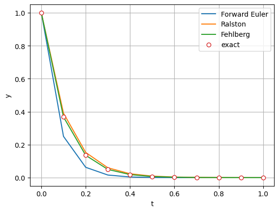
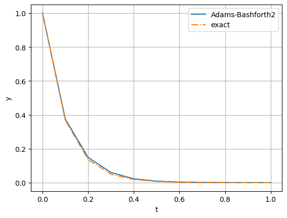
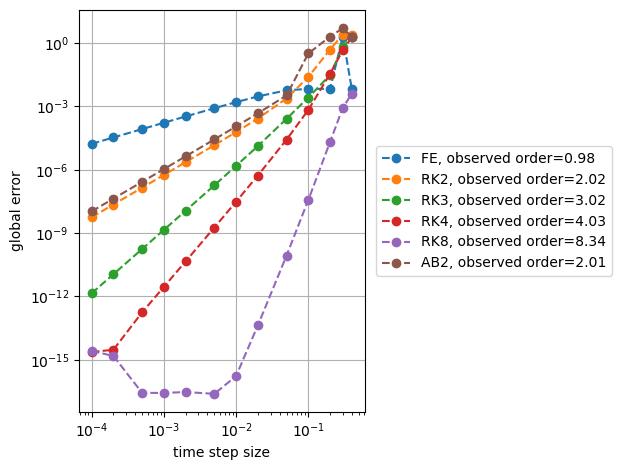

Explicit time integration with user-defined methods
===================================================

*This demo is part of Spitfire, with* `licensing and copyright info
here. <https://github.com/sandialabs/Spitfire/blob/master/license.md>`__

*Highlights*

-  solving ordinary differential equations with your own methods
-  custom eighth-order Runge-Kutta method
-  coding up a second-order Adams-Bashforth method for use in Spitfire

Introduction
------------

In previous demonstrations you’ve seen the basics of using Spitfire’s
``odesolve`` method. The abstraction of time integration techniques in
``odesolve`` makes it possible for you to “plug in” methods defined
entirely in your own code, which is the focal point of this notebook.

Two ways of building your own time-stepping methods are covered: 1.
Using the ``GeneralAdaptiveERK`` class in ``spitfire.time.methods`` to
provide Butcher coefficients for general, explicit Runge-Kutta methods
(possibly with error-based adaptive time-stepping) 2. Writing your own
``Method`` classes for a ``Governor`` instance

We will use the first option to build some Runge-Kutta methods, and we
will show how the second method can actually enable the use of
`Adams-Bashforth
methods <https://en.wikipedia.org/wiki/Linear_multistep_method>`__ not
provided by Spitfire.

Custom Runge-Kutta methods with ``GeneralAdaptiveERK``
------------------------------------------------------

This class allows you to define the `Butcher
tableau <https://en.wikipedia.org/wiki/Runge–Kutta_methods>`__ for any
explicit Runge-Kutta method. Below we first build the Forward Euler
method and then a more interesting example - the two-stage, second-order
method of Ralston.

.. code:: ipython3

    import numpy as np
    from spitfire import GeneralAdaptiveERK as GERK
    
    runge_kutta_methods = dict()
    
    runge_kutta_methods['Forward Euler'] = GERK(name='Forward Euler',
                                                A=np.array([[0.]]),
                                                b=np.array([1.]),
                                                order=1)
    runge_kutta_methods['Ralston'] = GERK(name='Ralston',
                                          A=np.array([[0., 0.],
                                                   [2. / 3., 0.]]),
                                          b=np.array([0.25, 0.75]),
                                          order=2)

Just for some extra fun we now make an eighth-order method with thirteen
stages.

.. code:: ipython3

    runge_kutta_methods['Fehlberg'] = GERK(name='Fehlberg',
                                           A=np.array([[0, 0, 0, 0, 0, 0, 0, 0, 0, 0, 0, 0, 0],
                                                       [2. / 27., 0, 0, 0, 0, 0, 0, 0, 0, 0, 0, 0, 0],
                                                       [1. / 36., 1. / 12., 0, 0, 0, 0, 0, 0, 0, 0, 0, 0, 0],
                                                       [1. / 24, 0, 1. / 8, 0, 0, 0, 0, 0, 0, 0, 0, 0, 0],
                                                       [5. / 12., 0, -25. / 16., 25. / 16., 0, 0, 0, 0, 0, 0, 0, 0, 0],
                                                       [1. / 20., 0, 0, 1. / 4., 1. / 5., 0, 0, 0, 0, 0, 0, 0, 0],
                                                       [-25. / 108, 0, 0, 125. / 108., -65. / 27., 125. / 54., 0, 0, 0, 0, 0, 0, 0],
                                                       [31. / 300., 0, 0, 0, 61. / 225., -2. / 9., 13. / 900., 0, 0, 0, 0, 0, 0],
                                                       [2., 0, 0, -53. / 6., 704. / 45., -107. / 9., 67. / 90., 3., 0, 0, 0, 0, 0],
                                                       [-91. / 108., 0, 0, 23. / 108., -976. / 135., 311. / 54., -19. / 60., 17. / 6., -1. / 12., 0, 0, 0, 0],
                                                       [2383. / 4100., 0, 0, -341. / 164., 4496. / 1025., -301. / 82., 2133. / 4100., 45. / 82., 45. / 164., 18. / 41., 0, 0, 0],
                                                       [3. / 205., 0, 0, 0, 0, -6. / 41., -3. / 205., -3. / 41., 3. / 41., 6. / 41., 0, 0, 0],
                                                       [-1777. / 4100., 0, 0, -341. / 164., 4496. / 1025., -289. / 82., 2193. / 4100., 51. / 82., 33. / 164., 12. / 41., 0, 1., 0]]),
                                           b=np.array([0, 0, 0, 0, 0, 34. / 105., 9. / 35., 9. / 35., 9. / 280., 9. / 280., 0, 41. / 840., 41. / 840.]),
                                           order=8)

Now we can go ahead and solve the exponential decay problem from prior
notebooks with each method. Note how accurate the eighth-order method is
compared to Forward Euler and the Ralston method.

.. code:: ipython3

    from spitfire import odesolve
    
    import matplotlib.pyplot as plt
    
    dt = 0.05
    k = -10.
    tf = 1.
    y0 = np.array([1.])
    rhs = lambda t, y: k * y
    
    output_times = np.linspace(0., tf, 11)
    y_exact = y0 * np.exp(k * output_times)
    
    for name in runge_kutta_methods:
        y = odesolve(rhs, y0, output_times, step_size=dt, method=runge_kutta_methods[name])
        plt.plot(output_times, y, '-', label=name)
    
    plt.plot(output_times, y_exact, 'o', markerfacecolor='w', label='exact')
    
    plt.xlabel('t')
    plt.ylabel('y')
    plt.legend(loc='best')
    plt.grid()
    plt.show()

Adams-Bashforth method with a custom class
------------------------------------------

Now we show how to write a new method that can be used in ``odesolve``.
Spitfire doesn’t provide linear multistep methods out of the box, but we
can code up the second-order Adams-Bashforth method in twenty or so
lines. Our class derives from the ``TimeStepperBase`` class, to which it
provides its name and order of accuracy in the ``super().__init__`` call
(a base class constructor in Python). Next, the ``single_step`` method
is defined and written so that it returns a ``StepOutput`` object
populated with the solution update (:math:`y^{n+1}-y^{n}`). And that’s
it.

The second-order `Adams-Bashforth
method <https://en.wikipedia.org/wiki/Linear_multistep_method>`__,
referred to frequently as AB2, is a two-step method that uses the
right-hand side at both the current time level and the prior one. The
next time level, with solution :math:`y^{n+1}`, is computed with

.. math::  y^{n+1} = y^{n} + \frac{\Delta t}{2}\left(3 r(t^n,y^n) - r(t^{n-1},y^{n-1})\right) 

where :math:`r(t,y)` is the right-hand side function of the differential
equation. This update can’t be performed on the first time step and so
we simply use the Forward Euler update
:math:`y^{n+1} = y^{n} + \Delta t r(t^n, y^n)`. This is not strictly
accurate to second-order, but it works well enough in practice.

A key detail in implementing linear multistep methods is the challenge
of handling a variable time step history. We simply ignore this
difficulty here, so the class below will only be correct for a fixed
time step. We’ll actually implement a variable step AB2 method in a
following demonstration.

Note that custom time-stepper methods like this can return more
information in ``StepOutput``, such as error estimates for time step
adaptativity, but that’s a bit more advanced and we suggest interested
developers check out the source code in the ``spitfire.time.methods.py``
file for more details.

.. code:: ipython3

    from spitfire.time.methods import StepOutput, TimeStepperBase
    
    class AdamsBashforth2(TimeStepperBase):
        def __init__(self):
            super().__init__(name='Adams-Bashforth-2', order=2)
            self._rhs_nm1 = None
    
        def single_step(self, state, t, dt, rhs, *args, **kwargs):
            rhs_n = rhs(t, state)
            if self._rhs_nm1 is None:
                update = dt * rhs_n   # if first step, use Forward Euler
            else:
                update = 0.5 * dt * (3. * rhs_n - self._rhs_nm1)
            self._rhs_nm1 = np.copy(rhs_n)    
            return StepOutput(solution_update=update)

Now this class may simply be provided to ``odesolve`` like any of the
other methods we’ve used so far.

.. code:: ipython3

    y_ab2 = odesolve(rhs, y0, output_times, step_size=dt, method=AdamsBashforth2())
    
    plt.plot(output_times, y_ab2, '-', label='Adams-Bashforth2')
    plt.plot(output_times, y_exact, '-.', label='exact')
    
    plt.xlabel('t')
    plt.ylabel('y')
    plt.legend(loc='best')
    plt.grid()
    plt.show()

Verification
------------

To make sure that we coded our new Adams-Bashforth method correctly,
we’re going to verify by establishing its order of accuracy. This
consists of running simulations at different time step sizes and
observing how the error (against an exact solution) decreases. A
first-order method will see a 10x decrease in error for a 10x decrease
in the step size, while a second-order method would see a 100x decrease
and a fourth order method would see a 10000x decrease.

To simplify this we define the ``compute_error`` method below that takes
in a time-stepper method and a step size and returns the error in
solving the exponential decay problem to a specified time.

.. code:: ipython3

    def compute_error(method, time_step_size):
        tf = 0.5
        yf = odesolve(rhs, y0, np.array([tf]), step_size=time_step_size, method=method).ravel()
        return np.abs(yf - y0 * np.exp(k * tf))[0]

Now we import a few more methods provided by Spitfire for comparison’s
sake and run ``compute_error`` for each method across a range of time
step sizes. This uses a Python list comprehension to simplify the
construction of the list of errors, and simply saves off the results in
a dictionary. This sort of pattern is really convenient in many uses of
Spitfire.

Following this we use NumPy’s ``polyfit`` function to obtain the slopes
of the error over time step size results (in logarithmic scale). This
shows that Spitfire’s methods and our new second-order Adams-Bashforth
method are all solving the problem to their design order of accuracy.

.. code:: ipython3

    from spitfire import ForwardEulerS1P1, \
        RK4ClassicalS4P4, \
        ExpRalstonS2P2, \
        RK3KuttaS3P3
    
    dt_list = [1e-4, 2e-4, 5e-4, 1e-3, 2e-3, 5e-3, 1e-2, 2e-2, 5e-2, 1e-1, 2e-1, 3e-1, 4e-1]
    
    error_dict = dict()
    error_dict['FE'] = [compute_error(ForwardEulerS1P1(), dt) for dt in dt_list]
    error_dict['RK2'] = [compute_error(ExpRalstonS2P2(), dt) for dt in dt_list]
    error_dict['RK3'] = [compute_error(RK3KuttaS3P3(), dt) for dt in dt_list]
    error_dict['RK4'] = [compute_error(RK4ClassicalS4P4(), dt) for dt in dt_list]
    error_dict['RK8'] = [compute_error(runge_kutta_methods['Fehlberg'], dt) for dt in dt_list]
    error_dict['AB2'] = [compute_error(AdamsBashforth2(), dt) for dt in dt_list]
    
    order_dict = dict()
    for method in error_dict:
        # here we slice the results so that the polyfit is done only on the asymptotic data,
        # - some of the methods are unstable with dt > 0.1
        # - the RK8 method and RK4 method reach machine precision errors that cannot be lower
        if method == 'RK8':
            s = slice(6, 10, None)
        else:
            s = slice(2, 7, None)
        order_dict[method] = np.polyfit(np.log(dt_list[s]), np.log(error_dict[method][s]), 1)[0]
    
    for method in error_dict:
        plt.loglog(dt_list, error_dict[method], 'o--', label=f'{method}, observed order={order_dict[method]:.2f}')
    plt.legend(bbox_to_anchor=(1.04,0.5), loc="center left", borderaxespad=0)
    plt.xlabel('time step size')
    plt.ylabel('global error')
    plt.grid()
    plt.tight_layout()
    plt.show()

Conclusions
-----------

In this example we’ve shown how to employ user-defined explicit
Runge-Kutta methods and custom classes, in this a second-order
Adams-Bashforth method, to solve a simple ordinary differential
equation. Verifying the order of accuracy of the methods suggests
confidence that they are implemented correctly.

