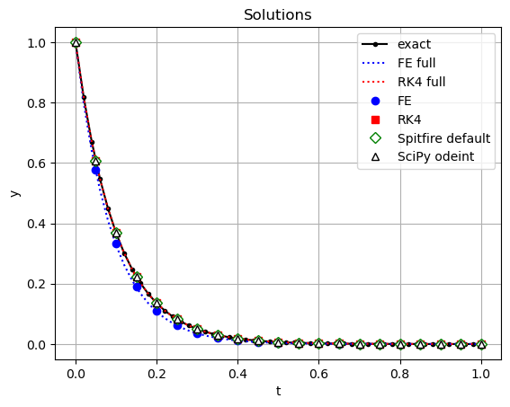

Explicit time integration basics
================================

*This demo is part of Spitfire, with* `licensing and copyright info
here. <https://github.com/sandialabs/Spitfire/blob/master/license.md>`__

*Highlights*

-  the basics of time integration with Spitfire

Introduction
------------

This notebook demonstrates the use of Spitfire’s time integration
framework, notably its default solver and the use of explicit
Runge-Kutta methods. We also compare to the use of
``scipy.integrate.odeint``, another convenient ODE solver.

In this first example we solve a simple ordinary differential equation,

.. math::  \frac{\mathrm{d}y}{\mathrm{d}t} = -ky 

subject to initial condition :math:`y(0) = y_0` with real coefficient
:math:`k>0`. This has the exact solution, :math:`y(t)=y_0 \exp(-kt)`.
This is a simple differential equation but is the fundamental building
block of more complicated systems.

Solving with Spitfire’s ``odesolve`` and SciPy’s ``integrate.odeint``
---------------------------------------------------------------------

First we use ``odesolve``, a Spitfire method that drives all the various
types of time integration in Spitfire, from the simple Forward Euler
method to adaptive time-stepping with high-order implicit Runge-Kutta
methods. This method may be used with default settings for many
small-scale ODE systems like the above exponential decay or ecology
models and simple chemistry models.

.. code:: ipython3

    import numpy as np
    import matplotlib.pyplot as plt
    
    from spitfire import odesolve

Next we set up some of the problem details, like the time step,
:math:`k` value, final time, and initial condition :math:`y_0`, which
you’ll note is made as a ``NumPy`` array.

Here we also make a function that computes the right-hand side of the
differential equation given the current time and solution value,
respectively, as inputs. Any callable object - something that has a
``()`` operator that takes two arguments, namely the time and the
solution state - can be used as the right-hand side operator.

.. code:: ipython3

    dt = 0.02
    tf = 1.0
    k = -10.
    y0 = np.array([1.])
    
    rhs = lambda t, y: k * y

Now to use Spitfire’s default solver and obtain the solution at the
specified set of times (possibly doing many more time steps of variable
size behind the scenes, we use the following call to ``odesolve``:

.. code:: ipython3

    output_times = np.linspace(0., tf, 21)
    y_default = odesolve(rhs, y0, output_times)

By comparison, see the use of SciPy’s ``integrate.odeint`` method below.
Note that SciPy takes the opposite convention that the state vector
comes before the solution time in the arguments to the right-hand side
function. The ``lambda`` function below simply switches the argument
ordering for SciPy.

.. code:: ipython3

    from scipy import integrate as scipy_integrate
    
    rhs_for_scipy = lambda x, t: rhs(t, x)
    
    y_scipy = scipy_integrate.odeint(rhs_for_scipy, y0, output_times)

Using Forward Euler and RK4 in ``odesolve``
-------------------------------------------

Now we show how to use Spitfire to use some explicit Runge-Kutta methods
it provides for you. Other methods are provided as well, and in
following demonstrations we will show how to write your own methods for
use with ``odesolve``.

-  ``ForwardEulerS1P1``: `the simplest time-stepping method of
   all <https://en.wikipedia.org/wiki/Euler_method>`__
-  ``RK4ClassicalS4P4``: `the Runge Kutta
   method <https://en.wikipedia.org/wiki/Runge–Kutta_methods>`__, a
   four-stage, fourth-order method

Note below that two changes are needed to run the explicit methods.

1. We provide the ``method`` keyword argument to ``odesolve``. Carefully
   note that we are constructing an instance due to the parentheses
   after ``ForwardEulerS1P1``.
2. With these methods we have to tell Spitfire how large the time step
   is. The default method uses advanced adaptive time-stepping
   approaches, while here we simply use a constant time step by
   providing a number to the ``step_size`` keyword argument.

.. code:: ipython3

    from spitfire import ForwardEulerS1P1, RK4ClassicalS4P4
    
    y_fe = odesolve(rhs, y0, output_times, step_size=dt, method=ForwardEulerS1P1())
    y_rk = odesolve(rhs, y0, output_times, step_size=dt, method=RK4ClassicalS4P4())

We show one more example in this demonstration. Below we use
``odesolve`` with the ``save_each_step`` argument instead of providing
an array of output times as above. When this is used, the time and state
vector at every time step taken under the hood of ``odesolve`` are
returned. This can be more generally useful when a good array of
``output_times`` is unclear. Note that it can also generate a lot of
data for long-running simulations.

Another key difference is that without ``output_times`` it’s not
specified how the simulation should actually terminate. So, we add the
``stop_at_time`` argument to integrate only until the final time is
reached. Other stopping criteria will be introduced in later
demonstrations - as will the ability to write your own entirely
customized stopping criteria.

.. code:: ipython3

    t_fe_full, y_fe_full = odesolve(rhs, y0, stop_at_time=tf, save_each_step=True, step_size=dt, method=ForwardEulerS1P1())
    t_rk_full, y_rk_full = odesolve(rhs, y0, stop_at_time=tf, save_each_step=True, step_size=dt, method=RK4ClassicalS4P4())

Plotting the results shows that the Forward Euler method, as is
expected, is quite inaccurate compared to the other methods. The default
integrators in Spitfire and Scipy both yield excellent solutions to this
problem. To see in more detail you can zoom in on the plot, thanks to
the ``%matplotlib notebook`` magic.

.. code:: ipython3

    y_exact = y0 * np.exp(k * t_fe_full)
    
    plt.plot(t_fe_full, y_exact, 'k.-', label='exact')
    plt.plot(t_fe_full, y_fe_full, 'b:', label='FE full')
    plt.plot(t_rk_full, y_rk_full, 'r:', label='RK4 full')
    plt.plot(output_times, y_fe, 'bo', label='FE')
    plt.plot(output_times, y_rk, 'rs', label='RK4')
    plt.plot(output_times, y_default, 'gD', markerfacecolor='w', label='Spitfire default')
    plt.plot(output_times, y_scipy, 'k^', markerfacecolor='w', label='SciPy odeint')
    
    plt.title('Solutions')
    plt.xlabel('t')
    plt.ylabel('y')
    plt.legend(loc='best')
    plt.grid()
    plt.show()

Conclusions
-----------

In this example we’ve shown how to use two common time-stepping schemes
with Spitfire to solve a simple ordinary differential equation. We’ve
covered how to use the ``odesolve`` method to drive the time-stepping
loop and save data at particular solution times. This can be quite
similar to other ODE solvers, such as those in Matlab or SciPy’s
``integrate.odeint`` method. While ``odesolve`` provides a convenient
interface for simple ODEs like this, it allows a great deal of
extensibility and fine-grained control over the use of advanced
steppers, linear and nonlinear solvers, step controllers, data output,
and more. This enables ``odesolve`` to efficiently solve much more
complicated ODE/PDE problems where default solver choices can be
infeasibly slow.

