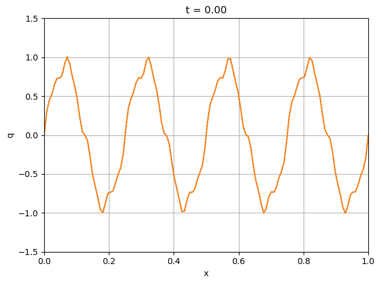
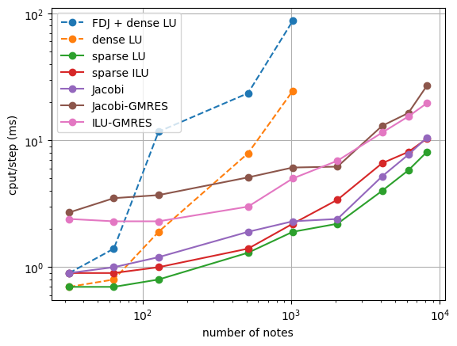
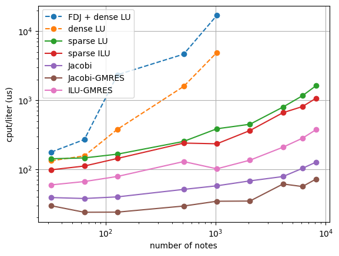

Advanced options for implicit time integration: linear solvers & advection-diffusion
====================================================================================

*This demo is part of Spitfire, with* `licensing and copyright info
here. <https://github.com/sandialabs/Spitfire/blob/master/license.md>`__

*Highlights*

-  “plug and play” of a variety of linear solvers for adaptive,
   high-order implicit Runge-Kutta scheme to solve an unsteady
   advection-diffusion equation
-  the scalability of different methods is shown as we increase the
   number of nodes in the spatial discretization

Introduction
------------

This notebook demonstrates advanced use of Spitfire’s implicit time
integration methods for solving a partial differential equation (PDE)
describing transport of a quantity by advection and diffusion. The
unsteady advection-diffusion equation for a spatially one-dimensional
field :math:`q(t,x)` is

.. math::  \frac{\partial q}{\partial t} + \frac{\partial q}{\partial x} = \frac{1}{\mathrm{Pe}}\frac{\partial^2 q}{\partial x^2}

where :math:`\mathrm{Pe}` is the `Peclet
number <https://en.wikipedia.org/wiki/Péclet_number>`__. We consider
this PDE on a periodic domain, which could be thought of as a ring where
anything transporting out of the right/left edge flows immediately into
the left/right edge. Unsteady advection-diffusion on a periodic domain
is a common problem for studying numerical methods for discretizing PDEs
spatially and temporally, as certain initial conditions for
:math:`q(0,x)` admit anaylytical solutions that may be easily evaluated.

We’re going to discretize the PDE in space with elementary `nodal finite
differences <https://en.wikipedia.org/wiki/Finite_difference_method>`__,
wherein second-order centered differences are used to approximate the
first and second derivatives (in space) in the PDE. As for the time
derivative, we’re going to employ the `method of
lines <http://www.scholarpedia.org/article/Method_of_lines>`__, which is
one way of saying that we compile the spatially-discretized scheme into
a system of ordinary differential equations (ODEs) with one equation per
node in space. We may then apply any of Spitfire’s time-stepping schemes
to the system of ODEs.

Linear Solvers
--------------

The details of our spatial discretization are widely available on the
web and so we skip over them. The purpose of this notebook is to show
how to use different linear solver strategies for implicit solvers for
the large ODE system that comes out of spatially discretizing the PDE.
The linear solver is often *the* key ingredient to developing efficient
and scalable solvers for partial differential equations. Although
everything in this notebook will be run on a single processor, the poor
scalability of some linear solvers can be easily be shown here. This may
be a very important notebook for your later use of Spitfire.

In what follows we use nine different linear solvers for this problem,
heavily leveraging Scipy for Krylov methods. The following list covers
both dense and sparse direct solvers as well as a few preconditioned
iterative solvers. It’s possibly that the PyAMG code could be included
in the future to incorporate a multigrid option that would probably be
the best for this system of equations, but for now we haven’t done this.

1. **finite differenced Jacobian + dense LU factorization**: This is by
   far the easiest scheme to use, as Spitfire provides this capability
   out of the box. However, for large systems with sparse Jacobian
   matrices (as here) this is extremely wasteful in both calculating a
   Jacobian and in factorizing it with dense solver.
2. **exact Jacobian with dense LU**: This is going to scale poorly
   because we aren’t exploiting the sparsity of the Jacobian matrix in
   this problem.
3. **sparse LU**: This will use the `SuperLU
   code <https://github.com/xiaoyeli/superlu>`__, that is roughly doing
   a symbolic factorization of a sparse matrix without including
   explicit zeros, to enable a fast back-substitution.
4. **sparse ILU**: Also using SuperLU, this is an *incomplete* sparse LU
   decomposition which can be much faster than full LU decomposition but
   only provides an inexact linear solution. This is most often used as
   a preconditioner for Kyrlov methods. Note that we’re simply using
   SciPy defaults for the fill factor and other possibly important
   parameters.
5. **Jacobi (diagonal of the Jacobian)**: This is a very simple linear
   solver wherein an inexact solutions is obtained by simply ignoring
   off-diagonal elements of the Jacobian matrix.
6. **Jacobi-GMRES**: Here we use the `GMRES Krylov
   method <https://en.wikipedia.org/wiki/Generalized_minimal_residual_method>`__
   with the Jacobi solver as a preconditioner. This is an iterative
   method that will find a much better solution than Jacobi alone.
7. **ILU-GMRES**: Here instead of using the Jacobi preconditioner we use
   ILU - this is a very common approach in large-scale PDE solvers for
   fluid dynamics and heat transfer.

Spitfire Abstraction
--------------------

For problems where an implicit solver will be used, Spitfire requires
not only a function for evaluating the right-hand side of the ODE but
also “setup” and “solve” functions. The “setup” function is for things
like factorization or preconditioner evaluation that can be done once
for many different solves (same matrix, different residuals). Spitfire
can enable lagged Jacobian/preconditioner evaluations, which may mean
calling the expensive “setup” method once for many solves within a time
step or possibly once across several time steps. For a linear problem
such as this that is solved with a constant time step, the “setup”
method can actually be called just once, but since we’re using adaptive
time-stepping (representative of more complex, nonlinear PDEs), we will
use Spitfire’s default behavior of calling “setup” once per time step.
For the ``KennedyCarpenterS6P4Q3`` method used here, there are five
nonlinear internal stages and so five nonlinear solves are needed (each
of which will need several linear solves), all of which will use the
Jacobian/preconditioner evaluated/factorized at the beginning of the
time step. This is often far faster than re-evaluating the “setup”
method once per nonlinear iteration (which Spitfire does enable you to
do).

The “solve” function will be called once per linear solve (so, anywhere
from five to fifty or so times per time step with this ESDIRK64 method),
and returns three things: the solution to the linear system, whether or
not convergence was obtained, and how many iterations were required. As
you can see below the direct methods simply return the solution and
``True`` and ``1``.

To simplify things for the variety of solvers, we define the
``AdvDiffEqn`` class to hold data members associated with the “setup”
and “solve” functionality and to provide the methods themselves. Many
large-scale codes for time integration or other abstract numerical
algorithms leverage similar abstractions around a “Model” class that can
provide residual or Jacobian evaluations to a solver.

Take a look through the code below. The class is quite nontrivial
because we’re supporting nine different linear solvers - in many cases
one or two is sufficient and so your “Model” classes will be much
simpler. As you look through the code, recall that the “setup” and
“solve” methods have to conform to the API (input arguments and return
values) that Spitfire expects and that otherwise they only have to be
consistent - each “setup” is the precursor its corresponding “solve”
method. Note that the preconditioner “setup” methods for the Krylov
methods are shared, there is a single Jacobi and single ILU “setup” that
are shared by all Krylov methods.

.. code:: ipython3

    import numpy as np
    from scipy.sparse import diags, csc_matrix
    from scipy.linalg.lapack import dgetrf as lapack_lu_factor
    from scipy.linalg.lapack import dgetrs as lapack_lu_solve
    from scipy.sparse.linalg import splu as superlu_factor
    from scipy.sparse.linalg import spilu as spilu_factor
    from scipy.sparse.linalg import gmres, LinearOperator
    
    class AdvDiffEqn:
        def __init__(self, x_nodes, Pe):
            self._x_nodes = np.copy(x_nodes)
            self._dx = x_nodes[1] - x_nodes[0]
            self._idx = 1. / self._dx
            
            self._n_nodes = self._x_nodes.size
            onx = np.ones(self._n_nodes)
            om1 = np.ones(self._n_nodes - 1)
    
            C1 = diags([-om1, om1], [-1, 1], format='lil')
            C1[0, -2] = -1
            C1[-1, 1] = 1
            C1 = 0.5 * self._idx * csc_matrix(C1)
    
            C2 = diags([om1, -2. * onx, om1], [-1, 0, 1], format='lil')
            C2[0, -2] = 1
            C2[-1, 1] = 1
            C2 = self._idx * self._idx * csc_matrix(C2)
    
            self._I = diags([onx], [0], format='csc')
            self._A = 1. / Pe * C2 - C1
            
            self._md = 0.5 * self._idx + -2. / Pe * self._idx * self._idx
            
            self._lhs_inv_op = None
            self._linear_iter = 0
        
        @property
        def x(self):
            return self._x_nodes
        
        def rhs(self, t, q):
            return self._A.dot(q)
        
        def setup_lapack_lu(self, t, q, prefactor):
            self._lhs_inv_op = lapack_lu_factor((prefactor * self._A - self._I).todense())[:2]
        
        def solve_lapack_lu(self, residual):
            solution = lapack_lu_solve(self._lhs_inv_op[0], self._lhs_inv_op[1], residual)[0]
            return solution, 1, True
        
        def setup_superlu(self, t, q, prefactor):
            self._lhs_inv_op = superlu_factor(prefactor * self._A - self._I)
        
        def solve_superlu(self, residual):
            return self._lhs_inv_op.solve(residual), 1, True
        
        def setup_superilu(self, t, q, prefactor):
            self._lhs_inv_op = spilu_factor(prefactor * self._A - self._I)
        
        def solve_superilu(self, residual):
            return self._lhs_inv_op.solve(residual), 1, True
        
        def setup_Jacobi(self, t, q, prefactor):
            self._lhs_inv_op = 1. / (prefactor * self._md - 1.)
        
        def solve_Jacobi(self, residual):
            return self._lhs_inv_op * residual, 1, True
        
        def setup_Jacobi_Krylov(self, t, q, prefactor):
            self._linear_iter = 0
            self._lhs_op = prefactor * self._A - self._I
            self._lhs_inv_op = 1. / (prefactor * self._md - 1.)
            self._krylov_preconditioner = LinearOperator((self._n_nodes, self._n_nodes), 
                                                          lambda res: self._lhs_inv_op * res)
        
        def setup_ILU_Krylov(self, t, q, prefactor):
            self._linear_iter = 0
            self._lhs_op = prefactor * self._A - self._I
            self._lhs_inv_op = spilu_factor(prefactor * self._A - self._I)
            self._krylov_preconditioner = LinearOperator((self._n_nodes, self._n_nodes), 
                                                          lambda res: self._lhs_inv_op.solve(res))
        
        def _increment_linear_iter(self, *args, **kwargs):
            self._linear_iter += 1
            
        def solve_GMRES(self, residual):
            x, i = gmres(self._lhs_op,
                         residual,
                         M=self._krylov_preconditioner,
                         atol=1.e-12,
                         maxiter=100,
                         callback=self._increment_linear_iter,
                         callback_type='legacy')
            return x, self._linear_iter, not i

Now we go ahead and solve the advection-diffusion equation on a grid of
128 nodes with a periodic initial condition made up of several sine
waves. Note that our choice for the Peclet number yields a nice mix of
diffusive (smoothing) and advective behaviors. In this first case we use
the sparse LU decomposition - in following cells we study all nine
solvers mentioned above.

Use the slider widget below to watch the field evolve over time.

.. code:: ipython3

    from spitfire import odesolve, SimpleNewtonSolver, KennedyCarpenterS6P4Q3, PIController
    import matplotlib.pyplot as plt
    from ipywidgets import interact, widgets
    
    x_nodes = np.linspace(0, 1, 128)
    q0 = 0.9 * np.sin(8. * np.pi * x_nodes) + 0.1 * np.sin(32. * np.pi * x_nodes) + 0.05 * np.sin(64. * np.pi * x_nodes)
    Pe = 1.e4
    
    pde = AdvDiffEqn(x_nodes, Pe)
    
    timestepper = KennedyCarpenterS6P4Q3(SimpleNewtonSolver())
    controller = PIController(target_error=1.e-8, first_step=1e-4, max_step=5e-2)
    
    output_times = np.linspace(0., 2., 100)
    
    q = odesolve(pde.rhs, q0, output_times,
                 linear_setup=pde.setup_superlu,
                 linear_solve=pde.solve_superlu,
                 step_size=controller,
                 method=timestepper)
    
    plt.plot(x_nodes, q[0, :], ':')
    l1, = plt.plot(x_nodes, q[0, :])
    plt.xlim([x_nodes[0], x_nodes[-1]])
    plt.ylim([-1.5, 1.5])
    plt.grid()
    plt.xlabel('x')
    plt.ylabel('q')
    plt.title(f't = {output_times[0]:.2f}')
    plt.tight_layout()
    
    def f(it):
        plt.title(f't = {output_times[it]:.2f}')
        l1.set_ydata(q[it, :])
    
    # interact(f, it=widgets.IntSlider(min=0, max=output_times.size-1, step=1, value=0));

Comparing Linear Solvers
------------------------

In the next cell we define the ``solve`` method that will simplify our
studies of solver performance later on…

.. code:: ipython3

    def solve(n_nodes, Pe, solver_choice):
        x_nodes = np.linspace(0., 1., n_nodes)
        pde = AdvDiffEqn(x_nodes, Pe=Pe)
        q0 = 0.9 * np.sin(8. * np.pi * x_nodes) + \
             0.1 * np.sin(32. * np.pi * x_nodes) + \
             0.05 * np.sin(64. * np.pi * x_nodes)
        
        timestepper = KennedyCarpenterS6P4Q3(SimpleNewtonSolver())
        controller = PIController(target_error=1.e-8, first_step=1e-5, max_step=5e-2)
        
        methods = dict({
            'FDJ + dense LU': (None,None),
            'dense LU': (pde.setup_lapack_lu, pde.solve_lapack_lu),
            'sparse LU': (pde.setup_superlu, pde.solve_superlu),
            'sparse ILU': (pde.setup_superilu, pde.solve_superilu),
            'Jacobi': (pde.setup_Jacobi, pde.solve_Jacobi),
            'Jacobi-GMRES': (pde.setup_Jacobi_Krylov, pde.solve_GMRES),
            'ILU-GMRES': (pde.setup_ILU_Krylov, pde.solve_GMRES),
        })
        
        setup, solve = methods[solver_choice]
        _, _, _, solve_info = odesolve(pde.rhs, q0,
                                       stop_at_time=0.1,
                                       linear_setup=setup,
                                       linear_solve=solve,
                                       step_size=controller,
                                       method=timestepper,
                                       return_info=True)
        linear_iter = solve_info['linear iter']
        nonlinear_iter = solve_info['nonlinear iter']
        cput = solve_info['total cpu time (s)']
        nsteps = solve_info['time steps']
        print(nsteps, linear_iter)
        
        return dict({'nsteps': f'{nsteps}',
                     'cput/step (ms)': f'{1.e3 * cput / nsteps:.1f}',
                     'cput/liter (us)': f'{1.e6 * cput / linear_iter:.1f}',
                     'liter/niter': f'{linear_iter / nonlinear_iter:.1f}',
                     'niter/solve': f'{nonlinear_iter / (5 * nsteps):.1f}'})  # 5 implicit stages in ESDIRK64

Now we run the various solvers on a range of grid sizes and print out a
giant table of the results. Note that we avoid running the dense LU
solvers on the largest grids. Scroll down a bit to see some plots and
conclusions drawn from all this data.

.. code:: ipython3

    Pe = 1.e4
    
    solvers = ['FDJ + dense LU',
               'dense LU',
               'sparse LU',
               'sparse ILU',
               'Jacobi',
               'Jacobi-GMRES',
               'ILU-GMRES']
    solvers_wout_dense_LU = list(solvers)
    solvers_wout_dense_LU.remove('FDJ + dense LU')
    solvers_wout_dense_LU.remove('dense LU')
    
    n_list = [32, 64, 128, 512, 1024, 2048, 4096, 6144, 8192]
    n_list_for_dense_LU = list()
    for n in n_list:
        if n < 1025:
            n_list_for_dense_LU.append(n)
    
    solver_info = dict()
    
    for n in n_list:
        print(f'number of nodes = {n}')
        print(f'{"solver":<20} {"nsteps":<10} {"cput/step (ms)":<20} {"niter/solve":<20} {"liter/niter":<20} {"cput/liter (us)":<20}')
        print('-' * 112)
        
        for solver in (solvers if n < 1025 else solvers_wout_dense_LU):
            solver_data = solve(n, Pe, solver)
            solver_info[(solver, n)] = solver_data
    
            print(f'{solver:<20} {solver_data["nsteps"]:<10} {solver_data["cput/step (ms)"]:<20} {solver_data["niter/solve"]:<20} {solver_data["liter/niter"]:<20} {solver_data["cput/liter (us)"]:<20}')
        print('-' * 112)

.. parsed-literal::

    number of nodes = 32
    solver               nsteps     cput/step (ms)       niter/solve          liter/niter          cput/liter (us)     
    ----------------------------------------------------------------------------------------------------------------
    79 395
    FDJ + dense LU       79         0.9                  1.0                  1.0                  177.5               
    79 395
    dense LU             79         0.7                  1.0                  1.0                  132.9               
    79 395
    sparse LU            79         0.7                  1.0                  1.0                  142.0               
    79 708
    sparse ILU           79         0.9                  1.8                  1.0                  98.3                
    79 1801
    Jacobi               79         0.9                  4.6                  1.0                  39.0                
    79 7079
    Jacobi-GMRES         79         2.7                  1.8                  10.2                 29.7                
    79 3202
    ILU-GMRES            79         2.4                  1.6                  5.2                  59.5                
    ----------------------------------------------------------------------------------------------------------------
    number of nodes = 64
    solver               nsteps     cput/step (ms)       niter/solve          liter/niter          cput/liter (us)     
    ----------------------------------------------------------------------------------------------------------------
    92 463
    FDJ + dense LU       92         1.4                  1.0                  1.0                  269.7               
    92 460
    dense LU             92         0.8                  1.0                  1.0                  156.4               
    92 460
    sparse LU            92         0.7                  1.0                  1.0                  146.2               
    92 713
    sparse ILU           92         0.9                  1.6                  1.0                  111.5               
    92 2435
    Jacobi               92         1.0                  5.3                  1.0                  37.8                
    92 13370
    Jacobi-GMRES         92         3.5                  2.1                  13.8                 23.9                
    92 3203
    ILU-GMRES            92         2.3                  1.5                  4.7                  66.5                
    ----------------------------------------------------------------------------------------------------------------
    number of nodes = 128
    solver               nsteps     cput/step (ms)       niter/solve          liter/niter          cput/liter (us)     
    ----------------------------------------------------------------------------------------------------------------
    120 604
    FDJ + dense LU       120        11.7                 1.0                  1.0                  2333.4              
    120 600
    dense LU             120        1.9                  1.0                  1.0                  379.6               
    120 600
    sparse LU            120        0.8                  1.0                  1.0                  165.6               
    120 820
    sparse ILU           120        1.0                  1.4                  1.0                  143.6               
    120 3631
    Jacobi               120        1.2                  6.1                  1.0                  39.9                
    120 18628
    Jacobi-GMRES         120        3.7                  2.1                  14.6                 24.0                
    120 3485
    ILU-GMRES            120        2.3                  1.3                  4.3                  78.8                
    ----------------------------------------------------------------------------------------------------------------
    number of nodes = 512
    solver               nsteps     cput/step (ms)       niter/solve          liter/niter          cput/liter (us)     
    ----------------------------------------------------------------------------------------------------------------
    149 755
    FDJ + dense LU       149        23.5                 1.0                  1.0                  4636.1              
    149 745
    dense LU             149        7.9                  1.0                  1.0                  1585.0              
    149 745
    sparse LU            149        1.3                  1.0                  1.0                  253.4               
    149 900
    sparse ILU           149        1.4                  1.2                  1.0                  239.6               
    149 5421
    Jacobi               149        1.9                  7.3                  1.0                  51.2                
    149 25752
    Jacobi-GMRES         149        5.1                  2.0                  17.3                 29.4                
    149 3475
    ILU-GMRES            149        3.0                  1.2                  3.9                  129.4               
    ----------------------------------------------------------------------------------------------------------------
    number of nodes = 1024
    solver               nsteps     cput/step (ms)       niter/solve          liter/niter          cput/liter (us)     
    ----------------------------------------------------------------------------------------------------------------
    150 777
    FDJ + dense LU       150        87.3                 1.0                  1.0                  16856.9             
    150 750
    dense LU             150        24.5                 1.0                  1.0                  4896.0              
    150 750
    sparse LU            150        1.9                  1.0                  1.0                  385.7               
    150 1387
    sparse ILU           150        2.2                  1.8                  1.0                  233.8               
    150 6034
    Jacobi               150        2.3                  8.0                  1.0                  57.7                
    150 26372
    Jacobi-GMRES         150        6.1                  2.0                  17.6                 34.5                
    150 7333
    ILU-GMRES            150        5.0                  1.8                  5.3                  101.6               
    ----------------------------------------------------------------------------------------------------------------
    number of nodes = 2048
    solver               nsteps     cput/step (ms)       niter/solve          liter/niter          cput/liter (us)     
    ----------------------------------------------------------------------------------------------------------------
    151 755
    sparse LU            151        2.2                  1.0                  1.0                  448.4               
    151 1430
    sparse ILU           151        3.4                  1.9                  1.0                  363.7               
    151 5346
    Jacobi               151        2.4                  7.1                  1.0                  68.0                
    151 27017
    Jacobi-GMRES         151        6.2                  2.0                  17.9                 34.7                
    151 7661
    ILU-GMRES            151        6.9                  1.9                  5.4                  135.5               
    ----------------------------------------------------------------------------------------------------------------
    number of nodes = 4096
    solver               nsteps     cput/step (ms)       niter/solve          liter/niter          cput/liter (us)     
    ----------------------------------------------------------------------------------------------------------------
    151 755
    sparse LU            151        4.0                  1.0                  1.0                  796.1               
    151 1508
    sparse ILU           151        6.6                  2.0                  1.0                  660.0               
    151 9916
    Jacobi               151        5.2                  13.1                 1.0                  78.6                
    151 31883
    Jacobi-GMRES         151        13.0                 2.0                  21.1                 61.3                
    151 8286
    ILU-GMRES            151        11.5                 2.0                  5.5                  208.9               
    ----------------------------------------------------------------------------------------------------------------
    number of nodes = 6144
    solver               nsteps     cput/step (ms)       niter/solve          liter/niter          cput/liter (us)     
    ----------------------------------------------------------------------------------------------------------------
    151 755
    sparse LU            151        5.8                  1.0                  1.0                  1158.8              
    151 1507
    sparse ILU           151        8.1                  2.0                  1.0                  808.2               
    323 24076
    Jacobi               323        7.7                  14.9                 1.0                  103.2               
    151 43911
    Jacobi-GMRES         151        16.4                 2.0                  29.0                 56.3                
    151 8278
    ILU-GMRES            151        15.4                 2.0                  5.5                  281.7               
    ----------------------------------------------------------------------------------------------------------------
    number of nodes = 8192
    solver               nsteps     cput/step (ms)       niter/solve          liter/niter          cput/liter (us)     
    ----------------------------------------------------------------------------------------------------------------
    151 755
    sparse LU            151        8.1                  1.0                  1.0                  1625.7              
    151 1458
    sparse ILU           151        10.3                 1.9                  1.0                  1069.1              
    419 34485
    Jacobi               419        10.5                 16.5                 1.0                  127.2               
    151 56079
    Jacobi-GMRES         151        26.9                 2.0                  37.1                 72.4                
    151 7886
    ILU-GMRES            151        19.6                 1.9                  5.4                  375.1               
    ----------------------------------------------------------------------------------------------------------------

.. code:: ipython3

    for s in solvers:
        if s in solvers_wout_dense_LU:
            plt.loglog(n_list, [float(solver_info[(s, n)]['cput/step (ms)']) for n in n_list], 'o-', label=s)
        else:
            plt.loglog(n_list_for_dense_LU, [float(solver_info[(s, n)]['cput/step (ms)']) for n in n_list_for_dense_LU], 'o--', label=s)
    plt.legend(loc='best')
    plt.grid()
    plt.xlabel('number of notes')
    plt.ylabel('cput/step (ms)')
    plt.show()

.. code:: ipython3

    for s in solvers:
        if s in solvers_wout_dense_LU:
            plt.loglog(n_list, [float(solver_info[(s, n)]['cput/liter (us)']) for n in n_list], 'o-', label=s)
        else:
            plt.loglog(n_list_for_dense_LU, [float(solver_info[(s, n)]['cput/liter (us)']) for n in n_list_for_dense_LU], 'o--', label=s)
    plt.legend(loc='best')
    plt.grid()
    plt.xlabel('number of notes')
    plt.ylabel('cput/liter (us)')
    plt.show()

Scalability Results
-------------------

The first conclusion we can draw from the table and plots above is that
the dense LU factorization solvers scale terribly and are practically
unusable for all but the smallest grids. They are quite fast on the
smallest grids because the overhead incurred by sparse solvers and
matrix representations is still relatively large for small matrices.

For the largest systems, an interesting observation is the poor
performance of the Jacobi solver (just using the diagonal of the
Jacobian matrix), which behaves poorly despite its low cost because it
provides such a bad solution to the linear system. This propagates up
the solver stack, as the bad linear solutions make the nonlinear solver
less efficient (leading to more linear systems) and typically make the
adaptive time stepper run with a smaller time step to maintain the same
target error (as seen in the table - significantly more steps are needed
by Jacobi on large grids). So despite its low cost per linear solution,
it doesn’t scale particularly well because of its inaccuracy as a
solver. Implicit methods can be tricky to design because of the coupling
up and down the solver stack - alternatively to this observation, time
steppers can be too “aggressive” in taking very large time steps,
shifting work to the nonlinear solver and ultimately making linear
systems with poorer conditioning than those at smaller time steps
(sometimes removing iterative methods from the realm of possibility
altogether).

Getting back to the results above, the sparse direct methods and
preconditioned Krylov solvers remain quite efficient on large grids. The
table shows that the average number of linear iterations per linear
system (nonlinear iteration) for the ILU preconditioner is substantially
lower than that for the Jacobi preconditioner, as ILU yields a better
inexact solution to the linear system. For many problems that can be
solved in serial (on a single processor) the performance difference
between SuperLU and well-preconditioned iterative methods may never
really be too important. A nice benefit of SuperLU is that it is
exceptionally robust and can be very efficient given some optimization
of the rate of “setup” calls (how often the expensive factorization is
called). Iterative solvers can be harder to get “off the ground” because
an effective problem-specific preconditioner is needed.

Some final notes are that we’ve not optimized parameters like the fill
factor or drop tolerance for the incomplete LU decomposition, as either
a solver or a preconditioner for the Krylov methods. It’s possible
performance could be improved a bit. Additionally we haven’t explored
the effect of solver tolerance for the iterative methods - sometimes a
solution is not needed to the tolerance of :math:`10^{-12}` used here,
and sometimes the maximum number of iterations can be limited to avoid
“over-solving” the problem. Usually there’s an interplay between the
target error of the adaptive time-stepper, the tolerance of the
nonlinear (Newton) solver, and the tolerance of the linear solver -
usually you want the linear solver to be more accurate than the
nonlinear solver and the nonlinear solver to be be more accurate than
the time stepper. This is so that no system is receiving errors from a
sub-solver that are larger than it is responsible for itself.

A final note is that performance numbers of Python/NumPy/Cython apps can
be very challenging to understand. A careful eye will observe that the
Jacobi method has a higher computational time per linear iteration than
the Krylov methods, which sounds crazy because the Jacobi iteration is
simply a scalar muliplying a NumPy array. Things like this are easier
(but still challenging) to explain in lower-level languages without so
many layers stack atop one another. Typically if you want to get extreme
optimizations (as we do in Spitfire’s C++ engine called Griffon) you
have to move to C/C++/Fortran and provide Python wrappers (for instance,
through Cython).

Conclusions
-----------

This notebook shows how to use a variety of linear solvers for implicit
time integration with Spitfire and compares a number of solvers on a
canonical partial differential equation.

