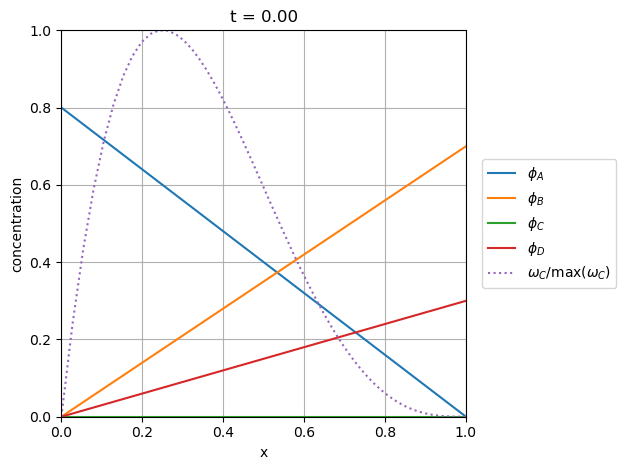
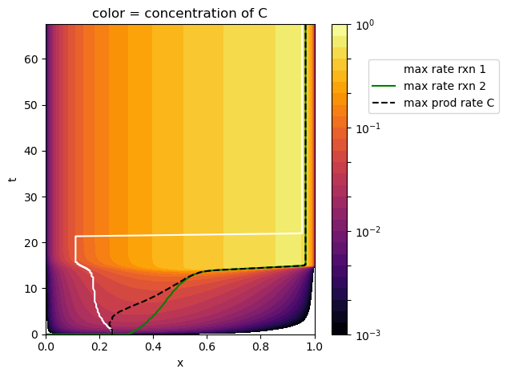
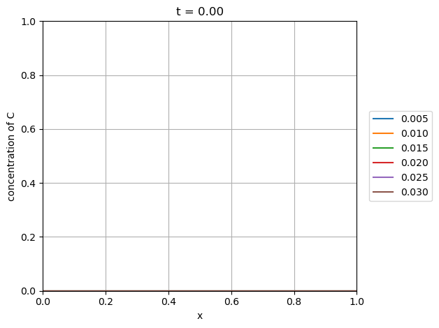
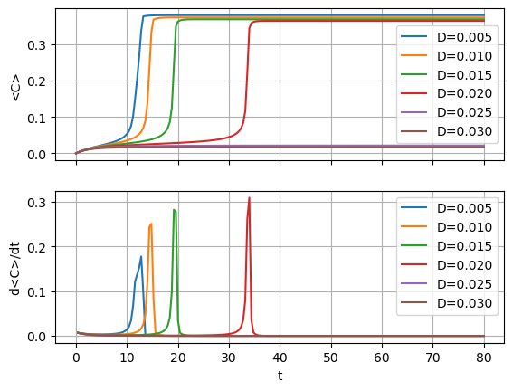

Solving an Explosive Diffusion-Reaction System
==============================================

*This demo is part of Spitfire, with* `licensing and copyright info
here. <https://github.com/sandialabs/Spitfire/blob/master/license.md>`__

*Highlights*

-  Using ``odesolve`` and SuperLU to solve 1D diffusion-reaction
   problems on a nonuniform grid
-  Varying the diffusion coefficient to see ignition limits in a
   simplified chemical system

Introduction
------------

Diffusion-reaction (DR) dynamics are a fundamental aspect of many
mathematical models of physical processes, especially in biology and
combustion. In combustion, streams of fuel and air are brought into
close contact by advective transport and must be mixed by diffusive
processes before they can react and ignite. The coupling of transport
processes and chemical reactions ultimately determine the structures of
combusting flows from candle flames on the kitchen table to fireplaces
and gigantic industrial burners. In many of these systems, scale
separation arguments lead to practical models that handle the tight
coupling of diffusion and reaction separately from slower transport
processes. In biology, patterns in animal coats and nerve firings and
many more phenomena are often mathematically represented with
diffusion-reaction models.

In this demonstration we consider a one-dimensional system of coupled,
nonlinear diffusion-reaction equations. Using :math:`\phi_i` to
represent the concentration of a particular chemical species, each
transport equation can be written as

.. math::

   \frac{\partial\phi_i}{\partial t} = D\frac{\partial^2\phi_i}{\partial x^2} + \omega_i(\phi_1,\phi_2,\ldots),

where :math:`t` is the time coordinate, :math:`x` is the spatial
coordinate, :math:`D` is the diffusion coefficient, and :math:`\omega_i`
is the net rate of production of species :math:`i` via chemical
reactions, which may depend on any number of the chemical species. The
system of equations is completed by initial conditions
:math:`\phi_i(0,x)=f_i(x)` and boundary conditions, for which we use
Dirichlet conditions based on the chosen initial condition,
:math:`\phi(t,x=0)=f_i(0)` and :math:`\phi(t,x=1)=f_i(1)`. Another
interesting option is to introduce variation of a boundary value in
time.

Toy Problem with Ignition Dynamics
----------------------------------

In this particular notebook, we write a general-purpose
``DiffusionReaction`` class that can solve any number of such equations.
We use it to study a particular system involving four chemical species
undergoing two reactions. These reactions are not physical - this is a
‘toy’ system designed to mimick behaviors of ignition chemistry of large
hydrocarbons. In the first ‘induction’ reaction, species A and B react
to form species C. This reaction is heavily favored towards consumption
of A, as 3 molecules are required for each of B. A tetramolecular
reaction such as this is not likely, but again, this is merely a toy
problem.

.. math::

   \text{(1) Induction reaction: } 3\mathrm{A} + \mathrm{B} \to \mathrm{C}

The next reaction, which mimics chemical runaway characteristic of
ignition, involves species B and C, which react to produce an additional
molecule of C. This reaction yields explosive behavior as it accelerates
itself until species B is exhausted.

.. math::

   \text{(2) Ignition reaction: } \mathrm{B} + 3\mathrm{C} \to 4\mathrm{C}

Supplementing A, B, and C is a fourth species D that is inert and used
as a diluent/balance. Thus, given a homogeneous mixture of A, B, and D,
reaction (1) will occur until enough C is produced to spark reaction (2)
which eventually takes over as A is consumed and C is produced faster
and faster. Our diffusion-reaction problem, however, will be a bit more
interesting - we’ll start with linear profiles of A and B, with A
provided from the left side of the domain and B from the right side. In
this configuration, reaction (1) starts on the left side where A is more
prevalent, and then reaction (2) will spark on the left and follow a
wave to the right into reactions with more of species B.

The governing equations for this problem are

.. math::

   \frac{\partial\phi_A}{\partial t} = D\frac{\partial^2\phi_A}{\partial x^2} - 3r_1, \\
   \frac{\partial\phi_B}{\partial t} = D\frac{\partial^2\phi_B}{\partial x^2} - r_1 - r_2, \\
   \frac{\partial\phi_C}{\partial t} = D\frac{\partial^2\phi_C}{\partial x^2} + r_1 + r_2, \\
   \frac{\partial\phi_D}{\partial t} = D\frac{\partial^2\phi_D}{\partial x^2}, \\

where :math:`r_1 = k_1 \phi_A^3 \phi_B` and
:math:`r_2 = k_2 \phi_B \phi_C^3` are the rates of reactions (1) and
(2), respectively, with rate constants :math:`k_j`.

Solution Procedure
------------------

To solve this problem, we first discretize the spatial dimension with a
standard nodal finite differencing scheme for grids with nonuniform
spacing. This employs a three-point stencil and the equations are
grouped so that the resultant Jacobian of the ODE system has a
block-tridiagonal structure. Using ``odesolve``\ ’s default implicit
Runge-Kutta solver (see prior demonstrations for more discussion) with
adaptive time-stepping requires us to solve linear systems like the
following.

.. math::

   p
   \Delta t
   \left(
   \begin{pmatrix}
   \mathrm{0} \\
   & \mathrm{K}_1 \\
   & & \mathrm{K}_2 \\
   & & & \ddots  \\
   & & & & \mathrm{K}_{n-2} \\
   & & & & & \mathrm{0}
   \end{pmatrix}
   +
   \begin{pmatrix}
   \mathrm{0} \\
   b_1\mathrm{I} & d_1\mathrm{I} & p_1\mathrm{I} \\
   & b_2\mathrm{I} & d_2\mathrm{I} & p_2\mathrm{I} \\
   & & \ddots & \ddots & \ddots \\
   & & & b_{n-2}\mathrm{I} & d_{n-2}\mathrm{I} & p_{n-2}\mathrm{I} \\
   & & & & & \mathrm{0}
   \end{pmatrix}
   \right)
   -
   \begin{pmatrix}
   \mathrm{I} \\
     & \mathrm{I} \\
   & & \mathrm{I} \\
   & & & \ddots & \ddots \\
   & & & & \mathrm{I} & \\
   & & & & & \mathrm{I}
   \end{pmatrix},

where the block-diagonal chemistry term is

.. math::

   [\mathrm{K}_i]_{jk} = \frac{\partial \omega_j}{\partial \phi_k},

and the tridiagonal diffusion term is made up of stencil coefficients
:math:`b_i`, :math:`d_i`, and :math:`p_i`. In the case of a uniform
grid, these would simply be the well-known coefficients
:math:`1/(\Delta x)^2`, :math:`-2/(\Delta x)^2`, and
:math:`1/(\Delta x)^2`. Note that in the above the zeros on the first
and last rows represent the boundary terms whose right-hand side
functions are zero to preserve the Dirichlet BCs. A formulation that
includes the boundary nodes is unnecessary here but can be more easily
generalized to Neumann or Robin conditions.

In Spitfire’s solvers for non-premixed flamelets, which possess a
similar structure, a specialized solver is used for block-tridiagonal
matrices with diagonal off-diagonal blocks. This solver is especially
important for flamelets because the size of the blocks is often larger
than the number of them (for instance, solving 170 equations on grids of
128 nodes). To keep things simple in this example, whose blocks are only
4x4 matrices, we employ SciPy sparse matrices and the SuperLU sparse
linear solver.

With the ``DiffusionReaction`` class below, which is similar to the
class defined in the previous advection-diffusion demonstration
notebook, we define the ``setup_superlu`` to evaluate the Jacobian and
use SuperLU for the factorization, and the ``solve_superlu`` methods to
perform the back-substitution. As the back-substitution is significantly
faster, it can be worthwhile to freeze the Jacobian and its factored
form for several time steps - Spitfire does this automatically when you
set the ``linear_setup_rate`` argument to a number greater than one. The
``linear_setup_rate`` is the largest number of time steps between calls
to the linear setup method. By default it is one but in this problem it
can be advantageous to increase it and let heuristics inform Jacobian
evaluation.

A final subtlety in the code below is that the ``DiffusionReaction``
class itself does not know how to evaluate the right-hand side or
Jacobian - these are specified externally for a given chemical
mechanism.

.. code:: ipython3

    import numpy as np
    from scipy.sparse import csc_matrix, diags, block_diag, eye as speye
    from scipy.sparse.linalg import splu as superlu_factor
    
    class DiffusionReaction(object):
        def __init__(self,
                     initial_conditions,
                     diffusion_coefficient,
                     source_term,
                     source_term_jacobian,
                     grid_points=65,
                     grid_cluster_intensity=2.,
                     grid_cluster_point=0.8):
    
            # make the nonuniform grid in the x-direction
            self._x = np.linspace(0., 1., grid_points)
            xo = 1.0 / (2.0 * grid_cluster_intensity) * np.log(
                (1. + (np.exp(grid_cluster_intensity) - 1.) * grid_cluster_point) / (
                    1. + (np.exp(-grid_cluster_intensity) - 1.) * grid_cluster_point))
            a = np.sinh(grid_cluster_intensity * xo)
            self._x = grid_cluster_point / a * (np.sinh(grid_cluster_intensity * (self._x - xo)) + a)
            self._x[-1] = 1.
            self._dx = self._x[1:] - self._x[:-1]
            self._nx = self._x.size
            
            self._neq = len(initial_conditions)
            self._ndof = self._neq * self._nx
            
            self._d = np.zeros_like(self._x) + diffusion_coefficient
            
            self._initial_state = np.zeros(self._ndof)
            for offset, initial_condition in enumerate(initial_conditions):
                if callable(initial_condition):
                    self._initial_state[offset::self._neq] = initial_condition(self._x)
                else:
                    self._initial_state[offset::self._neq] = initial_condition
    
            self._source_term = source_term
            self._source_term_jacobian = source_term_jacobian
    
            # creating a sparse matrix for the diffusion operator, most of this is just dealing with the nonuniform grid
            self._lhs_inverse_operator = None
            self._I = csc_matrix(speye(self._ndof))
            dxt = self._dx[:-1] + self._dx[1:]
            self._major_coeffs = - 2. * self._d[1:-1] / (self._dx[:-1] * self._dx[1:])
            self._sub_coeffs = 2. * self._d[1:-1] / (dxt * self._dx[:-1])
            self._sup_coeffs = 2. * self._d[1:-1] / (dxt * self._dx[1:])
            majdiag = np.tile(self._major_coeffs, (self._neq, 1)).T.ravel()
            supdiag = np.tile(self._sup_coeffs, (self._neq, 1)).T.ravel()
            subdiag = np.tile(self._sub_coeffs, (self._neq, 1)).T.ravel()
            self._diffop = csc_matrix(diags([np.hstack([np.zeros(self._neq), majdiag, np.zeros(self._neq)]), 
                                             np.hstack([np.zeros(self._neq), supdiag]), 
                                             np.hstack([subdiag, np.zeros(self._neq)])], 
                                            [0, self._neq, -self._neq]))
    
        @property
        def initial_state(self):
            return self._initial_state
        
        @property
        def x(self):
            return self._x
        
        def right_hand_side(self, t, state):
            rhs = self._source_term(t, state) + self._diffop.dot(state)
            return rhs
    
        def setup_superlu(self, t, state, prefactor):
            jac = self._source_term_jacobian(t, state) + self._diffop
            self._lhs_inverse_operator = superlu_factor(prefactor * jac - self._I)
    
        def solve_superlu(self, residual):
            return self._lhs_inverse_operator.solve(residual), 1, True

Source Term Expressions
~~~~~~~~~~~~~~~~~~~~~~~

These functions evaluate the reaction rate and sensitivities for
:math:`r_1 = k_1 \phi_A^3 \phi_B` and :math:`r_2 = k_2 \phi_B \phi_C^3`,
summing the terms into the chemical contribution to the right-hand side
according to reaction stoichiometry.

.. code:: ipython3

    def source_term(t, c, k_1, k_2):
        neq = 4
        rhs = np.zeros_like(c)
        c_a = c[neq:-neq:neq]
        c_b = c[neq+1:-neq:neq]
        c_c = c[neq+2:-neq:neq]
        c_d = c[neq+3:-neq:neq]
        q_1 = k_1 * c_a * c_a * c_a * c_b
        q_2 = k_2 * c_b * c_c * c_c * c_c
        rhs[4:-4:4] = -3. * q_1
        rhs[5:-4:4] = -q_1 - q_2
        rhs[6:-4:4] =  q_1 + q_2
        rhs[7:-4:4] = 0.
        return rhs
    
    def source_term_jacobian(t, c, k_1, k_2):
        neq = 4
        c_a = c[neq:-neq:neq]
        c_b = c[neq+1:-neq:neq]
        c_c = c[neq+2:-neq:neq]
        c_d = c[neq+3:-neq:neq]
        dq1_ca = k_1 * 3. * c_a * c_a * c_b
        dq1_cb = k_1 * c_a * c_a * c_a
        dq1_cc = 0.
        dq1_cd = 0.
        dq2_ca = 0.
        dq2_cb = k_2 * c_c * c_c * c_c
        dq2_cc = 3. * k_2 * c_b * c_c * c_c
        dq2_cd = 0.
        
        karray = np.zeros((c.size // 4, 4, 4))
         
        karray[1:-1, 0, 0] = -3. * dq1_ca
        karray[1:-1, 0, 1] = -3. * dq1_cb
        karray[1:-1, 0, 2] =  dq1_cc
        karray[1:-1, 0, 3] =  dq1_cd
        
        karray[1:-1, 1, 0] = -dq1_ca - dq2_ca
        karray[1:-1, 1, 1] = -dq1_cb - dq2_cb
        karray[1:-1, 1, 2] = -dq1_cc - dq2_cc
        karray[1:-1, 1, 3] = -dq1_cc - dq2_cc
        
        karray[1:-1, 2, 0] = dq1_ca + dq2_ca
        karray[1:-1, 2, 1] = dq1_cb + dq2_cb
        karray[1:-1, 2, 2] = dq1_cc + dq2_cc
        karray[1:-1, 2, 3] = dq1_cd + dq2_cd
        
        karray[1:-1, 3, 0] = 0.
        karray[1:-1, 3, 1] = 0.
        karray[1:-1, 3, 2] = 0.
        karray[1:-1, 3, 3] = 0.
        
        kjac = block_diag(karray, format='csc')
        
        return kjac

Ignition Dynamics
-----------------

Now we’re ready to solve the system with ``odesolve``. The reaction rate
constants are specified below and the ``src`` and ``jac`` methods alias
the source terms and sensitivities above. This case is run until the
steady state is identified (small residual norm) and the state at every
time step is saved. The default PI controller used by Spitfire has too
high of a target error to run this case, so we specify a lower value
below. Finally, the ``show_solver_stats_in_situ`` keyword turns on the
extra logger output of nonlinear and linear convergence rates along with
the average number of steps taken per Jacobian evaluation and
factorization.

.. code:: ipython3

    from spitfire import PIController, odesolve
    
    k_1 = 0.5
    k_2 = 2.e2
    
    src = lambda t, y: source_term(t, y, k_1, k_2)
    jac = lambda t, y: source_term_jacobian(t, y, k_1, k_2)
    
    ics = [lambda x: 0.8 * (1. - x), 
           lambda x: 0.7 * x,
           0.,
           lambda x: 0.3 * x]
    
    D = 0.01
    model = DiffusionReaction(ics, D, src, jac, grid_points=256)
    
    t, q = odesolve(model.right_hand_side,
                    model.initial_state,
                    stop_at_steady=True,
                    save_each_step=True,
                    linear_setup=model.setup_superlu,
                    linear_solve=model.solve_superlu,
                    step_size=PIController(target_error=1.e-8),
                    linear_setup_rate=20,
                    verbose=True,
                    log_rate=100,
                    show_solver_stats_in_situ=True)

.. parsed-literal::

    
     2024-03-15 14:42 : Spitfire running case with method: Kennedy/Carpenter ESDIRK64
    
    |number of  | simulation | time step  | nlin. iter | lin. iter  | steps      | diff. eqn. | total cpu  | cput per |
    |time steps | time (s)   | size (s)   | per step   | per nlin.  | per Jac.   | |residual| | time (s)   | step (ms)|
    ------------------------------------------------------------------------------------------------------------------|
    | 100       | 1.41e+01   | 1.86e-02   | 15.98      | 1.00       | 1.10       | 6.89e-01   | 6.31e-01   | 6.31e+00 |
    | 200       | 1.49e+01   | 6.46e-03   | 24.66      | 1.00       | 2.08       | 1.67e+00   | 1.12e+00   | 5.60e+00 |
    
    Integration successfully completed!
    
    Statistics:
    - number of time steps : 285
    - final simulation time: 67.50370308364087
    - smallest time step   : 0.001
    - average time step    : 0.23685509853909079
    - largest time step    : 4.6036175764439715
    
      CPU time
    - total    (s) : 1.626761e+00
    - per step (ms): 5.707932e+00
    
      Nonlinear iterations
    - total   : 6394
    - per step: 22.4
    
      Linear iterations
    - total     : 6394
    - per step  : 22.4
    - per nliter: 1.0
    
      Jacobian setups
    - total     : 167
    - steps per : 1.7
    - nliter per: 38.3
    - liter per : 38.3
    
     2024-03-15 14:42 : Spitfire finished in 1.62676050e+00 seconds!
    

Results
~~~~~~~

The slider animation below shows the concentration profiles of each
species in addition to the normalized rate of the chemical production of
species C. As discussed above, the induction reaction produces C early
on in A-rich mixtures around :math:`x=0.2` followed by a wave of C
production up the :math:`x`-coordinate into the B-rich right side.

.. code:: ipython3

    import matplotlib.pyplot as plt
    from ipywidgets import interact, widgets
    
    lA, = plt.plot(model.x, q[0, 0::4], label='$\phi_A$')
    lB, = plt.plot(model.x, q[0, 1::4], label='$\phi_B$')
    lC, = plt.plot(model.x, q[0, 2::4], label='$\phi_C$')
    lD, = plt.plot(model.x, q[0, 3::4], label='$\phi_D$')
    rC = source_term(0, q[0, :].ravel(), k_1, k_2)[2::4]
    lR, = plt.plot(model.x, rC / np.max(rC), ':', label='$\omega_C/\max(\omega_C)$')
    plt.xlim([model.x[0], model.x[-1]])
    plt.ylim([0., 1.])
    plt.grid()
    plt.xlabel('x')
    plt.ylabel('concentration')
    plt.legend(bbox_to_anchor=(1.04,0.5), loc="center left", borderaxespad=0)
    plt.title(f't = {t[0]:.2f}')
    plt.tight_layout()
    
    def f(it):
        plt.title(f't = {t[it]:.2f}')
        lA.set_ydata(q[it, 0::4])
        lB.set_ydata(q[it, 1::4])
        lC.set_ydata(q[it, 2::4])
        lD.set_ydata(q[it, 3::4])
        rC = source_term(0, q[it, :].ravel(), k_1, k_2)[2::4]
        lR.set_ydata(rC / np.max(rC))
    
    # interact(f, it=widgets.IntSlider(min=0, max=t.size-1, step=1, value=0));

The following contour plot shows the concentration of C in the
:math:`(x,t)` plane in addition to the locations of the maximum reaction
rates and maximum production rate of C as they vary through time. This
further confirms that the induction reaction dominates C production
early on and that it shifts to follow the ignition reaction later.

.. code:: ipython3

    from matplotlib.colors import LogNorm
    
    C = q[:, 2::4]
    xC = np.zeros_like(t)
    x1 = np.zeros_like(t)
    x2 = np.zeros_like(t)
    for i in range(t.size):
        rateC = source_term(0, q[i, :].ravel(), k_1, k_2)[2::4]
        c_a = q[i, :].ravel()[0::4]
        c_b = q[i, :].ravel()[1::4]
        c_c = q[i, :].ravel()[2::4]
        q_1 = k_1 * c_a * c_a * c_a * c_b
        q_2 = k_2 * c_b * c_c * c_c * c_c
        xC[i] = model.x[np.argmax(rateC)]
        x1[i] = model.x[np.argmax(q_1)]
        x2[i] = model.x[np.argmax(q_2)]
    
    plt.contourf(model.x, t, C+1e-16, np.logspace(-3, 0, 28), cmap='inferno', norm=LogNorm(1.e-3, 1))
    plt.colorbar()
    plt.plot(x1, t, 'w-', label='max rate rxn 1')
    plt.plot(x2, t, 'g-', label='max rate rxn 2')
    plt.plot(xC, t, 'k--', label='max prod rate C')
    plt.title('color = concentration of C')
    plt.xlabel('x')
    plt.ylabel('t')
    plt.legend(bbox_to_anchor=(1.2,0.8), loc="center left", borderaxespad=0)
    plt.tight_layout()
    plt.show()

Ignition Limits
---------------

Now we solve the problem across a range of diffusion coefficients to see
its impact on the ignition dynamics. In order to simpify animating the
range of solutions we specify the list of output times for each
solution.

.. code:: ipython3

    times = np.hstack((np.linspace(0, 40, 101), 60., 80.))
    sol_dict = dict()
    
    for D in [0.005, 0.01, 0.015, 0.02, 0.025, 0.03]:
        model = DiffusionReaction(ics, D, src, jac)
        q = odesolve(model.right_hand_side,
                     model.initial_state,
                     times,
                     linear_setup=model.setup_superlu,
                     linear_solve=model.solve_superlu,
                     step_size=PIController(target_error=1.e-8),
                     linear_setup_rate=20,
                     verbose=False,
                     log_rate=100,
                     show_solver_stats_in_situ=True)
        print(f'completed D = {D:.3f}')
        sol_dict[D] = np.copy(q)

.. parsed-literal::

    completed D = 0.005
    completed D = 0.010
    completed D = 0.015
    completed D = 0.020
    completed D = 0.025
    completed D = 0.030

The animation below shows that at :math:`D=0.025` and :math:`D=0.03` the
system fails to ignite as a critical concentration of species C is
unable to develop, being diffused away to form an equilibrium below the
value needed for reaction (2) to accelerate and ignite. The reason the
output times above are extended to 80 seconds is simply to ensure that
these systems are indeed not igniting.

.. code:: ipython3

    l_dict = dict()
    for D in sol_dict:
        l_dict[D], = plt.plot(model.x, sol_dict[D][0, 2::4], label=f'{D:.3f}')
    plt.xlim([model.x[0], model.x[-1]])
    plt.ylim([0., 1.])
    plt.grid()
    plt.xlabel('x')
    plt.ylabel('concentration of C')
    plt.legend(bbox_to_anchor=(1.04,0.5), loc="center left", borderaxespad=0)
    plt.title(f't = {times[0]:.2f}')
    plt.tight_layout()
    
    def f(it):
        plt.title(f't = {times[it]:.2f}')
        for D in sol_dict:
            l_dict[D].set_ydata(sol_dict[D][it, 2::4])
    
    # interact(f, it=widgets.IntSlider(min=0, max=times.size-1, step=1, value=0));

Another way to visualize ignition is to show the time history of the
mean value of :math:`\phi_C`, which is shown below along with its time
derivative to demonstrate the effect of the diffusion coefficient on the
ignition delay.

.. code:: ipython3

    fig, axarray = plt.subplots(2, 1, sharex=True)
    
    for D in sol_dict:
        qCmean = np.mean(sol_dict[D][:, 2::4], axis=1)
        dt = times[1:] - times[:-1]
        axarray[0].plot(times, qCmean, label=f'D={D:.3f}')
        axarray[1].plot(times[1:], (qCmean[1:] - qCmean[:-1]) / dt, '-', label=f'D={D:.3f}')
    axarray[1].set_xlabel('t')
    axarray[0].set_ylabel('<C>')
    axarray[1].set_ylabel('d<C>/dt')
    axarray[0].legend(loc='best')
    axarray[1].legend(loc='best')
    axarray[0].grid()
    axarray[1].grid()
    plt.show()

Conclusions
-----------

We’ve used Spitfire’s ``odesolve`` method along with SciPy sparse matrix
operators and SuperLU to study a four-species diffusion-reaction system
that mimicks ignition chemistry of hydrocarbon-air mixtures.

