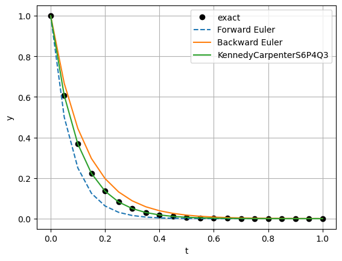

Implicit time integration basics
================================

*This demo is part of Spitfire, with* `licensing and copyright info
here. <https://github.com/sandialabs/Spitfire/blob/master/license.md>`__

*Highlights*

-  a basic example of the implicit Backward Euler method of solving a
   simple differential equation

Introduction
------------

This notebook demonstrates the use of Spitfire’s implicit time
integration methods for solving the simple exponential decay problem
introduced in other notebooks. The default behavior of the ``odesolve``
method presented earlier is in fact to use an implicit method - these
demonstrations show how to go beyond the default behavior.

Following prior demonstrations, we import some useful classes, set up
the problem, and solve first with Forward Euler as before.

.. code:: ipython3

    import numpy as np
    from spitfire import odesolve, ForwardEulerS1P1
    
    dt = 0.05
    tf = 1.0
    k = -10.
    y0 = np.array([1.])
    
    rhs = lambda t, y: k * y
    
    output_times = np.linspace(0., tf, 21)
    
    y_fe = odesolve(rhs, y0, output_times, step_size=dt, method=ForwardEulerS1P1())

To solve with the implicit Backward Euler method, we import the
``BackwardEulerS1P1Q1`` and ``SimpleNewtonSolver`` classes.
``BackwardEulerS1P1Q1`` is the time stepper class and
``SimpleNewtonSolver`` will be the underlying solver for the nonlinear
system of equations solved in each time step.

Note from the output of ``integrate`` in this case that we now have
nontrivial numbers for the ``nonlinear iter``, ``linear iter``, and
``Jacobian setups`` fields. These aren’t particularly interesting in
this case because the exponential decay problem is linear and we haven’t
set up any advanced solution options. We’ll cover these in a later
notebook.

The only distinction between using this implicit method and the explicit
methods used before is that the ``BackwardEulerS1P1Q1`` instance is
built with a ``SimpleNewtonSolver`` object when passed to ``integrate``.
This simplicity is present in this case because we are letting Spitfire
use a default dense linear solver (LU factorization and
back-substitution with LAPACK) and a finite difference approximation to
the Jacobian matrix of the system. In cases where a dense solver and
approximate Jacobian matrix are appropriate, this is a very convenient
option. However, in many cases of practical interest this is not
efficient and more advanced options need to be explored - these will be
covered in later demonstrations.

.. code:: ipython3

    from spitfire import BackwardEulerS1P1Q1, SimpleNewtonSolver
    
    y_be = odesolve(rhs, y0, output_times, step_size=dt, method=BackwardEulerS1P1Q1(SimpleNewtonSolver()))

Now we can just as easily use the more advanced
``KennedyCarpenterS6P4Q3`` method. This method is the workhorse of
Spitfire’s solvers for complex chemistry problems and is extremely
useful as a general solver - it is the default method used by
``odesolve`` along with adaptive time-stepping not shown here. It is
fourth-order accurate and possesses excellent characteristics such as
L-stability, a stage order of two (due to the explicit first stage), and
singly diagonally implicit solves meaning that its embedded linear
systems may be solved much more efficiently than those of fully implicit
Runge-Kutta methods with comparable properties.

.. code:: ipython3

    from spitfire import KennedyCarpenterS6P4Q3
    
    y_esdirk64 = odesolve(rhs, y0, output_times, step_size=dt, method=KennedyCarpenterS6P4Q3(SimpleNewtonSolver()))

Plotting the solutions from the Forward and Backward Euler methods along
with the exact solution shows that the two methods yield exactly
opposite errors. When the nonlinear system in Backward Euler’s time
steps can be solved exactly this is consistent with theory. This also
shows that the Runge Kutta method is exceptionally accurate.

.. code:: ipython3

    import matplotlib.pyplot as plt
    
    plt.plot(output_times, y0 * np.exp(k * output_times), 'ko', label='exact')
    plt.plot(output_times, y_fe, '--', label='Forward Euler')
    plt.plot(output_times, y_be, '-', label='Backward Euler')
    plt.plot(output_times, y_esdirk64, '-', label='KennedyCarpenterS6P4Q3')
    
    plt.xlabel('t')
    plt.ylabel('y')
    plt.legend(loc='best')
    plt.grid()
    plt.show()

Conclusions
-----------

This notebook shows the simplest use of some implicit time-stepping
methods, including a high-order Runge-Kutta method, with Spitfire.
Implicit methods can perform extremely well for many classes of problems
when fine-tuned - examples of such fine-tuning will follow in more
advanced demonstrations.

