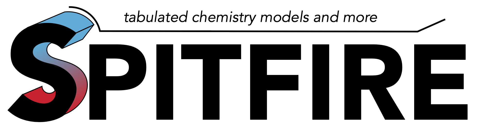

Introduction
============
Spitfire is a Python/C++ scientific computing code for chemistry and reaction-diffusion problems related to combustion and porous material decomposition.
Spitfire is primarily used at Sandia National Laboratories to build advanced nonpremixed flamelet libraries for large-scale accidental fire simulations and small-scale pool fires.

Next we describe acquiring and installing Spitfire.
You may jump to background and API documentation as well as a number of tutorials with the links below.

.. toctree::
    :numbered:
    :maxdepth: 2

    reactionmodeling
    mixingmodeling
    timeintegration
    modules

Objectives
----------
Spitfire has been designed to be fast and extensible in meeting three key objectives:

- Solve canonical chemistry problems with complex reaction mechanisms using advanced numerical methods
- Efficiently build tabulated chemistry models for reacting flow simulations
- Rapidly prototype numerical methods for ordinary and partial differential equations

Researchers at Sandia Labs, the University of Utah, and the Université Libre de Bruxelles have used Spitfire for a number of applications:

- Construct adiabatic and nonadiabatic flamelet libraries for single- and multi-phase turbulent combustion
- Generate reactor, flamelet, and general reaction-diffusion datasets to train surrogate chemistry models
- Perform fundamental studies of combustion in the MILD regime
- Study chemical explosive modes and low-temperature oxidation of complex fuels in non-premixed systems
- Study the formulation of state vectors and analytical Jacobian matrices for combustion simulation
- Design specialized Runge-Kutta methods and advanced adaptive time stepping techniques

Access
------
Spitfire is a BSD(3) open-source code hosted publicly on GitHub: https://github.com/sandialabs/Spitfire

Static documentation including a number of demonstrations is hosted by Read the Docs: https://spitfire.readthedocs.io/en/latest/

Authors
-------
Mike Hansen is Spitfire's primary author and point of contact and can be contacted by email at ``mahanse@sandia.gov``.
Elizabeth Armstrong, John Hewson, Josh McConnell, James Sutherland, and Robert Knaus have also contributed to Spitfire.

Citing Spitfire
---------------
If you use Spitfire for a publication, please cite it according to the following BiBTeX block::

  @misc{Spitfire,
    author = {Hansen, M. A. and Hewson, J. C. and Armstrong, E. and McConnell, J. T. and Sutherland, J. C. and Knaus, R. C.},
    title  = {Spitfire v1.3},
    year   = {2024},
    url    = {https://github.com/sandialabs/Spitfire},
  }

Installing Spitfire
-------------------
Spitfire can be installed most easily with Anaconda.
It has been installed on Python versions spanning 3.4 to 3.11,
but we recommend 3.11 to gain access to cantera version 3.0.
We further recommend recent (as of March, 2024) versions of Anaconda that support the libmamba environment solver.

Anaconda Suggestions
""""""""""""""""""""
Given an Anaconda installation, first install the libmamba environment solver::

  conda install -n base conda-libmamba-solver

We recommend setting these configuration settings for your install to acquire dependencies from `conda-forge`::

  conda config --add channels conda-forge
  conda config --set channel_priority strict
  conda config --set solver libmamba

Conda Environment Setup
"""""""""""""""""""""""
We recommend first installing with a fresh environment::

  name-based: conda create --name spenv python=3.11
  path-based: conda create --prefix [...]/spenv python=3.11

Activate your environment, with either ``source activate [name/path]`` or ``conda activate [name/path]``, 
and then install the following dependencies.
Spitfire's C++ engine requires a C++11 compiler and BLAS/LAPACK, which you'll install via conda below::
 
  conda install -y compilers setuptools numpy scipy matplotlib Cython sphinx numpydoc gitpython
  conda install -y -c cantera cantera=3.0

To build the `pytabprops` package, also install these::

  conda install -y boost-cpp cmake pybind11

To contribute to documentation (specifically demonstrations) you'll need jupyter as well::

  conda install -y jupyter jupyterlab

Installing the ``spitfire`` Package
"""""""""""""""""""""""""""""""""""
Now clone and install Spitfire itself::

  git clone https://github.com/sandialabs/Spitfire.git
  cd Spitfire
  pip install .

Running Tests
"""""""""""""
To run the test suite you can simply execute::

  python3 -m unittest discover -s tests

Building Documentation
""""""""""""""""""""""
To build the HTML documentation, simply do the following::

  cd docs
  make html

You can then point your browser to ``[...]/Spitfire/docs/build/html/index.html``.

Installing PyTabProps
"""""""""""""""""""""
Spitfire can use the TabProps code developed at the University of Utah for presumed PDF mixing models.
TabProps also provides arbitrary order piecewise Lagrange interpolants for structured data in up to five dimensions. 
A Python interface may be built to enable these capabilities in Spitfire. 
Without TabProps, Spitfire still provides fully featured reaction modeling capabilities, 
so if you aren't interested in mixing models, installing TabProps is optional.

TabProps requires a few more dependencies (see above). After their installation, TabProps can be cloned here::

  git clone https://gitlab.multiscale.utah.edu/common/TabProps.git

And then we use CMake::

  cd TabProps
  mkdir build
  cd build
  cmake .. \
    -DENABLE_PYTHON=ON \
    -DENABLE_MIXMDL=ON \
    -DTabProps_UTILS=OFF \
    -DTabProps_PREPROCESSOR=OFF \
    -DTabProps_ENABLE_TESTING=OFF \
    -DCMAKE_BUILD_TYPE=Release
  
  make -j4 install

Note that CMake may struggle to find the Python interpreter of your conda environment. 
If this happens (you might see permission issues or see /usr/lib in the python paths, etc.), 
you can add lines akin to the following to the CMake configuration above::

    -DPYTHON_LIBRARY=[env-path]/lib/libpython3.[py_minor_version]m.a \
    -DPYTHON_INCLUDE_DIR=[env-path]/bin/python3.[py_minor_version]m \
    -DPYTHON_EXECUTABLE=[env-path]/bin/python3.[py_minor_version] \

Another annoyance that can happen is that CMake can forget to install the ``pytabprops`` module into the environment.
To rectify this you can manually copy it.
From the build directory, with the same substitutions as above::

  cp tabprops/pytabprops.*.so [env-path]/lib/python3.[py_minor_version]/site-packages/

To verify, simply fire off an interactive python interpeter and import ``pytabprops``::
  
  $ python3
  > import pytabprops

It is worth rerunning the Spitfire unit tests after installing pytabprops,
as this will enable tests of the mixing model capability.