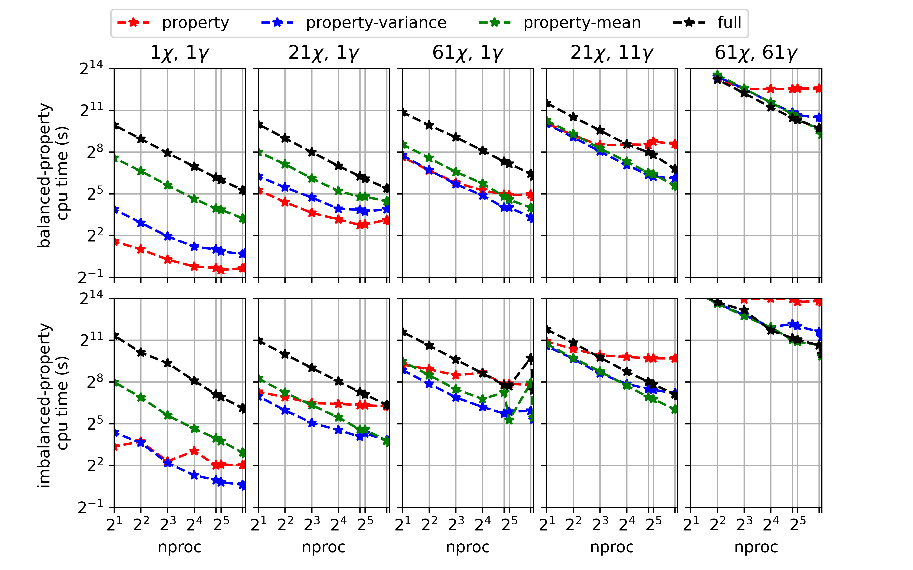
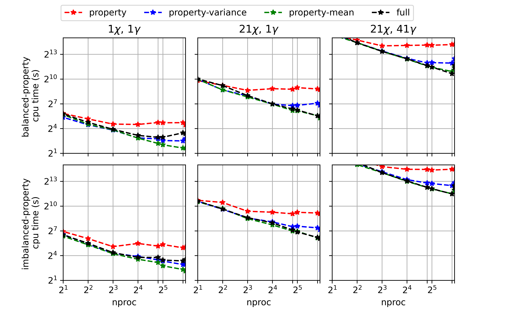
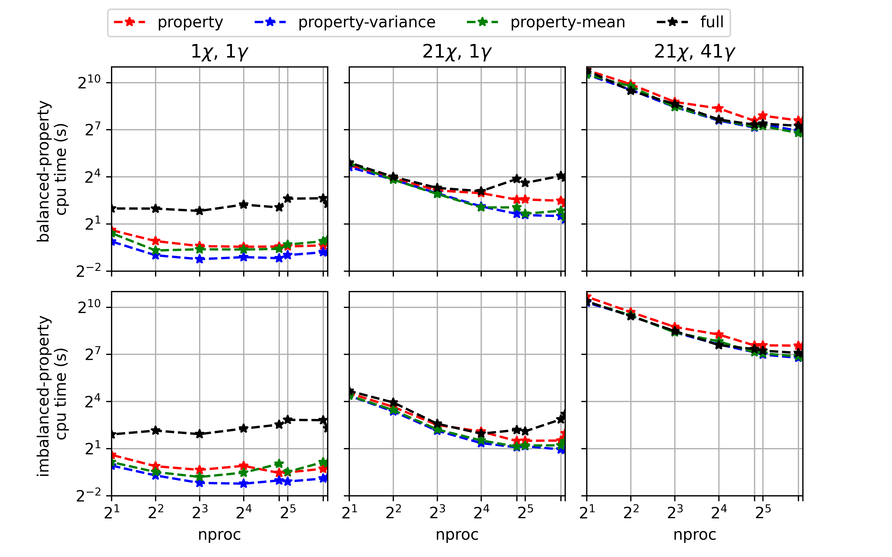

Mixing Models
=============

Background
----------

Tabulated chemistry models can often be split into two pieces: a reaction model and a mixing model.
The reaction model describes small scale laminar flame structure, for instance equilibrium (fast chemistry) or diffusion-reaction (SLFM), possibly perturbed by radiative heat losses.
A mixing model is unnecessary in a CFD simulation when the flow is laminar or when all scales of turbulence are resolved as in direct numerical simulation (DNS).
In Reynolds-averaged Navier-Stokes (RANS) or large eddy simulation (LES), however, small scales are modeled instead of being resolved by the mesh.
Here a mixing model is necessary to account for turbulence-chemistry interaction on subgrid scales.

In RANS and LES, typically two statistical moments of conserved scalars are transported on the mesh and the mixing model accounts for unresolved, or subgrid, heterogeneity.
A mixing model accomplishes this by describing the statistical distribution of the subgrid scalar field.
If the joint probability density function (PDF) of the set of transported scalars is known, then a filtered property :math:`\widetilde{f}` can be computed as the convolution of the laminar property :math:`f` with the joint-PDF.
For a two-dimensional tabulation over mixture fraction and scalar dissipation rate, :math:`(Z,\chi)`, this convolution looks like

.. math::
    \widetilde{f}(\widetilde{Z}, \widetilde{\sigma^2_Z}, \widetilde{\chi}, \widetilde{\sigma^2_\chi}) = \int_0^\infty \int_0^1  f(Z, \chi) P_{Z\chi}(Z, \chi; \widetilde{Z}, \widetilde{\sigma^2_Z}, \widetilde{\chi}, \widetilde{\sigma^2_\chi}) \mathrm{d} Z \mathrm{d} \chi.
    :label: pdf_eqn

Statistical independence is often assumed, which allows us to separate out the individual PDFs as

.. math::
    \widetilde{f}(\widetilde{Z}, \widetilde{\sigma^2_Z}, \widetilde{\chi}, \widetilde{\sigma^2_\chi}) = \int_0^\infty P_\chi(\chi; \widetilde{\chi}, \widetilde{\sigma^2_\chi}) \int_0^1 f(Z, \chi) P_Z(Z; \widetilde{Z}, \widetilde{\sigma^2_Z}) \mathrm{d} Z \mathrm{d} \chi.
    :label: independent_pdf_eqn

Furthermore, the PDFs of the scalar dissipation rate or heat loss coordinates are often presumed to be delta PDFs, which means

.. math::
    P_\chi(\chi; \widetilde{\chi}, \widetilde{\sigma^2_\chi}) = \delta(\chi - \widetilde{\chi}).
    :label: delta_chi_eqn

This further simplifies :eq:`independent_pdf_eqn` to give

.. math::
    \widetilde{f}(\widetilde{Z}, \widetilde{\sigma^2_Z}, \widetilde{\chi}) = \int_0^1 f(Z, \widetilde{\chi}) P_Z(Z; \widetilde{Z}, \widetilde{\sigma^2_Z}) \mathrm{d} Z
    :label: simplified_pdf_eqn

for which there are a variety of presumed PDFs to choose from for :math:`P_Z`.

All mixture fraction PDFs must exist completely within the [0,1] range and satisfy the following three integrals

.. math::
    \begin{align}
        1 &= \int_{0}^1 P_Z(Z; \widetilde{Z}, \widetilde{\sigma^2_Z}) \mathrm{d}Z \\
        \widetilde{Z} &= \int_{0}^1 Z P_Z(Z; \widetilde{Z}, \widetilde{\sigma^2_Z}) \mathrm{d}Z \\
        \widetilde{\sigma^2_Z} &= \int_{0}^1 (Z - \widetilde{Z})^2 P_Z(Z; \widetilde{Z}, \widetilde{\sigma^2_Z}) \mathrm{d}Z .
    \end{align}
    :label: pdf_test_eqn

Spitfire provides the function ``compute_pdf_max_integration_errors`` with which the relative errors from evaluating the integrals in :eq:`pdf_test_eqn` may be computed.
This can be helpful in ensuring any parameters used to construct either supported or custom PDFs lead to acceptably small errors in the integrals.

Three mixture fraction PDFs supported in Spitfire include a clipped Gaussian PDF, a :math:`\beta`-PDF, and a double delta PDF.
Spitfire leverages the Tabprops implementations of a clipped Gaussian PDF and :math:`\beta`-PDF, but supports its own integration of the :math:`\beta`-PDF, which can be challenging at high/low values of the variance and/or mean.

The clipped Gaussian starts with the Gaussian

.. math::
    P_Z(Z; \widetilde{Z}, \widetilde{\sigma^2_Z}) = \frac{1}{\sqrt{2 \pi \widetilde{\sigma^2_Z}}} \exp \left[ \frac{-(Z - \widetilde{Z})^2}{2 \widetilde{\sigma^2_Z}} \right]
    :label: clipgauss_pdf

then clips it to exist within [0,1] while satisying the specified mean and variance.

The :math:`\beta`-PDF can be written as

.. math::
    P_Z(Z; \widetilde{Z}, \widetilde{\sigma^2_Z}) = Z^{a-1}(1-Z)^{b-1}\frac{\Gamma(a+b)}{\Gamma(a)\Gamma(b)}
    :label: beta_pdf

where

.. math::
    \begin{align}
        a &= \widetilde{Z}[\widetilde{\sigma^2}_\mathrm{max} / \widetilde{\sigma^2_Z} - 1] \\
        b &= a(1-\widetilde{Z})/\widetilde{Z}.
    \end{align}
    :label: beta_param

Since integration of this PDF can be challenging and unreliable at small/large variances and/or means, the ``BetaDPF`` class in Spitfire is contructed with thresholds specifying where interpolation of the PDF is performed between trusted integration bounds.
The ``scaled_variance_max_integrate`` parameter specifies the maximum scaled scalar variance for which integration is trusted.
Any values higher than this will have the integral interpolated between the integration at ``scaled_variance_max_integrate`` and 1.
Similarly, the ``scaled_variance_min_integrate`` parameter specifies the lower limit of integration, below which the integral is interpolated between ``scaled_variance_min_integrate`` and 0.
Finally, ``mean_boundary_integrate`` controls the distance from either side of the [0,1] mixture fraction mean boundary within which integrals are interpolated.
Default values are provided, but the ``compute_pdf_max_integration_errors`` function can be used to assess the viability of a ``BetaDPF`` constructed with different parameter values.

Finally, the ``DoubleDelta`` PDF class supported in Spitfire can be written as

.. math::
    P_Z(Z; \widetilde{Z}, \widetilde{\sigma^2_Z}) = w_l \delta(Z - b_l) + (1-w_l)\delta(Z - b_r)
    :label: double_delta_pdf

where

.. math::
    \begin{cases}
        w_l= 1 - \frac{\widetilde{Z}^2}{\widetilde{\sigma^2_Z} + \widetilde{Z}^2} \ b_l=0 \ b_r=\frac{\widetilde{Z}}{1-w_l} & \mathrm{if } \ \widetilde{Z} - \widetilde{\sigma_Z} < 0\\
        w_l= \frac{(1 - \widetilde{Z})^2}{\widetilde{\sigma^2_Z} +  (1-\widetilde{Z})^2} \ b_l=1 - \frac{1-\widetilde{Z}}{w_l} \ b_r=1 & \mathrm{if } \ \widetilde{Z} + \widetilde{\sigma_Z}>1\\
        w_l=0.5, \ b_l=\widetilde{Z} - \widetilde{\sigma_Z}, \ b_r=\widetilde{Z} + \widetilde{\sigma_Z} & \mathrm{otherwise}
    \end{cases}
    :label: double_delta_pdf_params

which ensures the delta functions exist within [0,1] and satisfy the provided mean and variance.

Convolution integrals can be performed using the ``apply_mixing_model`` function.
This takes an existing tabulated chemistry library and incorporates subgrid variation in each reaction variable with a presumed PDF model, assuming statistical independence of the reaction variables.
A delta PDF is presumed for each reaction variable that is not included in the ``mixing_spec`` dictionary.
If nontrivial (not delta) PDFs are given for multiple variables, the integrals are computed sequentially as in :eq:`independent_pdf_eqn`.
PDFs can be specified using the ``PDFspec`` class with the strings ``'ClipGauss'``, ``'Beta'``, or ``'DoubleDelta'`` to use the clipped Gaussian, :math:`\beta`, or double delta PDFs, respectively, shown above.
A ``'Delta'`` PDF may also be used to interpolate the property data onto a different (e.g., smaller) grid by providing ``PDFspec`` with ``mean_values``.
``PDFspec`` can also take custom PDF objects.

``apply_mixing_model`` will perform the integrals over all properties and mixture fraction values in the laminar library, as well as over all provided variance values.
The default behavior is to compute these integrals in serial.
This can be slow for large tables, so Spitfire supports a variety of parallel computing options when ``num_procs`` is greater than one.
These options are specified through ``parallel_type`` in the ``PDFspec`` and include

- ``'property'``: parallelize over properties

- ``'property-mean'``: parallelize over properties and means

- ``'property-variance'``: parallelize over properties and variances

- ``'full'``: parallelize over properties, means, and variances

- ``'default'``: estimate the fastest parallel option on average depending on the PDF (``'property-mean'`` for ``BetaPDF``, ``'property-variance'`` otherwise).

The default behaviors were chosen based on the data shown in :numref:`figure_clipgaus_timings`, :numref:`figure_beta_timings`, and :numref:`figure_doubledelta_timings` which provide a rough comparison of timings across the different parallel options for different sized tables.
The timings shown are for convolution integrals over 20 properties, 161 mixture fraction means, and 10 scaled variances.
For the top row of each plot, the convolution integrals took about the same amount of time for each property.
For the bottom row of each plot, there is an imbalance in the integral timings across properties.
The amount of parallelism provided by the ``'full'`` option typically only becomes advantageous for larger tables.

.. _figure_clipgaus_timings:

    Timings for convolutions with the clipped Gaussian PDF over 20 properties, 161 mixture fraction means, and 10 scaled variances plotted over the number of processors.
    The timings labels refer to whether there is a balance or imbalance in the time to compute the integrals across the properties.

.. _figure_beta_timings:

    Timings for convolutions with the :math:`\beta`-PDF over 20 properties, 161 mixture fraction means, and 10 scaled variances plotted over the number of processors.
    The timings labels refer to whether there is a balance or imbalance in the time to compute the integrals across the properties.

.. _figure_doubledelta_timings:

    Timings for convolutions with the double delta PDF over 20 properties, 161 mixture fraction means, and 10 scaled variances plotted over the number of processors.
    The timings labels refer to whether there is a balance or imbalance in the time to compute the integrals across the properties.

Tutorials
---------

.. toctree::
    :maxdepth: 1

    demo/flamelet/tabulation_api_presumed_pdf
    demo/flamelet/custom_pdf_logmean_chi