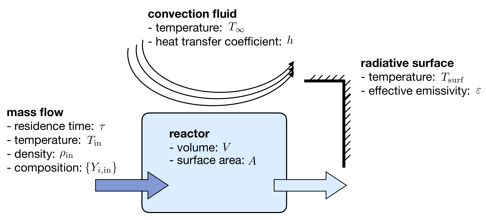

Combustion Theory
=================

This section details the theory behind Spitfire's combustion modeling capabilities.
We present the governing equations for homogeneous reactors and non-premixed flamelets,
techniques for building tabulated chemistry models,
and supported reaction rate laws and thermodynamic property models.

Governing Equations for Homogeneous Reactors
++++++++++++++++++++++++++++++++++++++++++++
Homogeneous, or 'zero-dimensional,' reactor models represent well-mixed combustion systems wherein there are no spatial gradients in any quantity describing the chemical mixture.
In such a system the temperature :math:`T`, pressure :math:`p`, and composition, expressed by the mass fractions :math:`\{Y_i\}`, are all homogeneous and a reactor may be modeled as a point in space whose properties vary only in time, :math:`t`.
Zero-dimensional systems are idealizations of very complex systems but have their place in the modeling of combustion processes.
In a lab setting this idealization can be approached with *jet-stirred reactors* (JSR, also commonly referred to as a continuous stirred tank reactor (CSTR), perfectly stirred reactor (PSR), and Longwell reactor) and *rapid compression machines* (RCM).
A JSR is a continuous stirred tank reactor to which reactants are fed and mixed rapidly through several opposed jets.
A JSR unit coupled with downstream gas chromatography and mass spectrometry can be used to quantify the composition of the chemical mixture as reaction proceeds.
Detailed models of combustion kinetics are developed through comparison with experimental data from such systems.
The rapid computational solution of kinetic models for simple, zero-dimensional reactors is of great fundamental importance to combustion modeling.

In Spitfire we model mixtures of ideal gases in twelve types of reactors distinguished by their *configuration*, *heat transfer*, and *mass transfer*.
We use *configuration* to distinguish isochoric, or constant-volume, reactors from isobaric, or constant-pressure, ones.
*Mass transfer* refers to a closed, or batch, reactor or an open reactor with mass flow at specified mean residence time.
Three types of *heat transfer* are available:

- adiabatic: a reactor with insulated walls that allow no heat transfer with the surroundings
- isothermal: a reactor whose temperature is held exactly constant for all time
- diathermal: a reactor whose walls allow a finite rate of heat transfer by radiative heat transfer to a nearby surface and convective heat transfer to a fluid flowing around the reactor

Below we detail the equations governing isochoric and isobaric reactors with any pair of models for mass and transfer.
In all cases the ideal gas law applies,

.. math::
 p = \rho R_\mathrm{mix} T,
 :label: ideal_gas_law

where the mixture specific gas constant, :math:`R_\mathrm{mix}`, is the universal molar gas constant divided by the mixture molar mass,

.. math::
 M_\mathrm{mix} = \left(\sum_{i=1}^{n}\frac{Y_i}{M_i}\right)^{-1},
 :label: mixture_molar_mass

where :math:`M_i` is the molar mass of species :math:`i` in a mixture with :math:`n` distinct species.
Additionally for all reactors the mass fractions, of which only :math:`n-1` are independent, are related by

.. math::
 Y_n = 1 - \sum_{i=1}^{n-1}Y_i.
 :label: Y_n_eqn

Isochoric Reactors
__________________

Figure :numref:`figure_isochoric_reactor_diagram` diagrams an open, constant-volume reactor with diathermal walls.
The reactor has volume :math:`V` and surface area :math:`A`.
Convective heat transfer is described by a fluid temperature :math:`T_\infty` and convective heat transfer coefficient :math:`h`.
Radiative heat transfer is determined by the temperature of the surface, :math:`T_\mathrm{surf}`, and effective emissivity, :math:`\varepsilon`.
Finally, for an isochoric reactor, mass transfer is specified by the residence time :math:`\tau`, based on volumetric flow rate, and inflowing state
with temperature :math:`T_\mathrm{in}`, density :math:`\rho_\mathrm{in}`, and mass fractions :math:`\{Y_{i,\mathrm{in}}\}`.

.. _figure_isochoric_reactor_diagram:

    Isochoric reactor with mass transfer and convective and radiative heat transfer

Isochoric reactors are governed by the following equations for the reactor density, temperature, and first :math:`n-1` mass fractions.
:math:`\omega_i` is the net mass production rate of species :math:`i` due to chemical reactions,
:math:`c_v` is the specific, isochoric heat capacity of the mixture,
and :math:`e_i` and :math:`e_{i,\mathrm{in}}` are the specific internal energy of species :math:`i` in the feed and reactor.
:math:`\sigma` is the Stefan-Boltzmann constant.
We solve these equations in Spitfire to maximize sparsity and minimize calculation cost of Jacobian matrices.
Recent work [MJ2018]_ has shown that the conservation error that results from solving a temperature equation instead of an energy equation is negligible when high-order time integration methods such as those in Spitfire are used.
Closed reactors are obtained by setting :math:`\tau\to\infty`.
Adiabatic reactors are obtained by setting :math:`h,\varepsilon\to0`.
Isothermal reactors are obtained by setting the entire right-hand side of the temperature equation to zero.

.. math::
 \frac{\partial \rho}{\partial t} = \frac{\rho_\mathrm{in} - \rho}{\tau},
 :label: isochoric_rho_eqn

.. math::
 \frac{\partial Y_i}{\partial t} = \frac{\rho_\mathrm{in}}{\rho}\frac{Y_{i,\mathrm{in}} - Y_i}{\tau} + \frac{\omega_i}{\rho}, \quad i=1,\ldots,n-1
 :label: isochoric_Yi_eqn

.. math::
 \frac{\partial T}{\partial t} = \frac{\rho_\mathrm{in}}{\rho \tau c_v}\sum_{i=1}^{n}Y_{i,\mathrm{in}}(e_{i,\mathrm{in}} - e_i) - \frac{1}{\rho c_v}\sum_{i=1}^{n}\omega_i e_i + \frac{1}{\rho c_v}\frac{A}{V}\left(h(T_\infty - T) + \varepsilon\sigma(T_\mathrm{surf}^4 - T^4)\right),
 :label: isochoric_T_eqn

.. [MJ2018] Michael A. Hansen, James C. Sutherland,
    On the consistency of state vectors and Jacobian matrices,
    Combustion and Flame,
    Volume 193,
    2018,
    Pages 257-271,

Isobaric Reactors
_________________

Figure :numref:`figure_isobaric_reactor_diagram` diagrams an open, constant-pressure reactor with diathermal walls.
The pressure, :math:`p`, of this reactor is held constant by the motion of a weightless, frictionless piston.
The expansion work done by this process is an important difference between isobaric and isochoric reactors.
We solve the following equations governing isobaric reactors.
:math:`c_p` is the specific, isobaric heat capacity of the mixture,
and :math:`h_i` and :math:`h_{i,\mathrm{in}}` are the specific internal enthalpy of species :math:`i` in the feed and reactor.

.. math::
 \frac{\partial Y_i}{\partial t} = \frac{Y_{i,\mathrm{in}} - Y_i}{\tau} + \frac{\omega_i}{\rho}, \quad i=1,\ldots,n-1
 :label: isobaric_Yi_eqn

.. math::
 \frac{\partial T}{\partial t} = \frac{1}{\tau c_p}\sum_{i=1}^{n}Y_{i,\mathrm{in}}(h_{i,\mathrm{in}} - h_i) - \frac{1}{\rho c_p}\sum_{i=1}^{n}\omega_i h_i + \frac{1}{\rho c_p}\frac{A}{V}\left(h(T_\infty - T) + \varepsilon\sigma(T_\mathrm{surf}^4 - T^4)\right),
 :label: isobaric_T_eqn

.. _figure_isobaric_reactor_diagram:
.. figure:: images/isobaric-reactor-diagram.png
    :width: 660px
    :align: center
    :figclass: align-center

    Isobaric reactor with expansion work, mass transfer, and convective and radiative heat transfer

Governing Equations for Non-premixed Flamelets
++++++++++++++++++++++++++++++++++++++++++++++
The unsteady flamelet equations describe the evolution of mass fractions :math:`Y_i` and temperature :math:`T`
in a Lagrangian time :math:`t` and the mixture fraction :math:`\mathcal{Z}`.
Equations :eq:`adiabatic_flamelet_Yi_eqn` and :eq:`adiabatic_flamelet_T_eqn` govern adiabatic flamelets,
which evolve due to diffusion (with strength proportional the scalar dissipation rate :math:`\chi`) and chemistry.
These equations include variable heat capacity effects and the full form of the heat flux including the enthalpy flux, but do not account for differential diffusion
(although this is in plans).
The variable heat capacity term (the term, not the thermodynamics of individual species) and enthalpy flux terms are optional in Spitfire
(specify ``include_variable_cp=True`` and ``include_enthalpy_flux=True`` when building a flamelet object).
Steady flamelet equations are derived by simply removing the time term.

.. math::
    \frac{\partial Y_i}{\partial t} = \frac{\chi}{2}\frac{\partial^2 Y_i}{\partial \mathcal{Z}^2} + \frac{\omega_i}{\rho},
    :label: adiabatic_flamelet_Yi_eqn

.. math::
    \frac{\partial T}{\partial t} = \frac{\chi}{2}\left(\frac{\partial^2 T}{\partial \mathcal{Z}^2} + \frac{\partial T}{\partial \mathcal{Z}}\sum_{i=1}^{n}\frac{c_{p,i}}{c_p}\frac{\partial Y_i}{\partial \mathcal{Z}} + \frac{1}{c_p}\frac{\partial c_p}{\partial \mathcal{Z}}\frac{\partial T}{\partial \mathcal{Z}}\right) - \frac{1}{\rho c_p}\sum_{i=1}^{n}\omega_i h_i.
    :label: adiabatic_flamelet_T_eqn

These equations are supplemented by boundary conditions defined by the oxidizer and fuel states,

.. math::
    T(t, 0) &= T_{\mathrm{oxy}}, \\
    Y_i(t, 0) &= Y_{i,\mathrm{oxy}}, \\
    T(t, 1) &= T_{\mathrm{fuel}}, \\
    Y_i(t, 1) &= Y_{i,\mathrm{fuel}}.

The dissipation rate :math:`\chi` can be a constant or depend on the mixture fraction as

.. math::
    \chi(\mathcal{Z}) = \chi_{\mathrm{max}} \exp\left( -2\left[\mathrm{erfinv}(2\mathcal{Z}-1)\right]^2 \right).

Spitfire also supports nonadiabatic flamelets, which modifies only the temperature equation,

.. math::
    \frac{\partial T}{\partial t} = \left.\frac{\partial T}{\partial t}\right|_{\mathrm{adiabatic}} + \frac{1}{\rho c_p}\left(h(T_\infty - T) + \varepsilon\sigma(T_\mathrm{surf}^4 - T^4)\right).
    :label: nonadiabatic_flamelet_T_eqn

Spitfire allows the convection and radiation coefficients and temperatures to vary over the mixture fraction.
A special option for building transient heat loss flamelet libraries involves the following choices
(enabled with ``use_scaled_heat_loss=True``).

.. math::
    T_\infty &= T_\mathrm{oxy} + \mathcal{Z}(T_\mathrm{fuel} - T_\mathrm{oxy}), \\
    h &= h' \chi_{\mathrm{max}} \frac{1 - \mathcal{Z}_{\mathrm{st}} }{ \mathcal{Z}_{\mathrm{st}} }, \\
    \varepsilon &= 0,

where :math:`\mathcal{Z}_{\mathrm{st}}` is the stoichiometric mixture fraction and
:math:`h'` is an arbitrary parameter of order :math:`10^7` to drive a flamelet to extinction due to heat loss.

Chemical Kinetic Models
+++++++++++++++++++++++
Spitfire currently supports various forms of reaction rate expressions for homogeneous gas-phase systems.
Let :math:`n_r` be the number of elementary reactions.
The net mass production rate of species :math:`i` is then

.. math::
    \omega_i = M_i \sum_{j=1}^{n_r}\nu_{i,j}q_j,

where :math:`\nu_{i,j}` is the net molar stoichiometric coefficient of species :math:`i` in reaction :math:`j` and :math:`q_j` is the rate of progress of reaction :math:`j`.

The rate of progress is decomposed into two parts: first, the mass action component :math:`\mathcal{R}_j`, and second, the TBAF component :math:`\mathcal{C}_j` which contains third-body enhancement and falloff effects.

.. math::
    q_j = \overset{\text{mass action}}{\mathcal{R}_j}\cdot\overset{\text{3-body + falloff}}{\mathcal{C}_j}.

The mass action component consists of forward and reverse rate constants :math:`k_{f,j}` and :math:`k_{r,j}` along with products of species concentrations :math:`\left\langle c_k\right\rangle`,

.. math::
    \mathcal{R}_j = k_{f,j}\prod_{k=1}^{N}\left\langle c_k\right\rangle^{\nu^f_{k,j}} - k_{r,j}\prod_{k=1}^{N}\left\langle c_k\right\rangle^{\nu^r_{k,j}},

in which :math:`\nu^f_{i,j}` and :math:`\nu^r_{i,j}` are the forward and reverse stoichiometric coefficients of species :math:`i` in reaction :math:`j`, respectively.

The forward rate constant is found with a modified Arrhenius expression,

.. math::
    k_{f,j} = A_j T^{b_j} \exp\left(-\frac{E_{a,j}}{R_u T}\right) = A_j T^{b_j} \exp\left(-\frac{T_{a,j}}{T}\right),

where :math:`A_j`, :math:`b_j`, and :math:`E_{a,j}` are the pre-exponential factor, temperature exponent, and activation energy of reaction :math:`j`, respectively.
We define :math:`T_{a,j}=E_{a,j}/R_u` as the activation temperature.

The reverse rate constant of an irreversible reaction is zero.
:math:`k_{r,j}` for a reversible reaction is found with the equilibrium constant :math:`K_{c,j}`, via :math:`k_{r,j} = k_{f,j}/K_{c,j}`.
The equilibrium constant is

.. math::
    K_{c,j} = \left(\frac{p_\text{atm}}{R_u}\right)^{\Xi_j}\exp\left(\sum_{k=1}^{N}\nu_{k,j}B_k\right),

where :math:`\Xi_j=\sum_{k=1}^{N}\nu_{k,j}` and :math:`B_k` is

.. math::
    B_k = -\ln(T) + \frac{M_k}{R_u}\left(s_k - \frac{h_k}{T}\right).

For the TBAF component :math:`\mathcal{C}_j` there are two nontrivial cases: (1) a three-body reaction and, (2) a unimolecular/recombination falloff reaction.
If a reaction is not of a three-body or falloff type, then :math:`\mathcal{C}_j = 1`.
For three-body reactions, it is

.. math::
    \mathcal{C}_j = \left\langle c_{TB,j}\right\rangle = \sum_{i=1}^{N}\alpha_{i,j}\left\langle c_i\right\rangle,

where :math:`\alpha_{i,j}` is the third-body enhancement factor of species :math:`i` in reaction :math:`j`, and :math:`\left\langle c_{TB,j}\right\rangle` is the third-body-enhanced concentration of reaction :math:`j`.
The quantity :math:`\alpha_{i,j}` defaults to one if not specified.
For falloff reactions, the TBAF component is

.. math::
    \mathcal{C}_j = \frac{p_{fr,j}}{1 + p_{fr,j}}\mathcal{F}_j,

in which :math:`p_{fr,j}` and :math:`\mathcal{F}_j` are the falloff reduced pressure and falloff blending factor, respectively.
The falloff reduced pressure is

.. math::
    p_{fr,j} = \frac{k_{0,j}}{k_{f,j}}\mathcal{T}_{F,j},

where :math:`k_{0,j}` is the low-pressure limit rate constant evaluated with low-pressure Arrhenius parameters :math:`A_{0,j}`, :math:`b_{0,j}`, :math:`E_{a,0,j}`, and :math:`\mathcal{T}_{F,j}` is the concentration of the mixture
which is either that of a single species if specified or the third-body-enhanced concentration if not.

The falloff blending factor :math:`\mathcal{F}_j` depends upon the specified falloff form.
For the Lindemann approach, :math:`\mathcal{F}_j = 1`.
In the Troe form,

.. math::
    \mathcal{F}_j &= \mathcal{F}_{\text{cent}}^{1/(1+(A/B)^2)}, \\
    \mathcal{F}_{\text{cent}} &= (1-a_{\text{Troe}})\exp\left(-\frac{T}{T^{***}}\right) + a_{\text{Troe}}\exp\left(-\frac{T}{T^{*}}\right) + \exp\left(-\frac{T^{**}}{T}\right), \\
    A &= \log_{10}p_{FR,j} - 0.67\log_{10}\mathcal{F}_{\text{cent}} - 0.4, \\
    B &= 0.806 - 1.1762\log_{10}\mathcal{F}_{\text{cent}} - 0.14\log_{10}p_{FR,j},

where :math:`a_{\text{Troe}}`, :math:`T^{*}`, :math:`T^{**}`, and :math:`T^{***}` are specified parameters of the Troe form.
If :math:`T^{***}` is unspecified in the mechanism file then its term is ignored.

todo: add description of new non-elementary reaction rates

Species Thermodynamics
++++++++++++++++++++++
Spitfire supports thermodynamics (enthalpies, entropies, equilibrium coefficients, etc.) based on two models of
species heat capacities.
First is a species with a constant heat capacity:

.. math::
    c_{p,i} &= c_{p,i}^\circ, \\
    h_i &= h_i^\circ + c_{p,i}^\circ(T - T^\circ), \\
    s_i &= s_i^\circ + c_{p,i}^\circ\ln\left(\frac{T}{T^\circ}\right),

where :math:`h_i^\circ` and :math:`s_i^\circ` are the standard state enthalpy and entropy of formation.

Second is a species with a variable heat capacity determined by the NASA-7 polynomials:

.. math::
    c_{p,i} &= \frac{R_u}{M_i}\left(a_0 + a_1T + a_2T^2 + a_3T^3 + a_4T^4\right), \\
    h_i &= \frac{R_u}{M_i}\left(a_0T + \frac{a_1}{2}T^2 + \frac{a_2}{3}T^3 + \frac{a_3}{4}T^4 + \frac{a_4}{5}T^5 + a_5\right), \\
    s_i &= \frac{R_u}{M_i}\left(a_0\ln(T) + a_1T + \frac{a_2}{2}T^2 + \frac{a_3}{3}T^3 + \frac{a_4}{4}T^4 + a_6\right),

where :math:`a_i` are the coefficients of the polynomial (in a particular temperature range) and :math:`R_u` is the universal molar gas constant.

